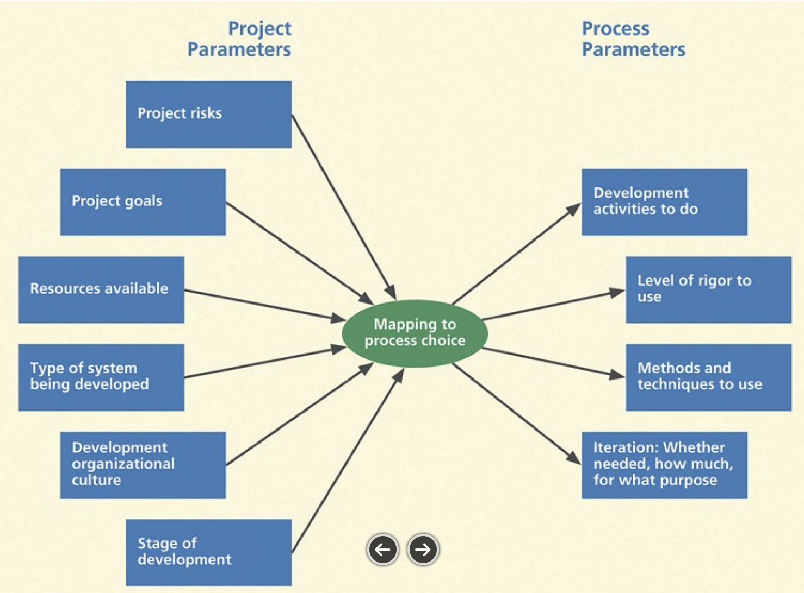
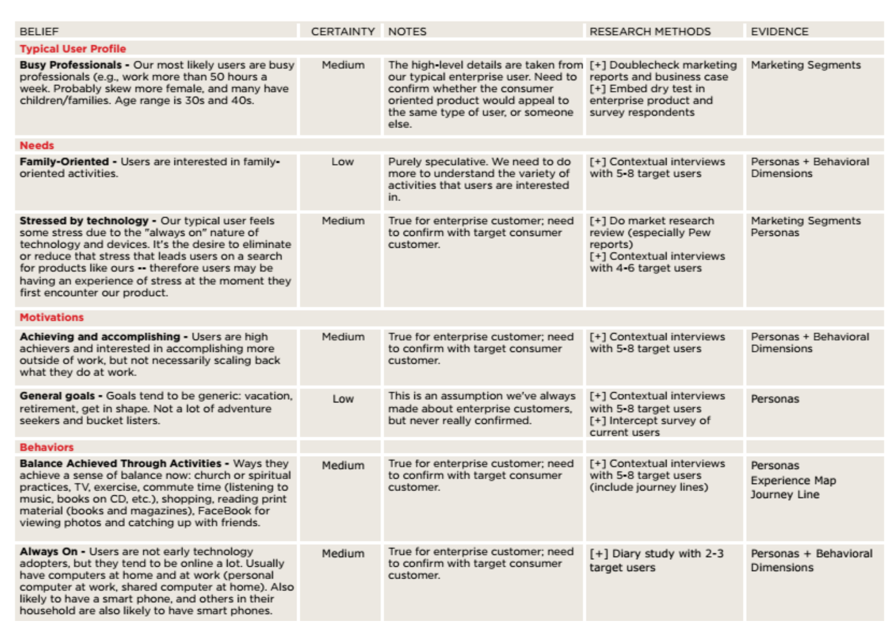

# ✏️📱 Progettazione di Applicazioni Mobili

###### 👨‍🏫 Prof. Stefano Burigat - 📧 stefano.burigat@uniud.it

##### ORARIO DELLE LEZIONI

| Giorno  | Orario        | Sede di Pordenone                              | Sede di Udine                                   |
| ------- | ------------- | ---------------------------------------------- | ----------------------------------------------- |
| Venerdì | 14:30 - 18:30 | Aula L06 (Una volta in presenza, una volta no) | Aula A018 (Una volta in presenza, una volta no) |

#### ESAME FINALE

[https://elearning.uniud.it/moodle/mod/page/view.php?id=133765](https://elearning.uniud.it/moodle/mod/page/view.php?id=133765)

> **NOTE SULL'ESAME FINALE**:
> Il professore ha il **Google Pixel 4a** quindi dobbiamo cercare di creare l'applicazione che funzioni al meglio su quel dispositivo, anche perché la testerà solo su quel dispositivo.

###### © 2024 | Appunti di [Pasquale Mazzullo](https://www.linkedin.com/in/pasqualemazzullo/) e [Giulia Martin](https://www.linkedin.com/in/martin-giulia/)

---

##### Lezione 1 - 04 Ottobre 2024 [Aula A018, Udine]

# Tipi di approcci per lo sviluppo di app

Quando si sviluppa un'applicazione, ci sono tre principali approcci che si possono seguire:

1. **Approccio Web**
   Questo metodo consiste nel creare l'app utilizzando tecnologie tipiche del web come **HTML**, **CSS** e **JavaScript**. L'app funziona all'interno di un browser e viene eseguita come una pagina web, ma è ottimizzata per essere utilizzata su dispositivi mobili. Un esempio sono le **Web App**. Questo approccio è utile perché permette di sviluppare l'app una sola volta per diversi dispositivi, ma ha accesso limitato alle funzionalità hardware del dispositivo (come la fotocamera o i sensori).

2. **Approccio Ibrido**
   L'approccio ibrido combina tecnologie web con strumenti che permettono di far funzionare l'app come se fosse nativa. Si utilizzano tecnologie come **HTML**, **CSS** e **JavaScript**, ma l'app viene "incapsulata" in un contenitore che la rende eseguibile sui dispositivi mobili. Un esempio di framework per questo approccio è **Ionic**. L'approccio ibrido permette di riutilizzare molto codice, ma non offre la stessa fluidità e accesso diretto alle funzionalità hardware come le app native.

3. **Approccio Nativo**
   Le app native vengono sviluppate utilizzando gli strumenti e i linguaggi messi a disposizione dalle piattaforme mobili specifiche:

   - **Android**: Si utilizza **Java** o **Kotlin** insieme all'**Android SDK**.
   - **iOS**: Si utilizza **Objective-C** o **Swift** insieme a **Xcode**.

   Questo approccio permette di accedere a tutte le funzionalità del dispositivo, inclusi elementi hardware come fotocamera, GPS e sensori, e offre le migliori prestazioni. Tuttavia, sviluppare un'app nativa richiede la scrittura di codice separato per ogni piattaforma (Android, iOS).

## Un esempio moderno: Flutter

Oggi esistono anche linguaggi e framework che permettono di sviluppare app native per più piattaforme contemporaneamente. Un esempio è **Flutter**, un **SDK** _(Software Development Kit)_ che consente di scrivere il codice una sola volta e poi compilarlo per diverse piattaforme (Android, iOS, Web, ecc.). Sebbene sia necessario apportare alcune modifiche specifiche per ogni dispositivo, la maggior parte del codice rimane uguale, riducendo il lavoro di sviluppo.

### Istruzioni per installare Flutter su Mac per lo sviluppo di app Android

**Passo 1: Scaricare Flutter SDK**

1. Vai al sito ufficiale di Flutter: [https://docs.flutter.dev/get-started/install/macos/mobile-android#install-the-flutter-sdk](https://docs.flutter.dev/get-started/install/macos/mobile-android#install-the-flutter-sdk).
2. Nella tabella che vedi, clicca sulla sezione `Download and install`. Dovrebbe essere selezionata di default ma se fosse selezionata `Use VS Code to install`, cambia sezione.
3. Clicca su uno dei bottoni blu per scaricare il pacchetto `.zip`. Fai attenzione a scaricare il pacchetto compatibile per il tuo processore. Se hai un Mac un po' vecchiotto, è probabile che tu abbia un processore Intel e quindi scarica il pacchetto per `Intel Processor`; se hai un Mac prodotto dal 2020 in poi, è probabile che tu abbia un processore Apple Silicon (M1, M2, M3, ...) e quindi scarica il pacchetto per `Apple Silicon`.

**Passo 2: Estrarre Flutter SDK**

1. Una volta scaricato il file `.zip`Puoi estrarre il contenuto del pacchetto in qualsiasi posto tu voglia del tuo computer. Ti consiglio di farlo in una directory denominata `development` (senza spazi e tutto minuscolo) in modo da tenere tutti i dati relativi allo sviluppo in un unico punto del tuo computer.

**Passo 3: Installare Android Studio "Ladybug"**

1. Vai sul sito ufficiale di Android Studio: [https://developer.android.com/studio](https://developer.android.com/studio).
2. Clicca sulla Call To Action `Download Android Studio Ladybug`.
3. Scorri tutti i _Terms and Conditions_ e spunta _I have read and agree with the above terms and conditions_.
4. Seleziona la versione di Android Studio corretta per il tuo Mac. Se hai un Mac un po' vecchiotto, è probabile che tu abbia un processore Intel e quindi scarica il pacchetto `Mac with Intel chip`; se hai un Mac prodotto dal 2020 in poi, è probabile che tu abbia un processore Apple Silicon (M1, M2, M3, ...) e quindi scarica il pacchetto `Mac with Apple chip`.

**Passo 4: Installare Android Studio**

1. Una volta scaricato il file `.dmg`, aprilo e trascina l'icona di Android Studio nella cartella _Applicazioni_.

**Passo 5: Configurare l'SDK Android 14**

1. Apri Android Studio.
2. Vai su **Preferences** > **Appearance & Behavior** > **System Settings** > **Android SDK**.
3. Nella scheda SDK Platforms, seleziona `Android 14 (UpsideDownCake)` e clicca su Apply per scaricare l'SDK.
4. Vai nella scheda SDK Tools, assicurati che sia selezionato `Android SDK Build-Tools` e clicca su OK.

**Passo 6: Configurare Flutter con Android Studio**

1. Apri Android Studio.
2. Vai su **Preferences** > **Plugins**.
3. Nella barra di ricerca in alto a destra, cerca `Flutter`.
4. Clicca su `Install` accanto al plugin Flutter.
5. Durante l'installazione, Android Studio ti chiederà di installare il plugin **Dart**. Conferma per installarlo.
6. Riavvia Android Studio per applicare i cambiamenti.

**Passo 7: Verificare l'installazione di Flutter in Android Studio**

1. Apri un nuovo progetto in _Android Studio_.
2. Seleziona _Flutter_ come tipo di progetto e segui le istruzioni per creare un'app Flutter di base.
3. Se ti viene chiesto, specifica il percorso di Flutter SDK (quello che hai specificato in _Passo 2: Estrarre Flutter SDK_).

**Passo 8: Configurare l'emulatore Android per Android 14**

1. In Android Studio, vai su `Device Manager` cliccando sull'icona `More Actions` (tre puntini) nell'angolo in alto a destra della finestra di Android Studio.
2. Clicca su `Create Device`.
3. Seleziona un modello di dispositivo (per l'esame il **Google Pixel 4a**, ossia quello sul quale il profesore testerà l'applicazione) e clicca su `Next`.
4. Nella sezione `System Image`, seleziona l'immagine di sistema per `Android 14 (UpsideDownCake)`.
5. Clicca su `Next`, poi su `Finish` per completare la creazione dell'emulatore.

**Passo 9: Avviare l'emulatore**

1. Dalla finestra `Virtual Device Manager`, avvia il nuovo emulatore cliccando sull'icona del play accanto al nome del dispositivo. La prima volta ci metterà un po' di tempo perché deve allocare la memoria e fare tutto il suo setup, ma più volte lo si avvia, prima si caricherà.

**Passo 10: Creare un'app Flutter**

1. Apri _Android Studio_.
2. Clicca sull'icona centrale `New Flutter Project`.
3. Assicurati che nella barra laterale a sinistra, sia selezionata la voce _Flutter_ e che in alto ci sia il path del pacchetto Flutter SDK (quello che hai specificato in _Passo 2: Estrarre Flutter SDK_).
4. Compila i campi richiesti:
   - **Project name**: Inserisci un nome per il tuo progetto (es. esame_pam).
   - **Flutter SDK path**: Se non è già popolato, specifica il percorso del Flutter SDK (quello che hai specificato in _Passo 2: Estrarre Flutter SDK_).
   - **Project location**: Scegli dove salvare il progetto sul tuo Mac. Per comodità ti consiglio di utilizzare la stessa directory nella quale hai il Flutter SDK in modo da avere tutto in un unico posto.
   - **Description**: Puoi aggiungere una descrizione opzionale per la tua app (es. "Nome e Cognome - Matricola - Esame di Progettazione di Applicazioni Mobili - A.A. 2024/2025").
5. Nella sezione `Piattaforme`, spunta solo `Android` per l'esame.
6. Clicca su `Next` e concludi il processo. Dovresti a questo punto ritrovarti Android Studio con tutti i file di basse dell'applicazione Flutter.

##### Lezione 2 - 11 Ottobre 2024 [Aula L06, Pordenone]

# Il primo smartphone della storia

Il primo smartphone della storia è stato l'**IBM Simon**, lanciato nel **1993** grazie alla collaborazione tra **IBM** e **BellSouth**. Questo dispositivo rappresentava una rivoluzione per l'epoca, combinando funzionalità tipiche dei telefoni con quelle dei computer portatili.

### Funzionalità e Caratteristiche

- **Oltre alle chiamate e ai messaggi**, l'IBM Simon permetteva di utilizzare alcune **applicazioni**. Queste includevano un'agenda, una rubrica, un calendario, una calcolatrice e persino la possibilità di inviare fax.
- **Sistema Operativo**: Il sistema operativo utilizzato era una versione del **DOS**. Essendo basato sull'architettura **x86**, era simile ai computer dell'epoca.
- **Touchscreen**: Uno degli aspetti innovativi dell'IBM Simon era la presenza di un **touchscreen**, che poteva essere utilizzato sia con le dita sia con un pennino.
- **Hardware**:
  - Processore a **16 MHz** con un'architettura a **18 bit**, x86 compatibile.
  - **1 MB di RAM**.
  - Supporto per l'espansione della memoria attraverso **memory card** tipo **PCMCIA**.
- **Design**: Il design era piuttosto voluminoso, simile a un "mattone", con un peso di **510 grammi**.

# Evoluzione degli Smartphone

### Dalla Tastiera al Display Full-Screen

Nel corso degli anni, gli smartphone hanno subito una **progressiva evoluzione** nel design e nelle funzionalità, con alcuni cambiamenti chiave:

- **Rimozione dei tasti hardware**: Inizialmente, gli smartphone erano dotati di tastiere fisiche e, in alcuni casi, anche di antenne esterne. Col tempo, questi elementi sono stati gradualmente eliminati a favore di un design più minimalista e pulito.
- **Schermo sempre più grande**: Lo schermo ha iniziato ad assumere un ruolo centrale, **occupando una porzione sempre maggiore** della superficie del dispositivo. Questo ha portato alla nascita dei design attuali con display "full-screen", dove il touchscreen copre quasi interamente la parte frontale del telefono.
- **Display a colori**: Con l'evoluzione della tecnologia, gli smartphone sono passati dai display monocromatici ai **display a colori**, migliorando notevolmente l'esperienza visiva.
- **Nuovi sensori**: Sono stati progressivamente aggiunti nuovi sensori, come accelerometri, giroscopi, sensori di prossimità, impronte digitali e riconoscimento facciale, che hanno reso gli smartphone sempre più interattivi e funzionali.

### Da CPU Separate a SoC

Oltre ai cambiamenti estetici e di funzionalità, l'evoluzione degli smartphone ha riguardato anche l'**architettura hardware** interna.

Con il passare del tempo, per ottimizzare lo spazio e migliorare le prestazioni, si è passati da componenti separati (come CPU, GPU e altri processori) a soluzioni più integrate, conosciute come **SoC (System-on-Chip)**.

- **System-on-Chip (SoC)**: Nei moderni smartphone, la CPU, la GPU, la memoria e altri componenti fondamentali sono integrati in un unico circuito, il SoC. Questo approccio consente di **ridurre** lo spazio necessario all'interno del dispositivo, migliorare l'**efficienza energetica** e offrire prestazioni elevate. Tuttavia, l'integrazione in un unico chip comporta anche sfide come la **gestione del calore** e la difficoltà nell'aggiornare singoli componenti.
- **Dominio ARM**: La maggior parte degli smartphone moderni utilizza processori basati sull'architettura **ARM**, che è diventata lo standard nel settore per via della sua efficienza energetica e delle dimensioni ridotte dei chip. ARM, di fatto, è il **principale brand** di riferimento per i processori mobili, superando le tradizionali CPU per PC in termini di diffusione nei dispositivi portatili.

Questo tipo di evoluzione ha permesso agli smartphone di diventare sempre più potenti, pur mantenendo dimensioni contenute e consumi ridotti.

### Memoria RAM e Ottimizzazione nell'Ecosistema Mobile

L'evoluzione degli smartphone ha portato a un notevole incremento nella quantità di **memoria RAM** disponibile nei dispositivi. Attualmente, la RAM degli smartphone si aggira intorno agli **8 GB**, una quantità più che sufficiente per garantire un'esperienza fluida, anche su dispositivi come l'iPhone, che tradizionalmente gestisce in modo molto efficiente le risorse hardware.

#### Gestione della Memoria e Ottimizzazione Energetica

Una delle sfide principali nella progettazione degli smartphone è la **gestione della memoria**, poiché questa è uno dei componenti che consuma più energia. Per ridurre il consumo energetico e migliorare le prestazioni, i **sistemi operativi** mobili e i **framework di sviluppo** sono progettati per ottimizzare l'accesso alla memoria, svolgendo automaticamente molte di queste operazioni senza che l'utente se ne accorga.

- **Android e l'ottimizzazione della memoria**: In passato, su sistemi come Android, quando la memoria si saturava, il sistema chiudeva automaticamente le applicazioni in background per liberare spazio. Tuttavia, veniva **salvato un timestamp** dell'applicazione, permettendo all'utente di riprendere esattamente da dove aveva lasciato quando riapriva l'app. Questo meccanismo garantiva una gestione ottimizzata della memoria senza compromettere l'esperienza utente.

Questi processi di ottimizzazione sono essenziali per bilanciare l'uso della memoria e il risparmio energetico, mantenendo le prestazioni elevate anche con un gran numero di applicazioni aperte.

# Il Display: Un Aspetto Cruciale per Design e Sviluppo

Uno degli elementi più importanti negli smartphone moderni è il **display**, che influenza sia il **design fisico** del dispositivo che le modalità di **sviluppo delle applicazioni**. Ci sono vari fattori che incidono direttamente sull'esperienza d'uso:

- **Dimensione fisica**: Si misura in verticale, orizzontale e diagonale.
- **Risoluzione**: La quantità di pixel visualizzabili sullo schermo, che incide sulla nitidezza dell'immagine.
- **Fattore di forma (aspect ratio)**: Il rapporto tra la larghezza e l'altezza dello schermo, che varia da dispositivi più squadrati a quelli allungati.

Questi fattori determinano lo **spazio disponibile** per la visualizzazione dei contenuti e possono cambiare drasticamente in base al **modo in cui il dispositivo viene utilizzato**. Per esempio, anche se lo schermo rimane lo stesso, passare dalla modalità **portrait (verticale)** a **landscape (orizzontale)** modifica la visualizzazione dei contenuti, richiedendo un adattamento nell'interfaccia utente.

### Adattamento Automatico e Manuale

Nel corso del tempo, i **sistemi operativi** e i **framework di sviluppo** hanno semplificato la gestione di questi cambiamenti, fornendo strumenti per **adattare automaticamente** l'interfaccia utente alle diverse dimensioni e orientamenti dello schermo. Tuttavia, questi adattamenti non sono sempre perfetti, e ci sono situazioni in cui è necessario un intervento **manuale** o **semi-automatico** per garantire che l'applicazione funzioni correttamente su diversi dispositivi.

### Dimensioni del Display e Risoluzione

Gli smartphone di oggi hanno display che variano da **3 a 7 pollici**, con risoluzioni che possono spaziare da **240x320 pixel** fino al **4K**. Tuttavia, la percezione umana ha dei limiti: per esempio, un display con una densità di **300 ppi** (pixel per pollice) è già abbastanza nitido se guardato da una distanza di circa 30 cm. **Densità superiori a 300 ppi** non vengono percepite dall'occhio umano e sono quindi perlopiù un elemento di **marketing**.

Gli **aspect ratio** più comuni includono formati come **4:3**, **16:9**, e formati più allungati come il **21:9**, che influenzano il modo in cui i contenuti vengono visualizzati e distribuiti sullo schermo.

### Sfide per gli Sviluppatori

Creare un **layout** che si adatti perfettamente a tutti i dispositivi e formati non è semplice. È un processo che richiede numerosi test su dispositivi con diverse dimensioni, risoluzioni e fattori di forma. Gli sviluppatori devono quindi gestire attentamente l'adattamento delle loro interfacce per garantire un'esperienza d'uso ottimale su ogni tipo di schermo.

# Smartphone: Input e Output

Gli smartphone moderni sono dispositivi estremamente versatili che utilizzano una vasta gamma di **input** e **output** per interagire con l'utente e con l'ambiente circostante. Questi elementi rendono gli smartphone strumenti potenti per comunicare, raccogliere dati e fornire feedback.

### Input (Ingressi)

Gli smartphone raccolgono informazioni attraverso diversi **dispositivi di input**, che permettono agli utenti di interagire con il dispositivo e agli sviluppatori di sfruttare dati provenienti dall'ambiente. Tra i principali input ci sono:

- **Touchscreen sensibile al tocco**, che è il metodo primario di input per la maggior parte delle interazioni.
- **Pulsanti fisici**, come quelli per il volume o il tasto di accensione.
- **Microfono**, utilizzato per registrare audio e per i comandi vocali.
- **Fotocamera**, che cattura immagini e video.
- **Sensori GPS**, per la localizzazione.
- **Accelerometro** e altri sensori come il **barometro**, che rilevano il movimento e i cambiamenti ambientali.
- **Connessione tramite porta**, che permette di collegare dispositivi esterni (ad esempio, cuffie o accessori tramite la porta di ricarica).
- **Connessione di rete**, che permette di inviare e ricevere dati tramite Wi-Fi o rete mobile.

### Output (Uscite)

Gli smartphone utilizzano anche diversi **dispositivi di output** per fornire feedback all'utente. Tra i principali output ci sono:

- **Schermo**, il principale mezzo di output visivo, utilizzato per mostrare interfacce, video, immagini e testo.
- **Altoparlanti**, che emettono suoni e notifiche.
- **Piccoli motori**, che producono **vibrazioni** per notifiche tattili.
- **LED luminosi**, utilizzati come **flash** per la fotocamera o per notifiche visive.
- **Connessione di rete**, che non solo riceve dati, ma li invia come output per condividere informazioni o comunicare.

# Gestione della Batteria: Ottimizzazione e Sfide

La **gestione della batteria** negli smartphone è un aspetto cruciale, soprattutto considerando l'ampia gamma di funzionalità che questi dispositivi offrono. Anche se i **sistemi operativi** e i **framework** aiutano a ottimizzare i consumi, ci sono aspetti che gli sviluppatori devono gestire manualmente per migliorare ulteriormente l'efficienza energetica.

### Ottimizzazione Automatica e Manuale

- **Ottimizzazione automatica**: I sistemi operativi mobili, come Android e iOS, hanno meccanismi integrati per risparmiare energia. Per esempio, quando un'app viene posta in **background**, alcune delle sue attività vengono automaticamente interrotte o ridotte, come i processi di aggiornamento continuo o le connessioni di rete non essenziali.

- Ottimizzazione manuale: Tuttavia, non tutto viene gestito automaticamente. Per esempio, le **animazioni** o altri effetti visivi possono continuare a consumare energia anche quando l'app è in background. In questi casi, spetta agli **sviluppatori** implementare soluzioni per ridurre il carico sulla batteria, come disattivare le animazioni o altre attività superflue quando non sono necessarie.

### Sfide della gestione della batteria

Nonostante i vari strumenti a disposizione, le possibilità di ottimizzare il consumo energetico sono comunque limitate, poiché molti fattori sono gestiti a livello hardware o di sistema operativo. L'obiettivo principale per gli sviluppatori è quindi quello di **minimizzare il consumo delle risorse** che non vengono gestite automaticamente, migliorando l'efficienza dell'app senza compromettere l'esperienza utente.

# iOS e Android: Due Sistemi Operativi Basati su UNIX

Sia **iOS** che **Android** sono sistemi operativi basati su UNIX, ma con origini e differenze specifiche:

- **iOS** deriva da **Darwin**, un sistema basato su UNIX sviluppato da Apple, mentre
- **Android** è direttamente derivato dal **kernel Linux**.
  Entrambi i sistemi sono progettati per essere controllati principalmente tramite **touchscreen**, utilizzando gesti sia **single-touch** che **multi-touch**.

### Linee Guida di Design e Sviluppo

Sia iOS che Android offrono **linee guida di design per l'interfaccia utente**, che aiutano gli sviluppatori a creare applicazioni visivamente coerenti e facili da usare:

- **iOS** segue le **Human Interface Guidelines**.
- **Android** utilizza le linee guida del **Material Design**.
  Entrambi i sistemi offrono **SDK** (Software Development Kit) per lo sviluppo nativo delle applicazioni, che possono essere distribuite tramite i rispettivi **App Store**. Tuttavia, esistono alcune differenze significative nel modo in cui gli sviluppatori possono distribuire le loro app su ogni piattaforma.

# iOS: Sviluppo e Distribuzione

- **Linguaggi di programmazione**: Su iOS si sviluppa principalmente con **Objective-C** o **Swift**, utilizzando l'ambiente di sviluppo **Xcode**.
- **Piattaforma**: Lo sviluppo può essere fatto **solo su macOS**.
- **Costi**: L'utilizzo di Xcode è **gratuito**, ma per pubblicare un'app su App Store è necessario pagare un abbonamento annuale di **99 dollari**.
- **Distribuzione su App Store**: Prima di essere pubblicata, ogni app deve essere approvata da Apple. L'azienda trattiene una commissione del **15%** sui ricavi per app fino a **1 milione di dollari**, e **30%** per ricavi superiori.

# Android: Sviluppo e Distribuzione

- **Linguaggi di programmazione**: Su Android si sviluppa con **Java** o **Kotlin**, utilizzando **Android Studio** come ambiente di sviluppo.
- **Piattaforma**: Android Studio è supportato su **qualsiasi piattaforma** (Windows, macOS, Linux).
- **Distribuzione delle app**: Le app possono essere distribuite in diversi modi: tramite **APK**, attraverso il **Google Play Store**, o anche tramite **store alternativi**.
- **Costi**: Per pubblicare sul Play Store, si paga una tariffa unica di **25 dollari** per utente, non per app.
- **Commissioni**: Anche Google trattiene il **15%** sui ricavi per app fino a **1 milione di dollari**, e **30%** per ricavi superiori.

# Native vs Hybrid vs Cross-Platform vs Web-Based: Tipologie di App Mobili

Quando si sviluppano applicazioni mobili, è possibile scegliere tra diverse soluzioni tecniche, ognuna con vantaggi e svantaggi specifici. Le principali categorie sono: **app web-based**, **native**, **ibride** e **cross-platform**.

### App Web-Based

Le **applicazioni web-based** sono applicazioni ospitate su un **server web**, a cui gli utenti accedono tramite il browser come se fossero delle app. Anche se queste app possono sembrare simili alle app native, non possono essere distribuite tramite gli **store** (come l'App Store o Google Play) e dipendono dal **motore del browser** per funzionare.

- **Vantaggi**: Non richiedono installazione e possono essere utilizzate su qualsiasi dispositivo con un browser.
- **Svantaggi**: Hanno accesso limitato alle funzionalità del dispositivo (ad esempio, sensori e fotocamera), e per accedere a determinate funzionalità del dispositivo, devono passare attraverso **passaggi intermedi**.

### App Native

Le **app native** sono sviluppate utilizzando i **SDK nativi** forniti dai produttori dei sistemi operativi, ovvero **Xcode** per iOS e **Android Studio** per Android.

- **Vantaggi**: Offrono **accesso completo ai servizi e alle funzionalità del dispositivo**, come sensori, GPS, fotocamera e notifiche. Inoltre, le app native garantiscono prestazioni elevate poiché sono ottimizzate per il sistema operativo.
- **Svantaggi**: Richiedono **codebase separate** per ogni piattaforma, aumentando i costi di sviluppo e manutenzione.

### App Ibride

Le **app ibride** combinano il meglio delle app web e delle app native. Sono costituite da **pagine web** che vengono eseguite all'interno di un **container nativo**. Questo container viene fornito da framework come **Ionic** e **Angular**, che permettono di incapsulare il codice web e farlo sembrare e funzionare come un'app nativa.

- **Vantaggi**: È possibile riutilizzare il codice web e distribuire l'app su più piattaforme, risparmiando tempo nello sviluppo.
- **Svantaggi**: Anche se le app ibride funzionano come app native, possono presentare **limitazioni di prestazioni** rispetto a quelle completamente native, specialmente per operazioni complesse o che richiedono un uso intensivo delle risorse del dispositivo.

### App Cross-Platform

Le **app cross-platform** permettono di sviluppare **app native** utilizzando un solo **linguaggio di programmazione** diverso da quelli nativi, con la possibilità di compilare il codice per più piattaforme contemporaneamente. Framework come **Flutter** (che utilizza il linguaggio **Dart**) e **React Native** (che usa **JavaScript** e **JSX**) sono molto diffusi.

- **Vantaggi**: Si sviluppa una **singola codebase** che viene poi compilata per più piattaforme, riducendo i costi e i tempi di sviluppo. Le app risultanti sono **app native**, con accesso diretto ai servizi del dispositivo.
- **Svantaggi**: Anche se le prestazioni sono generalmente buone, le app cross-platform potrebbero non essere completamente ottimizzate come quelle sviluppate con i linguaggi nativi per ogni piattaforma.

# Flutter: Introduzione e Architettura

**Flutter** è un framework open-source per lo sviluppo di applicazioni mobili, creato da Google nel **2018**. Utilizza il linguaggio di programmazione **Dart**, sviluppato nel **2011**, noto per la sua sintassi orientata agli oggetti, tipizzata e garbage-collected.

### Caratteristiche Principali di Flutter

- **Rendering**: Flutter è in grado di renderizzare a **120 fps**, offrendo un'esperienza utente fluida. Realizza il rendering attraverso una copia dei componenti dell'interfaccia utente (UI) progettati da lui stesso, utilizzando due principali librerie:
  - **Material Design** (per Android)
  - **Cupertino Design** (per iOS)

# Struttura di un Progetto Flutter

Un progetto Flutter è composto da diversi file e librerie che gestiscono le dipendenze e la configurazione. Ecco i principali componenti:

1. **pubspec.yaml**: Simile a un `package.json` in JavaScript, questo file elenca tutte le dipendenze del progetto. Le librerie possono essere cercate e aggiunte tramite [pub.dev](pub.dev). Ad esempio, per utilizzare icone di Cupertino, è possibile inserire `cupertino_icons` nelle dipendenze.
2. **build.gradle**: File di configurazione utilizzato per gestire le impostazioni di compilazione basate sulla versione di Android. All'interno della directory di Flutter, si trova `flutter.groovy`, che verifica la compatibilità con la versione di Android. Modifiche a `flutter.groovy` influiscono su tutto il progetto, mentre le modifiche a `build.gradle` sono specifiche per il progetto. È importante fare attenzione, poiché durante la ricompilazione potrebbero essere ripristinati i valori di `flutter.groovy`.
3. **Libreria "provider"**: Questa libreria, se installata correttamente, apparirà in **External Libraries** in Android Studio. Serve per gestire in modo più semplice lo stato dei widget all'interno dell'app.

# Componenti Fondamentali di Flutter

Flutter si compone di quattro elementi chiave:

1. **Piattaforma Dart**: Il linguaggio di programmazione utilizzato.
2. **Engine Flutter**: Basato su C++, gestisce il rendering delle schermate e l'esecuzione del codice.
3. **Foundation Library**: Serve da intermediario per scrivere codice Flutter e farlo funzionare in modo nativo.
4. **Widget**: Rappresentano i componenti dell'interfaccia utente. Ogni elemento visivo dell'app è un widget, che può essere a sua volta composto da altri widget.

# Architettura dell'App Flutter

Un'app Flutter è organizzata come un **widget tree**, in cui i widget sono disposti gerarchicamente. Esempi di questa struttura possono includere:

- Widget principale dell'app
  - Widget per la schermata
    - Widget contenitore
      - Widget pulsante

# Tipi di Widget

In Flutter, esistono due categorie di widget:

- **Widget con stato**: Questi widget cambiano in base all'interazione dell'utente. Sono dinamici e possono aggiornare la loro interfaccia in risposta a eventi.
- **Widget senza stato**: Questi widget non cambiano mai dopo la loro creazione e sono utilizzati per visualizzare informazioni statiche.

# Struttura e Sintassi di un Progetto Flutter

Quando si sviluppa un'applicazione Flutter, ci sono alcune convenzioni e pratiche comuni da seguire per garantire un codice chiaro e funzionante.

### Creazione di File Dart

All'interno della cartella `lib` del progetto, puoi creare nuovi file con estensione `.dart` per organizzare il tuo codice. Ogni file può contenere classi, funzioni e widget.

### Funzione Principale

La funzione `main` è il punto di ingresso dell'applicazione. È consigliabile definirla come `void main()` poiché non restituisce alcun valore. In questo modo, il codice è più chiaro e conforme alle convenzioni Dart.

```dart
void main() {
  runApp(MyApp());
}
```

### Scope e Struttura del Codice

Nel **scope globale**, puoi dichiarare variabili, costanti e altre impostazioni. Tutto il resto del codice, come classi e funzioni, deve essere definito all'interno di queste strutture globali.

### Gestione delle Variabili

Se dichiari una variabile con il tipo `dynamic`, puoi modificare il tipo della variabile in un secondo momento. Questo significa che una variabile dichiarata come `dynamic` può contenere un valore di qualsiasi tipo, rendendola flessibile, ma anche potenzialmente suscettibile a errori di runtime se non gestita correttamente.

```dart
dynamic myVariable = "Hello";
myVariable = 42; // Cambia il tipo a int
```

#### Lezione 25/10/2024

**Parametri di Progetto e Parametri di Processo**


Quante risorse dobbiamo utilizzare in ogni fase del processo? dipende da quanto è alto il rischio di avere quealcosa di non funzionante all'interno del progetto.
Degli strumenti che possiamo usare ce ne sono tanti ma non ci sono indicazioni sul quale usare perchè miglire. Un'altra scelta è cercare di usare più tecniche alternative possibili.
Il bello delle tecniche che vedremo sono abbastanza complementari;


- Project risks
bisogna parlare di rischi di progetto, se stiamo lavorando su un Software su cui si basa un'intera azienda, si sa che nella fase di progetto bisogna colmare tutti i punti abbondantemente.
- Project goals

- Resorces available

- tipo di sistema di sviluppo

- Development organization culture

- Stage of development 

..


**Tipo di sistema:**
Complessità del dominio, complessità delle procedure che bisogna attuare nel dominio. 
Comlpessità dell'interazione, quanto è difficile svolgere un task all'interno del sistema.
Alcuni parametri per noi possono essere più rilessanti per noi. L'agile è quello su cui ci concentriamo. 
Possiamo fare una rapida prototipazione e evacuazione. Per finire il ciclo che utilizzeremo noi è solo una variante di quello che abbiamo parlato fino ad ora e sono: 
Evision - > creare la visione dell'applicazione. Si avvicina all'analisi in modo semplice ed economico. 
prototype - > Abbiamo Design e prototyping, perchè qualunque attività che vogliamo fare dobbbiamo fare dei prototitpi.
Evaluate - > test dei nostri prototi sugli utenti.

## Fase di Evision

**System concept statement**
La versione finale del documento richiederebbe revisione alla luce delle altre tecniche (difficile che se lo facciamo per primo sia nella sua versione finale). 
È una descrizione breve del sistema che vogliamo creare (app). L’idea è un punto di riferimento e le scelte che faremo devono essere in base a quel riferimento, dobbiamo raggiungere l’obiettivo prefissato. L’idea non deve cambiare più poi. È una baseline per evitare di fare cose che non c’entrano (non spendere risorse in più). 
Stakeholder importanti: utenti, management (deve essere convinto che l’idea è sensata, dobbiamo mostrare questo documento). 
Cosa comprende il documento (in generale, questo è un esempio)?
Lunghezza: molto corto di solito (100-150 parole, può essere anche più lungo se il progetto è complesso, ma non troppe pagine)
Nome: non necessariamente sarà quello finale
Chi è il target: fondamentale, definirlo precisamente 
Obiettivo: quali problemi degli utenti risolverà il nostro sistema (problema inteso anche come intrattenimento, non per forza un vero e proprio problema)
Come il sistema intende di risolvere il problema, ma senza fornire dettagli tecnici a livello di interfaccia di come il sistema permetterà agli utenti di svolgere determinate attività
Tipo di esperienza utente che il sistema fornirà: aggettivi tipo facile da usare, colorato, divertente ecc. (di solito non vi è una sezione specifica, ma viene sparso nel documento e nell’insieme dà questo tipo di info).

Il come non ci deve essere in questa fase, ma solo la descrizione dei punti chiave dell'app.



Il **learning plan**è un tool utile per quando inizio un nunovo progetto. é la procedura, che indipendentemente dal formato che avrà, in cui si parte buttando giù tutto ciò che si sa o si pensa di sapere. Chi sono cosa fanno nell'argomento della nostra applicazione.
Possiamo sapere informazioni da diverse sorgenti. Potrebbe essere un'aggiornamento di una versione esistente?. Non bisogna usare il proprio punto di vista da quello degli utilizzatori finali. Abbiamo una divisione del target anche suddivisino in segmenti con caratteristiche differenti di obiettivi o comportamento.
Se usano altre applicazioni e cosa usano, non per forza applicazioni digitali. DOpo di che bisogna andare a capire quanto sicuri siamo. Qual'è il nostro livello di certezza che corrisponde alla realtà? (lo semplifichiamo in Basso, Medio, Alto). 
Dopo va un pò definito quali metodi possiamo utilizzar per ottenere delle informazioni e che tipo di sicurezza abbiamo che non ci servono ulteriori informazioni. Siamo sicuri che il target di utenza ha esattamente quella problematica?.

**Guerrilla User Rearch**
la tua prioriotà è andare a parlare direttamente con gli utenti, non necessariamente di persona, ma interaggire con loro.
dobbiamo decidere che domande fare, meglio i temi ho dei dubbi, parlare degli utenti di persona nel loro ambiente naturale e dove possono usare la nostra applicazione. Dobbiamo guidarli un pò ma non troppo.
Prendere appunti non è l'ideale perchè non si riesce a interagire con l'utente, il meglio sarebbe registrare oppure si può andare in coppia uno parla l'altro prende appunti.

**Competitive/coparative assessment**
Abbiamo concorrenza? diretta? indiretta? che tipo di applicazioni sono e come funzionano? 
se già ci sono altri prodotti simili al nostro, gli utenti sono già abituati ad usarlo e hanno delle attese da soddisfare rispetto ad altri prodotti. Bisogna identificare le applicazioni concorrenti e farne una lista. Non serve farle tutte. Selzionare il numero di applicazioni da analizzare, non c'è il numero massimo. 
Capire il tipo di contenuti presenti dentro all'applicazione, dal punto di vista di pattern di design che sono presenti nell'interfaccia, quali funzionalità permette l'applicazione. Conta anche capire qual'è il nostro effetto mentre stiamo usando quell'applicazione per la prima volta. Importnate sono anche i commenti sugli store. 
Mentre facciamo l'analisi importnate fare screenshot, e fare una tabella che evidenziano sia gli aspetti positivi sia quelli negativi. Un'altro aspetto da sottolineare è creare una sorta di linea guida / documento, in cui sottolineo le "*best practise*".


# ✏️📱 Progettazione di Applicazioni Mobili

###### 👨‍🏫 Prof. Stefano Burigat - 📧 stefano.burigat@uniud.it

##### ORARIO DELLE LEZIONI

| Giorno  | Orario        | Sede di Pordenone                              | Sede di Udine                                   |
| ------- | ------------- | ---------------------------------------------- | ----------------------------------------------- |
| Venerdì | 14:30 - 18:30 | Aula L06 (Una volta in presenza, una volta no) | Aula A018 (Una volta in presenza, una volta no) |

#### ESAME FINALE

[https://elearning.uniud.it/moodle/mod/page/view.php?id=133765](https://elearning.uniud.it/moodle/mod/page/view.php?id=133765)

> **NOTE SULL'ESAME FINALE**:
> Il professore ha il **Google Pixel 4a** quindi dobbiamo cercare di creare l'applicazione che funzioni al meglio su quel dispositivo, anche perché la testerà solo su quel dispositivo.

###### © 2024 | Appunti di [Pasquale Mazzullo](https://www.linkedin.com/in/pasqualemazzullo/) e [Giulia Martin](https://www.linkedin.com/in/martin-giulia/)

---

##### Lezione 1 - 04 Ottobre 2024 [Aula A018, Udine]

# Tipi di approcci per lo sviluppo di app

Quando si sviluppa un'applicazione, ci sono tre principali approcci che si possono seguire:

1. **Approccio Web**
   Questo metodo consiste nel creare l'app utilizzando tecnologie tipiche del web come **HTML**, **CSS** e **JavaScript**. L'app funziona all'interno di un browser e viene eseguita come una pagina web, ma è ottimizzata per essere utilizzata su dispositivi mobili. Un esempio sono le **Web App**. Questo approccio è utile perché permette di sviluppare l'app una sola volta per diversi dispositivi, ma ha accesso limitato alle funzionalità hardware del dispositivo (come la fotocamera o i sensori).

2. **Approccio Ibrido**
   L'approccio ibrido combina tecnologie web con strumenti che permettono di far funzionare l'app come se fosse nativa. Si utilizzano tecnologie come **HTML**, **CSS** e **JavaScript**, ma l'app viene "incapsulata" in un contenitore che la rende eseguibile sui dispositivi mobili. Un esempio di framework per questo approccio è **Ionic**. L'approccio ibrido permette di riutilizzare molto codice, ma non offre la stessa fluidità e accesso diretto alle funzionalità hardware come le app native.

3. **Approccio Nativo**
   Le app native vengono sviluppate utilizzando gli strumenti e i linguaggi messi a disposizione dalle piattaforme mobili specifiche:

   - **Android**: Si utilizza **Java** o **Kotlin** insieme all'**Android SDK**.
   - **iOS**: Si utilizza **Objective-C** o **Swift** insieme a **Xcode**.

   Questo approccio permette di accedere a tutte le funzionalità del dispositivo, inclusi elementi hardware come fotocamera, GPS e sensori, e offre le migliori prestazioni. Tuttavia, sviluppare un'app nativa richiede la scrittura di codice separato per ogni piattaforma (Android, iOS).

## Un esempio moderno: Flutter

Oggi esistono anche linguaggi e framework che permettono di sviluppare app native per più piattaforme contemporaneamente. Un esempio è **Flutter**, un **SDK** _(Software Development Kit)_ che consente di scrivere il codice una sola volta e poi compilarlo per diverse piattaforme (Android, iOS, Web, ecc.). Sebbene sia necessario apportare alcune modifiche specifiche per ogni dispositivo, la maggior parte del codice rimane uguale, riducendo il lavoro di sviluppo.

### Istruzioni per installare Flutter su Mac per lo sviluppo di app Android

**Passo 1: Scaricare Flutter SDK**

1. Vai al sito ufficiale di Flutter: [https://docs.flutter.dev/get-started/install/macos/mobile-android#install-the-flutter-sdk](https://docs.flutter.dev/get-started/install/macos/mobile-android#install-the-flutter-sdk).
2. Nella tabella che vedi, clicca sulla sezione `Download and install`. Dovrebbe essere selezionata di default ma se fosse selezionata `Use VS Code to install`, cambia sezione.
3. Clicca su uno dei bottoni blu per scaricare il pacchetto `.zip`. Fai attenzione a scaricare il pacchetto compatibile per il tuo processore. Se hai un Mac un po' vecchiotto, è probabile che tu abbia un processore Intel e quindi scarica il pacchetto per `Intel Processor`; se hai un Mac prodotto dal 2020 in poi, è probabile che tu abbia un processore Apple Silicon (M1, M2, M3, ...) e quindi scarica il pacchetto per `Apple Silicon`.

**Passo 2: Estrarre Flutter SDK**

1. Una volta scaricato il file `.zip`Puoi estrarre il contenuto del pacchetto in qualsiasi posto tu voglia del tuo computer. Ti consiglio di farlo in una directory denominata `development` (senza spazi e tutto minuscolo) in modo da tenere tutti i dati relativi allo sviluppo in un unico punto del tuo computer.

**Passo 3: Installare Android Studio "Ladybug"**

1. Vai sul sito ufficiale di Android Studio: [https://developer.android.com/studio](https://developer.android.com/studio).
2. Clicca sulla Call To Action `Download Android Studio Ladybug`.
3. Scorri tutti i _Terms and Conditions_ e spunta _I have read and agree with the above terms and conditions_.
4. Seleziona la versione di Android Studio corretta per il tuo Mac. Se hai un Mac un po' vecchiotto, è probabile che tu abbia un processore Intel e quindi scarica il pacchetto `Mac with Intel chip`; se hai un Mac prodotto dal 2020 in poi, è probabile che tu abbia un processore Apple Silicon (M1, M2, M3, ...) e quindi scarica il pacchetto `Mac with Apple chip`.

**Passo 4: Installare Android Studio**

1. Una volta scaricato il file `.dmg`, aprilo e trascina l'icona di Android Studio nella cartella _Applicazioni_.

**Passo 5: Configurare l'SDK Android 14**

1. Apri Android Studio.
2. Vai su **Preferences** > **Appearance & Behavior** > **System Settings** > **Android SDK**.
3. Nella scheda SDK Platforms, seleziona `Android 14 (UpsideDownCake)` e clicca su Apply per scaricare l'SDK.
4. Vai nella scheda SDK Tools, assicurati che sia selezionato `Android SDK Build-Tools` e clicca su OK.

**Passo 6: Configurare Flutter con Android Studio**

1. Apri Android Studio.
2. Vai su **Preferences** > **Plugins**.
3. Nella barra di ricerca in alto a destra, cerca `Flutter`.
4. Clicca su `Install` accanto al plugin Flutter.
5. Durante l'installazione, Android Studio ti chiederà di installare il plugin **Dart**. Conferma per installarlo.
6. Riavvia Android Studio per applicare i cambiamenti.

**Passo 7: Verificare l'installazione di Flutter in Android Studio**

1. Apri un nuovo progetto in _Android Studio_.
2. Seleziona _Flutter_ come tipo di progetto e segui le istruzioni per creare un'app Flutter di base.
3. Se ti viene chiesto, specifica il percorso di Flutter SDK (quello che hai specificato in _Passo 2: Estrarre Flutter SDK_).

**Passo 8: Configurare l'emulatore Android per Android 14**

1. In Android Studio, vai su `Device Manager` cliccando sull'icona `More Actions` (tre puntini) nell'angolo in alto a destra della finestra di Android Studio.
2. Clicca su `Create Device`.
3. Seleziona un modello di dispositivo (per l'esame il **Google Pixel 4a**, ossia quello sul quale il profesore testerà l'applicazione) e clicca su `Next`.
4. Nella sezione `System Image`, seleziona l'immagine di sistema per `Android 14 (UpsideDownCake)`.
5. Clicca su `Next`, poi su `Finish` per completare la creazione dell'emulatore.

**Passo 9: Avviare l'emulatore**

1. Dalla finestra `Virtual Device Manager`, avvia il nuovo emulatore cliccando sull'icona del play accanto al nome del dispositivo. La prima volta ci metterà un po' di tempo perché deve allocare la memoria e fare tutto il suo setup, ma più volte lo si avvia, prima si caricherà.

**Passo 10: Creare un'app Flutter**

1. Apri _Android Studio_.
2. Clicca sull'icona centrale `New Flutter Project`.
3. Assicurati che nella barra laterale a sinistra, sia selezionata la voce _Flutter_ e che in alto ci sia il path del pacchetto Flutter SDK (quello che hai specificato in _Passo 2: Estrarre Flutter SDK_).
4. Compila i campi richiesti:
   - **Project name**: Inserisci un nome per il tuo progetto (es. esame_pam).
   - **Flutter SDK path**: Se non è già popolato, specifica il percorso del Flutter SDK (quello che hai specificato in _Passo 2: Estrarre Flutter SDK_).
   - **Project location**: Scegli dove salvare il progetto sul tuo Mac. Per comodità ti consiglio di utilizzare la stessa directory nella quale hai il Flutter SDK in modo da avere tutto in un unico posto.
   - **Description**: Puoi aggiungere una descrizione opzionale per la tua app (es. "Nome e Cognome - Matricola - Esame di Progettazione di Applicazioni Mobili - A.A. 2024/2025").
5. Nella sezione `Piattaforme`, spunta solo `Android` per l'esame.
6. Clicca su `Next` e concludi il processo. Dovresti a questo punto ritrovarti Android Studio con tutti i file di basse dell'applicazione Flutter.

##### Lezione 2 - 11 Ottobre 2024 [Aula L06, Pordenone]

# Il primo smartphone della storia

Il primo smartphone della storia è stato l'**IBM Simon**, lanciato nel **1993** grazie alla collaborazione tra **IBM** e **BellSouth**. Questo dispositivo rappresentava una rivoluzione per l'epoca, combinando funzionalità tipiche dei telefoni con quelle dei computer portatili.

### Funzionalità e Caratteristiche

- **Oltre alle chiamate e ai messaggi**, l'IBM Simon permetteva di utilizzare alcune **applicazioni**. Queste includevano un'agenda, una rubrica, un calendario, una calcolatrice e persino la possibilità di inviare fax.
- **Sistema Operativo**: Il sistema operativo utilizzato era una versione del **DOS**. Essendo basato sull'architettura **x86**, era simile ai computer dell'epoca.
- **Touchscreen**: Uno degli aspetti innovativi dell'IBM Simon era la presenza di un **touchscreen**, che poteva essere utilizzato sia con le dita sia con un pennino.
- **Hardware**:
  - Processore a **16 MHz** con un'architettura a **18 bit**, x86 compatibile.
  - **1 MB di RAM**.
  - Supporto per l'espansione della memoria attraverso **memory card** tipo **PCMCIA**.
- **Design**: Il design era piuttosto voluminoso, simile a un "mattone", con un peso di **510 grammi**.

# Evoluzione degli Smartphone

### Dalla Tastiera al Display Full-Screen

Nel corso degli anni, gli smartphone hanno subito una **progressiva evoluzione** nel design e nelle funzionalità, con alcuni cambiamenti chiave:

- **Rimozione dei tasti hardware**: Inizialmente, gli smartphone erano dotati di tastiere fisiche e, in alcuni casi, anche di antenne esterne. Col tempo, questi elementi sono stati gradualmente eliminati a favore di un design più minimalista e pulito.
- **Schermo sempre più grande**: Lo schermo ha iniziato ad assumere un ruolo centrale, **occupando una porzione sempre maggiore** della superficie del dispositivo. Questo ha portato alla nascita dei design attuali con display "full-screen", dove il touchscreen copre quasi interamente la parte frontale del telefono.
- **Display a colori**: Con l'evoluzione della tecnologia, gli smartphone sono passati dai display monocromatici ai **display a colori**, migliorando notevolmente l'esperienza visiva.
- **Nuovi sensori**: Sono stati progressivamente aggiunti nuovi sensori, come accelerometri, giroscopi, sensori di prossimità, impronte digitali e riconoscimento facciale, che hanno reso gli smartphone sempre più interattivi e funzionali.

### Da CPU Separate a SoC

Oltre ai cambiamenti estetici e di funzionalità, l'evoluzione degli smartphone ha riguardato anche l'**architettura hardware** interna.

Con il passare del tempo, per ottimizzare lo spazio e migliorare le prestazioni, si è passati da componenti separati (come CPU, GPU e altri processori) a soluzioni più integrate, conosciute come **SoC (System-on-Chip)**.

- **System-on-Chip (SoC)**: Nei moderni smartphone, la CPU, la GPU, la memoria e altri componenti fondamentali sono integrati in un unico circuito, il SoC. Questo approccio consente di **ridurre** lo spazio necessario all'interno del dispositivo, migliorare l'**efficienza energetica** e offrire prestazioni elevate. Tuttavia, l'integrazione in un unico chip comporta anche sfide come la **gestione del calore** e la difficoltà nell'aggiornare singoli componenti.
- **Dominio ARM**: La maggior parte degli smartphone moderni utilizza processori basati sull'architettura **ARM**, che è diventata lo standard nel settore per via della sua efficienza energetica e delle dimensioni ridotte dei chip. ARM, di fatto, è il **principale brand** di riferimento per i processori mobili, superando le tradizionali CPU per PC in termini di diffusione nei dispositivi portatili.

Questo tipo di evoluzione ha permesso agli smartphone di diventare sempre più potenti, pur mantenendo dimensioni contenute e consumi ridotti.

### Memoria RAM e Ottimizzazione nell'Ecosistema Mobile

L'evoluzione degli smartphone ha portato a un notevole incremento nella quantità di **memoria RAM** disponibile nei dispositivi. Attualmente, la RAM degli smartphone si aggira intorno agli **8 GB**, una quantità più che sufficiente per garantire un'esperienza fluida, anche su dispositivi come l'iPhone, che tradizionalmente gestisce in modo molto efficiente le risorse hardware.

#### Gestione della Memoria e Ottimizzazione Energetica

Una delle sfide principali nella progettazione degli smartphone è la **gestione della memoria**, poiché questa è uno dei componenti che consuma più energia. Per ridurre il consumo energetico e migliorare le prestazioni, i **sistemi operativi** mobili e i **framework di sviluppo** sono progettati per ottimizzare l'accesso alla memoria, svolgendo automaticamente molte di queste operazioni senza che l'utente se ne accorga.

- **Android e l'ottimizzazione della memoria**: In passato, su sistemi come Android, quando la memoria si saturava, il sistema chiudeva automaticamente le applicazioni in background per liberare spazio. Tuttavia, veniva **salvato un timestamp** dell'applicazione, permettendo all'utente di riprendere esattamente da dove aveva lasciato quando riapriva l'app. Questo meccanismo garantiva una gestione ottimizzata della memoria senza compromettere l'esperienza utente.

Questi processi di ottimizzazione sono essenziali per bilanciare l'uso della memoria e il risparmio energetico, mantenendo le prestazioni elevate anche con un gran numero di applicazioni aperte.

# Il Display: Un Aspetto Cruciale per Design e Sviluppo

Uno degli elementi più importanti negli smartphone moderni è il **display**, che influenza sia il **design fisico** del dispositivo che le modalità di **sviluppo delle applicazioni**. Ci sono vari fattori che incidono direttamente sull'esperienza d'uso:

- **Dimensione fisica**: Si misura in verticale, orizzontale e diagonale.
- **Risoluzione**: La quantità di pixel visualizzabili sullo schermo, che incide sulla nitidezza dell'immagine.
- **Fattore di forma (aspect ratio)**: Il rapporto tra la larghezza e l'altezza dello schermo, che varia da dispositivi più squadrati a quelli allungati.

Questi fattori determinano lo **spazio disponibile** per la visualizzazione dei contenuti e possono cambiare drasticamente in base al **modo in cui il dispositivo viene utilizzato**. Per esempio, anche se lo schermo rimane lo stesso, passare dalla modalità **portrait (verticale)** a **landscape (orizzontale)** modifica la visualizzazione dei contenuti, richiedendo un adattamento nell'interfaccia utente.

### Adattamento Automatico e Manuale

Nel corso del tempo, i **sistemi operativi** e i **framework di sviluppo** hanno semplificato la gestione di questi cambiamenti, fornendo strumenti per **adattare automaticamente** l'interfaccia utente alle diverse dimensioni e orientamenti dello schermo. Tuttavia, questi adattamenti non sono sempre perfetti, e ci sono situazioni in cui è necessario un intervento **manuale** o **semi-automatico** per garantire che l'applicazione funzioni correttamente su diversi dispositivi.

### Dimensioni del Display e Risoluzione

Gli smartphone di oggi hanno display che variano da **3 a 7 pollici**, con risoluzioni che possono spaziare da **240x320 pixel** fino al **4K**. Tuttavia, la percezione umana ha dei limiti: per esempio, un display con una densità di **300 ppi** (pixel per pollice) è già abbastanza nitido se guardato da una distanza di circa 30 cm. **Densità superiori a 300 ppi** non vengono percepite dall'occhio umano e sono quindi perlopiù un elemento di **marketing**.

Gli **aspect ratio** più comuni includono formati come **4:3**, **16:9**, e formati più allungati come il **21:9**, che influenzano il modo in cui i contenuti vengono visualizzati e distribuiti sullo schermo.

### Sfide per gli Sviluppatori

Creare un **layout** che si adatti perfettamente a tutti i dispositivi e formati non è semplice. È un processo che richiede numerosi test su dispositivi con diverse dimensioni, risoluzioni e fattori di forma. Gli sviluppatori devono quindi gestire attentamente l'adattamento delle loro interfacce per garantire un'esperienza d'uso ottimale su ogni tipo di schermo.

# Smartphone: Input e Output

Gli smartphone moderni sono dispositivi estremamente versatili che utilizzano una vasta gamma di **input** e **output** per interagire con l'utente e con l'ambiente circostante. Questi elementi rendono gli smartphone strumenti potenti per comunicare, raccogliere dati e fornire feedback.

### Input (Ingressi)

Gli smartphone raccolgono informazioni attraverso diversi **dispositivi di input**, che permettono agli utenti di interagire con il dispositivo e agli sviluppatori di sfruttare dati provenienti dall'ambiente. Tra i principali input ci sono:

- **Touchscreen sensibile al tocco**, che è il metodo primario di input per la maggior parte delle interazioni.
- **Pulsanti fisici**, come quelli per il volume o il tasto di accensione.
- **Microfono**, utilizzato per registrare audio e per i comandi vocali.
- **Fotocamera**, che cattura immagini e video.
- **Sensori GPS**, per la localizzazione.
- **Accelerometro** e altri sensori come il **barometro**, che rilevano il movimento e i cambiamenti ambientali.
- **Connessione tramite porta**, che permette di collegare dispositivi esterni (ad esempio, cuffie o accessori tramite la porta di ricarica).
- **Connessione di rete**, che permette di inviare e ricevere dati tramite Wi-Fi o rete mobile.

### Output (Uscite)

Gli smartphone utilizzano anche diversi **dispositivi di output** per fornire feedback all'utente. Tra i principali output ci sono:

- **Schermo**, il principale mezzo di output visivo, utilizzato per mostrare interfacce, video, immagini e testo.
- **Altoparlanti**, che emettono suoni e notifiche.
- **Piccoli motori**, che producono **vibrazioni** per notifiche tattili.
- **LED luminosi**, utilizzati come **flash** per la fotocamera o per notifiche visive.
- **Connessione di rete**, che non solo riceve dati, ma li invia come output per condividere informazioni o comunicare.

# Gestione della Batteria: Ottimizzazione e Sfide

La **gestione della batteria** negli smartphone è un aspetto cruciale, soprattutto considerando l'ampia gamma di funzionalità che questi dispositivi offrono. Anche se i **sistemi operativi** e i **framework** aiutano a ottimizzare i consumi, ci sono aspetti che gli sviluppatori devono gestire manualmente per migliorare ulteriormente l'efficienza energetica.

### Ottimizzazione Automatica e Manuale

- **Ottimizzazione automatica**: I sistemi operativi mobili, come Android e iOS, hanno meccanismi integrati per risparmiare energia. Per esempio, quando un'app viene posta in **background**, alcune delle sue attività vengono automaticamente interrotte o ridotte, come i processi di aggiornamento continuo o le connessioni di rete non essenziali.

- Ottimizzazione manuale: Tuttavia, non tutto viene gestito automaticamente. Per esempio, le **animazioni** o altri effetti visivi possono continuare a consumare energia anche quando l'app è in background. In questi casi, spetta agli **sviluppatori** implementare soluzioni per ridurre il carico sulla batteria, come disattivare le animazioni o altre attività superflue quando non sono necessarie.

### Sfide della gestione della batteria

Nonostante i vari strumenti a disposizione, le possibilità di ottimizzare il consumo energetico sono comunque limitate, poiché molti fattori sono gestiti a livello hardware o di sistema operativo. L'obiettivo principale per gli sviluppatori è quindi quello di **minimizzare il consumo delle risorse** che non vengono gestite automaticamente, migliorando l'efficienza dell'app senza compromettere l'esperienza utente.

# iOS e Android: Due Sistemi Operativi Basati su UNIX

Sia **iOS** che **Android** sono sistemi operativi basati su UNIX, ma con origini e differenze specifiche:

- **iOS** deriva da **Darwin**, un sistema basato su UNIX sviluppato da Apple, mentre
- **Android** è direttamente derivato dal **kernel Linux**.
  Entrambi i sistemi sono progettati per essere controllati principalmente tramite **touchscreen**, utilizzando gesti sia **single-touch** che **multi-touch**.

### Linee Guida di Design e Sviluppo

Sia iOS che Android offrono **linee guida di design per l'interfaccia utente**, che aiutano gli sviluppatori a creare applicazioni visivamente coerenti e facili da usare:

- **iOS** segue le **Human Interface Guidelines**.
- **Android** utilizza le linee guida del **Material Design**.
  Entrambi i sistemi offrono **SDK** (Software Development Kit) per lo sviluppo nativo delle applicazioni, che possono essere distribuite tramite i rispettivi **App Store**. Tuttavia, esistono alcune differenze significative nel modo in cui gli sviluppatori possono distribuire le loro app su ogni piattaforma.

# iOS: Sviluppo e Distribuzione

- **Linguaggi di programmazione**: Su iOS si sviluppa principalmente con **Objective-C** o **Swift**, utilizzando l'ambiente di sviluppo **Xcode**.
- **Piattaforma**: Lo sviluppo può essere fatto **solo su macOS**.
- **Costi**: L'utilizzo di Xcode è **gratuito**, ma per pubblicare un'app su App Store è necessario pagare un abbonamento annuale di **99 dollari**.
- **Distribuzione su App Store**: Prima di essere pubblicata, ogni app deve essere approvata da Apple. L'azienda trattiene una commissione del **15%** sui ricavi per app fino a **1 milione di dollari**, e **30%** per ricavi superiori.

# Android: Sviluppo e Distribuzione

- **Linguaggi di programmazione**: Su Android si sviluppa con **Java** o **Kotlin**, utilizzando **Android Studio** come ambiente di sviluppo.
- **Piattaforma**: Android Studio è supportato su **qualsiasi piattaforma** (Windows, macOS, Linux).
- **Distribuzione delle app**: Le app possono essere distribuite in diversi modi: tramite **APK**, attraverso il **Google Play Store**, o anche tramite **store alternativi**.
- **Costi**: Per pubblicare sul Play Store, si paga una tariffa unica di **25 dollari** per utente, non per app.
- **Commissioni**: Anche Google trattiene il **15%** sui ricavi per app fino a **1 milione di dollari**, e **30%** per ricavi superiori.

# Native vs Hybrid vs Cross-Platform vs Web-Based: Tipologie di App Mobili

Quando si sviluppano applicazioni mobili, è possibile scegliere tra diverse soluzioni tecniche, ognuna con vantaggi e svantaggi specifici. Le principali categorie sono: **app web-based**, **native**, **ibride** e **cross-platform**.

### App Web-Based

Le **applicazioni web-based** sono applicazioni ospitate su un **server web**, a cui gli utenti accedono tramite il browser come se fossero delle app. Anche se queste app possono sembrare simili alle app native, non possono essere distribuite tramite gli **store** (come l'App Store o Google Play) e dipendono dal **motore del browser** per funzionare.

- **Vantaggi**: Non richiedono installazione e possono essere utilizzate su qualsiasi dispositivo con un browser.
- **Svantaggi**: Hanno accesso limitato alle funzionalità del dispositivo (ad esempio, sensori e fotocamera), e per accedere a determinate funzionalità del dispositivo, devono passare attraverso **passaggi intermedi**.

### App Native

Le **app native** sono sviluppate utilizzando i **SDK nativi** forniti dai produttori dei sistemi operativi, ovvero **Xcode** per iOS e **Android Studio** per Android.

- **Vantaggi**: Offrono **accesso completo ai servizi e alle funzionalità del dispositivo**, come sensori, GPS, fotocamera e notifiche. Inoltre, le app native garantiscono prestazioni elevate poiché sono ottimizzate per il sistema operativo.
- **Svantaggi**: Richiedono **codebase separate** per ogni piattaforma, aumentando i costi di sviluppo e manutenzione.

### App Ibride

Le **app ibride** combinano il meglio delle app web e delle app native. Sono costituite da **pagine web** che vengono eseguite all'interno di un **container nativo**. Questo container viene fornito da framework come **Ionic** e **Angular**, che permettono di incapsulare il codice web e farlo sembrare e funzionare come un'app nativa.

- **Vantaggi**: È possibile riutilizzare il codice web e distribuire l'app su più piattaforme, risparmiando tempo nello sviluppo.
- **Svantaggi**: Anche se le app ibride funzionano come app native, possono presentare **limitazioni di prestazioni** rispetto a quelle completamente native, specialmente per operazioni complesse o che richiedono un uso intensivo delle risorse del dispositivo.

### App Cross-Platform

Le **app cross-platform** permettono di sviluppare **app native** utilizzando un solo **linguaggio di programmazione** diverso da quelli nativi, con la possibilità di compilare il codice per più piattaforme contemporaneamente. Framework come **Flutter** (che utilizza il linguaggio **Dart**) e **React Native** (che usa **JavaScript** e **JSX**) sono molto diffusi.

- **Vantaggi**: Si sviluppa una **singola codebase** che viene poi compilata per più piattaforme, riducendo i costi e i tempi di sviluppo. Le app risultanti sono **app native**, con accesso diretto ai servizi del dispositivo.
- **Svantaggi**: Anche se le prestazioni sono generalmente buone, le app cross-platform potrebbero non essere completamente ottimizzate come quelle sviluppate con i linguaggi nativi per ogni piattaforma.

# Flutter: Introduzione e Architettura

**Flutter** è un framework open-source per lo sviluppo di applicazioni mobili, creato da Google nel **2018**. Utilizza il linguaggio di programmazione **Dart**, sviluppato nel **2011**, noto per la sua sintassi orientata agli oggetti, tipizzata e garbage-collected.

### Caratteristiche Principali di Flutter

- **Rendering**: Flutter è in grado di renderizzare a **120 fps**, offrendo un'esperienza utente fluida. Realizza il rendering attraverso una copia dei componenti dell'interfaccia utente (UI) progettati da lui stesso, utilizzando due principali librerie:
  - **Material Design** (per Android)
  - **Cupertino Design** (per iOS)

# Struttura di un Progetto Flutter

Un progetto Flutter è composto da diversi file e librerie che gestiscono le dipendenze e la configurazione. Ecco i principali componenti:

1. **pubspec.yaml**: Simile a un `package.json` in JavaScript, questo file elenca tutte le dipendenze del progetto. Le librerie possono essere cercate e aggiunte tramite [pub.dev](pub.dev). Ad esempio, per utilizzare icone di Cupertino, è possibile inserire `cupertino_icons` nelle dipendenze.
2. **build.gradle**: File di configurazione utilizzato per gestire le impostazioni di compilazione basate sulla versione di Android. All'interno della directory di Flutter, si trova `flutter.groovy`, che verifica la compatibilità con la versione di Android. Modifiche a `flutter.groovy` influiscono su tutto il progetto, mentre le modifiche a `build.gradle` sono specifiche per il progetto. È importante fare attenzione, poiché durante la ricompilazione potrebbero essere ripristinati i valori di `flutter.groovy`.
3. **Libreria "provider"**: Questa libreria, se installata correttamente, apparirà in **External Libraries** in Android Studio. Serve per gestire in modo più semplice lo stato dei widget all'interno dell'app.

# Componenti Fondamentali di Flutter

Flutter si compone di quattro elementi chiave:

1. **Piattaforma Dart**: Il linguaggio di programmazione utilizzato.
2. **Engine Flutter**: Basato su C++, gestisce il rendering delle schermate e l'esecuzione del codice.
3. **Foundation Library**: Serve da intermediario per scrivere codice Flutter e farlo funzionare in modo nativo.
4. **Widget**: Rappresentano i componenti dell'interfaccia utente. Ogni elemento visivo dell'app è un widget, che può essere a sua volta composto da altri widget.

# Architettura dell'App Flutter

Un'app Flutter è organizzata come un **widget tree**, in cui i widget sono disposti gerarchicamente. Esempi di questa struttura possono includere:

- Widget principale dell'app
  - Widget per la schermata
    - Widget contenitore
      - Widget pulsante

# Tipi di Widget

In Flutter, esistono due categorie di widget:

- **Widget con stato**: Questi widget cambiano in base all'interazione dell'utente. Sono dinamici e possono aggiornare la loro interfaccia in risposta a eventi.
- **Widget senza stato**: Questi widget non cambiano mai dopo la loro creazione e sono utilizzati per visualizzare informazioni statiche.

# Struttura e Sintassi di un Progetto Flutter

Quando si sviluppa un'applicazione Flutter, ci sono alcune convenzioni e pratiche comuni da seguire per garantire un codice chiaro e funzionante.

### Creazione di File Dart

All'interno della cartella `lib` del progetto, puoi creare nuovi file con estensione `.dart` per organizzare il tuo codice. Ogni file può contenere classi, funzioni e widget.

### Funzione Principale

La funzione `main` è il punto di ingresso dell'applicazione. È consigliabile definirla come `void main()` poiché non restituisce alcun valore. In questo modo, il codice è più chiaro e conforme alle convenzioni Dart.

```dart
void main() {
  runApp(MyApp());
}
```

### Scope e Struttura del Codice

Nel **scope globale**, puoi dichiarare variabili, costanti e altre impostazioni. Tutto il resto del codice, come classi e funzioni, deve essere definito all'interno di queste strutture globali.

### Gestione delle Variabili

Se dichiari una variabile con il tipo `dynamic`, puoi modificare il tipo della variabile in un secondo momento. Questo significa che una variabile dichiarata come `dynamic` può contenere un valore di qualsiasi tipo, rendendola flessibile, ma anche potenzialmente suscettibile a errori di runtime se non gestita correttamente.

```dart
dynamic myVariable = "Hello";
myVariable = 42; // Cambia il tipo a int
```

#### Lezione 25/10/2024

**Parametri di Progetto e Parametri di Processo**


Quante risorse dobbiamo utilizzare in ogni fase del processo? dipende da quanto è alto il rischio di avere quealcosa di non funzionante all'interno del progetto.
Degli strumenti che possiamo usare ce ne sono tanti ma non ci sono indicazioni sul quale usare perchè miglire. Un'altra scelta è cercare di usare più tecniche alternative possibili.
Il bello delle tecniche che vedremo sono abbastanza complementari;


- Project risks
bisogna parlare di rischi di progetto, se stiamo lavorando su un Software su cui si basa un'intera azienda, si sa che nella fase di progetto bisogna colmare tutti i punti abbondantemente.
- Project goals

- Resorces available

- tipo di sistema di sviluppo

- Development organization culture

- Stage of development 

..


**Tipo di sistema:**
Complessità del dominio, complessità delle procedure che bisogna attuare nel dominio. 
Comlpessità dell'interazione, quanto è difficile svolgere un task all'interno del sistema.
Alcuni parametri per noi possono essere più rilessanti per noi. L'agile è quello su cui ci concentriamo. 
Possiamo fare una rapida prototipazione e evacuazione. Per finire il ciclo che utilizzeremo noi è solo una variante di quello che abbiamo parlato fino ad ora e sono: 
Evision - > creare la visione dell'applicazione. Si avvicina all'analisi in modo semplice ed economico. 
prototype - > Abbiamo Design e prototyping, perchè qualunque attività che vogliamo fare dobbbiamo fare dei prototitpi.
Evaluate - > test dei nostri prototi sugli utenti.

## Fase di Evision

**System concept statement**
La versione finale del documento richiederebbe revisione alla luce delle altre tecniche (difficile che se lo facciamo per primo sia nella sua versione finale). 
È una descrizione breve del sistema che vogliamo creare (app). L’idea è un punto di riferimento e le scelte che faremo devono essere in base a quel riferimento, dobbiamo raggiungere l’obiettivo prefissato. L’idea non deve cambiare più poi. È una baseline per evitare di fare cose che non c’entrano (non spendere risorse in più). 
Stakeholder importanti: utenti, management (deve essere convinto che l’idea è sensata, dobbiamo mostrare questo documento). 
Cosa comprende il documento (in generale, questo è un esempio)?
Lunghezza: molto corto di solito (100-150 parole, può essere anche più lungo se il progetto è complesso, ma non troppe pagine)
Nome: non necessariamente sarà quello finale
Chi è il target: fondamentale, definirlo precisamente 
Obiettivo: quali problemi degli utenti risolverà il nostro sistema (problema inteso anche come intrattenimento, non per forza un vero e proprio problema)
Come il sistema intende di risolvere il problema, ma senza fornire dettagli tecnici a livello di interfaccia di come il sistema permetterà agli utenti di svolgere determinate attività
Tipo di esperienza utente che il sistema fornirà: aggettivi tipo facile da usare, colorato, divertente ecc. (di solito non vi è una sezione specifica, ma viene sparso nel documento e nell’insieme dà questo tipo di info).

Il come non ci deve essere in questa fase, ma solo la descrizione dei punti chiave dell'app.


Il **learning plan**è un tool utile per quando inizio un nunovo progetto. é la procedura, che indipendentemente dal formato che avrà, in cui si parte buttando giù tutto ciò che si sa o si pensa di sapere. Chi sono cosa fanno nell'argomento della nostra applicazione.
Possiamo sapere informazioni da diverse sorgenti. Potrebbe essere un'aggiornamento di una versione esistente?. Non bisogna usare il proprio punto di vista da quello degli utilizzatori finali. Abbiamo una divisione del target anche suddivisino in segmenti con caratteristiche differenti di obiettivi o comportamento.
Se usano altre applicazioni e cosa usano, non per forza applicazioni digitali. DOpo di che bisogna andare a capire quanto sicuri siamo. Qual'è il nostro livello di certezza che corrisponde alla realtà? (lo semplifichiamo in Basso, Medio, Alto). 
Dopo va un pò definito quali metodi possiamo utilizzar per ottenere delle informazioni e che tipo di sicurezza abbiamo che non ci servono ulteriori informazioni. Siamo sicuri che il target di utenza ha esattamente quella problematica?.

**Guerrilla User Rearch**
la tua prioriotà è andare a parlare direttamente con gli utenti, non necessariamente di persona, ma interaggire con loro.
dobbiamo decidere che domande fare, meglio i temi ho dei dubbi, parlare degli utenti di persona nel loro ambiente naturale e dove possono usare la nostra applicazione. Dobbiamo guidarli un pò ma non troppo.
Prendere appunti non è l'ideale perchè non si riesce a interagire con l'utente, il meglio sarebbe registrare oppure si può andare in coppia uno parla l'altro prende appunti.

**Competitive/coparative assessment**
Abbiamo concorrenza? diretta? indiretta? che tipo di applicazioni sono e come funzionano? 
se già ci sono altri prodotti simili al nostro, gli utenti sono già abituati ad usarlo e hanno delle attese da soddisfare rispetto ad altri prodotti. Bisogna identificare le applicazioni concorrenti e farne una lista. Non serve farle tutte. Selzionare il numero di applicazioni da analizzare, non c'è il numero massimo. 
Capire il tipo di contenuti presenti dentro all'applicazione, dal punto di vista di pattern di design che sono presenti nell'interfaccia, quali funzionalità permette l'applicazione. Conta anche capire qual'è il nostro effetto mentre stiamo usando quell'applicazione per la prima volta. Importnate sono anche i commenti sugli store. 
Mentre facciamo l'analisi importnate fare screenshot, e fare una tabella che evidenziano sia gli aspetti positivi sia quelli negativi. Un'altro aspetto da sottolineare è creare una sorta di linea guida / documento, in cui sottolineo le "*best practise*".
