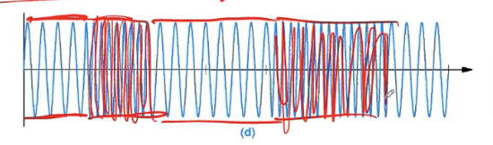
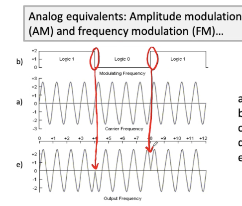

# 🧠🌐💻 Smart IoT Devices

###### 👨‍🏫 Prof. Niki Martinel - 📧 niki.martinel@uniud.it

###### Quando scrivi la mail, ricordati di inserire nell'oggetto della mail [SIoTD24]

##### ORARIO DELLE LEZIONI

| Giorno  | Orario        | Sede di Pordenone      | Sede di Udine                |
| ------- | ------------- | ---------------------- | ---------------------------- |
| Lunedì  | 13:45 - 17:30 | Aula L06 (In presenza) | Aula A018 (In teledidattica) |
| Giovedì | 09:00 - 12:15 | Aula L06 (In presenza) | Aula A018 (In teledidattica) |

#### ESAME FINALE

L'esame consisterà in un progetto a scelta, concordato preventivamente con il docente. L'esame prevede inoltre una presentazione orale del progetto e la consegna di un report scritto (massimo 3-4 pagine), da inviare almeno 5 giorni prima della data d'esame.

###### © 2024 | Appunti di [Pasquale Mazzullo](https://www.linkedin.com/in/pasqualemazzullo/) e [Giulia Martin](https://www.linkedin.com/in/martin-giulia/)

---

# Indice

1. [Lezione 1 - 01 Ottobre 2024](#lezione-1---01-ottobre-2024)
2. [Lezione 2 - 03 Ottobre 2024](#lezione-2---03-ottobre-2024)
3. [Lezione 3 - 08 Ottobre 2024](#lezione-3---08-ottobre-2024)
4. [Lezione 4 - 10 Ottobre 2024](#lezione-4---10-ottobre-2024)
5. [Lezione 5 - 15 Ottobre 2024](#lezione-5---15-ottobre-2024)
6. [Lezione 6 - 17 Ottobre 2024](#lezione-6---17-ottobre-2024)
7. [Lezione 7 - 22 Ottobre 2024](#lezione-7---22-ottobre-2024)

---

##### Lezione 1 - 01 Ottobre 2024

# IoT: concetti di base ed esempi

Uno Smart IoT Device è:

- Un dispositivo hardware tangibile dotato della capacità di **percepire l'ambiente attraverso sensori e di attuare azioni in risposta**, interagendo con il mondo fisico.
- **È interconnesso con altri dispositivi tramite una rete**, consentendo lo scambio di dati e misurazioni _(ad esempio, temperatura, umidità, ecc.)_.
- **Possiede un certo grado di autonomia**, che gli permette di eseguire operazioni intelligenti, come, ad esempio, inviare notifiche automaticamente.

Questi dispositivi, grazie agli **attuatori**, hanno la capacità di modificare il mondo fisico _(ad esempio, un distributore automatico di cibo per animali)_. Un comando digitale consente di influenzare direttamente il contesto fisico.

Quando parliamo di dispositivi IoT smart, i termini utilizzati sono spesso vaghi e sovrapponibili. In effetti, possiamo considerarli semplicemente come "oggetti" all'interno del concetto di "Internet of Things". È vero che i dispositivi smart possono non essere necessariamente connessi a Internet, ma oggi, nel 99% dei casi, quando ci riferiamo a oggetti intelligenti, pensiamo a dispositivi collegati in rete. Per questo motivo, è comune utilizzare il termine IoT.

# Elementi chiave dell'IoT

- **Sensori e attuatori**: I sensori, in particolare, sono dispositivi che consentono di rilevare, tradurre e raccogliere dati dall'ambiente.
- I **dati** raccolti vengono **condivisi tramite una rete**, che può essere Internet o una rete privata.
- **Algoritmi**: Questi processano i dati raccolti e, sulla base delle informazioni ottenute, si attivano per prendere decisioni in modo autonomo o con il supporto umano, rendendo il sistema "intelligente".

Il **dato** rappresenta il minimo comune denominatore, elemento fondamentale che connette tutte le componenti del sistema.

> ###### CURIOSITÀ DA SAPERE IN PIÙ
>
> "**Smart on the Edge**" si riferisce all'integrazione di intelligenza e capacità di elaborazione direttamente ai margini della rete, ovvero "edge". In altre parole, i dispositivi intelligenti (smart) che operano "on the edge" sono in grado di eseguire operazioni di calcolo e analisi dei dati vicino alla fonte dei dati stessi, senza dover inviare tutte le informazioni a un data center centrale o al cloud. Questa tecnologia **riduce la latenza**, **aumenta la reattività**, e **permette di gestire i dati in modo più efficiente**, **migliorando la sicurezza e la privacy**. Ad esempio, in una rete IoT, i dispositivi "smart on the edge" possono analizzare i dati localmente e prendere decisioni in tempo reale, senza attendere una risposta dal cloud. Un caso d'uso sono sicuramente le operazioni di monitoraggio ambientale o sicurezza in aree montane, in cui i dispositivi "smart" possono raccogliere e analizzare dati localmente, senza la necessità di un costante accesso a internet. In particolare nel monitoraggio valanghe, ci sono sensori posizionati su pendii o nei pressi di aree soggette a valanghe e possono raccogliere dati su temperatura, neve e pressione. Con l'approccio "Smart on the Edge", i dispositivi possono analizzare questi dati in tempo reale e inviare avvisi locali agli escursionisti o alle squadre di soccorso, senza bisogno di una connessione a un server centrale.

# I dispositivi

La parola "device" nel contesto degli Smart IoT Device si riferisce a qualsiasi strumento fisico, apparecchio o macchina (quindi parliamo di hardware) per interagire con il mondo esterno, raccogliere dati e operare in modo autonomo o semi-autonomo. Questi dispositivi possono variare ampiamente e includono:

- **Sensori**: dispositivi che rilevano dati ambientali, come temperatura, umidità, luce, movimento, e li trasmettono per l'analisi. Esistono un'infinità di sensori che vanno da quelli più comuni come il giroscopio incorporato in qualsiasi smartphone a quelli più specifici come quelli chimici che nell'ambito domestico generalmente vengono utilizzati per rilevare le scie di gas metano di fornelli lasciati accesi involontariamente.
- **Attuatori**: dispositivi che eseguono azioni fisiche, come aprire una valvola, accendere una luce o regolare la temperatura in risposta a comandi digitali. Anche qui, sono tantissimi e vengono usati in base all'obbiettivo del sistema da creare.

Il compito di questi dispositivi fisici è comunicare con un centro di elaborazione, il che richiede necessariamente l'accesso a una rete. Tale rete può essere di qualsiasi tipo e non deve necessariamente essere basata sul protocollo TCP/IP.

La prerogativa più importante di questi dispositivi è quella di essere **Low-power** / **Low-bandwidth**. Essi sono generalmente progettati per consumare poca energia e trasmettere una quantità limitata di dati al secondo. Ad esempio, nel caso di un campanello smart, non è necessario trasmettere video in 4K; al contrario, vengono prese decisioni mirate a ridurre il consumo di risorse, garantendo un utilizzo efficiente dell'energia e della larghezza di banda.

# Le reti

Nel contesto degli Smart IoT Devices, il termine **rete** si riferisce all'infrastruttura che consente la **comunicazione e lo scambio di dati** tra i dispositivi e altre entità, come server, cloud o altri dispositivi intelligenti. La rete permette ai dispositivi di **inviare e ricevere** informazioni in modo efficiente. La rete può assumere diverse forme, in base alle esigenze specifiche dell'applicazione IoT.

Innanzi tutto le reti si dividono in:

- **Rete cablata**: Si riferisce a una rete in cui i dispositivi sono fisicamente collegati tra loro tramite cavi, come i cavi **Ethernet**. Questo tipo di rete offre generalmente una connessione stabile, affidabile e ad alta velocità, ma richiede l'installazione fisica dei cavi.
- **Rete wireless**: In questo tipo di rete, i dispositivi comunicano senza fili utilizzando segnali radio, come **Wi-Fi**, **Bluetooth** o **reti cellulari (4G/5G)**. Le reti wireless offrono maggiore flessibilità e mobilità, ma possono essere più soggette a interferenze o perdita di segnale rispetto alle reti cablate.

Le reti, poi, possono essere distinte in base alla loro portata:

- **Range di comunicazione corto**: Indica una portata limitata per la trasmissione dei dati, tipicamente di pochi metri. Tecnologie come **Bluetooth** o **NFC** rientrano in questa categoria. Sono utilizzate per comunicazioni a breve distanza, come tra dispositivi indossabili o smartphone.
- **Range di comunicazione medio**: Si riferisce a distanze maggiori, solitamente fino a qualche centinaio di metri. Tecnologie come il **Wi-Fi** o **Zigbee** rientrano in questa fascia, utilizzate per connessioni in aree più ampie, come in abitazioni o uffici.
- **Range di comunicazione lungo**: Indica la capacità di coprire lunghe distanze, da diversi chilometri fino a decine di chilometri. Tecnologie come **LoRaWAN**, **NB-IoT** e **reti cellulari (4G/5G)** sono esempi di comunicazione a lungo raggio, utilizzate in ambienti come le smart cities o per monitoraggio remoto.

Infine, le reti sono progettate in base a determinati modelli. Tra i più importanti c'è l'**ISO/OSI**, riferimento concettuale che descrive come i dati vengono trasmessi tra dispositivi su una rete. Si compone di sette livelli, ciascuno con funzioni specifiche. I termini "**fisico**", "**rete**" e "**applicativo**" fanno riferimento a specifici livelli di questo modello:

- **Fisico** (Livello 1): Si occupa della trasmissione fisica dei dati, gestendo aspetti come i cavi, segnali elettrici o onde radio.
- **Rete** (Livello 3): Gestisce l'instradamento dei pacchetti di dati tra dispositivi in una rete o attraverso diverse reti. Qui intervengono protocolli come l'IP (Internet Protocol), che si occupa di decidere il percorso che i dati devono seguire per raggiungere la loro destinazione.
- **Applicativo** (Livello 7): Si trova al livello più alto del modello OSI e riguarda l'interazione diretta con le applicazioni software. Gestisce i protocolli di comunicazione che consentono agli utenti di inviare dati attraverso la rete, come HTTP (usato per il web), FTP (per il trasferimento di file), o SMTP (per la posta elettronica).

# I dati

I dati rappresentano una sfida crescente, poiché un numero sempre maggiore di dispositivi acquisisce informazioni e necessita di condividerle. Tuttavia, se gestiti e processati in modo intelligente, possono offrire alle aziende un vantaggio competitivo significativo, specialmente nell'ambito dei **Big Data**. Questi dati, spesso raccolti in tempo reale (come nel caso degli smartwatch), sono enormi: si stima che ammontino a circa **40 zettabyte**.

Questa mole di informazioni richiede reti sempre più performanti e soluzioni per l'archiviazione, come il **cloud**. Ma, soprattutto, diventa fondamentale il ruolo del **data analyst**, una figura professionale capace di tradurre la raccolta e l'analisi dei dati in valore economico, grazie alla capacità di interpretarli e visualizzarli in modo efficace.

# Un concetto, tanti nomi

Il termine **IoT** _(Internet of Things)_ è stato coniato da **Kevin Ashton** nel **1999**, mentre lavorava per **Procter & Gamble**, per descrivere una nuova idea legata alla supply chain della compagnia in relazione all'uso di Internet.

In realtà, in passato altre persone hanno utilizzato termini diversi per descrivere concetti simili:

- **Persuasive computing**
- **Ubiquitous computing**
- **Cyber-physical systems**

Più recentemente, è stato introdotto anche il termine "**Internet of Everything**", che però non ha ancora ottenuto una larga diffusione. Questo concetto si estende oltre l'Internet delle sole cose, includendo anche persone, dati e processi: qualunque elemento su cui si possano prendere decisioni. Non ci limitiamo più a dispositivi come frigoriferi o lavatrici, ma passiamo a un livello successivo di interconnessione e intelligenza distribuita.

# M2M

**M2M** _(Machine to Machine)_ indica una serie di situazioni in cui dispositivi comunicano direttamente tra loro. Tuttavia, questi dispositivi appartengono a gruppi omogenei, operano in reti molto ristrette e hanno un obiettivo specifico. Si tratta quindi di un sistema chiuso e limitato, in cui dispositivi dello stesso tipo scambiano informazioni tra loro.

> Un esempio di applicazione può essere una fabbrica, dove le macchine comunicano per coordinare i processi produttivi, o una serra, dove i sistemi di irrigazione e monitoraggio ambientale comunicano tra loro per regolare le condizioni in base alle specifiche esigenze di coltivazione nelle diverse aree. In questo contesto, i dispositivi creano una rete interna focalizzata su uno scopo comune.

# IoT: è totalmente una nuova tecnologia?

Il termine **IoT** _(Internet of Things)_ è semplicemente un nuovo nome per descrivere un insieme di tecnologie che esistono da tempo. I sensori, ad esempio, sono presenti da oltre 50 anni, Internet era già sviluppato, e il concetto di "smart" risale agli anni '80, quando si iniziava a studiare l'intelligenza artificiale e il machine learning.

Oggi, IoT rappresenta un framework in cui queste tecnologie, che un tempo operavano in modo indipendente, sono integrate in un unico contesto. Possiamo considerarlo come uno "stack" – almeno dal punto di vista concettuale – in cui abbiamo una visione chiara di come implementare soluzioni IoT, sfruttando la sinergia tra sensori, reti e software.

# Evoluzione dell'IoT: Business e Impatto sulla Società

1. **Connessione**: Il punto di partenza è la necessità di avere accesso al mondo digitale, attraverso strumenti come:

- Email
- Browser web
- Motori di ricerca

2. **Economia connessa**: La digitalizzazione dei processi aziendali diventa cruciale per il successo:

- E-commerce
- Digitalizzazione della supply chain
- Collaborazione digitale

3. **Esperienze immersive**: L'interazione digitale evolve con l'Internet of People, introducendo esperienze più profonde e coinvolgenti:

- Social network
- Mobilità digitale
- Soluzioni cloud
- Contenuti video

4. **Internet of Things**: La digitalizzazione si estende al mondo fisico, creando una moltitudine di Digital Twin che riproducono digitalmente oggetti e sistemi reali:

- Connessione delle persone
- Connessione dei processi
- Connessione dei dati
- Connessione degli oggetti

# IoT: uno scenario futuristico?

Il numero di persone che adottano dispositivi IoT è in costante crescita, seguendo un trend in rapida espansione. Si stima che entro il 2025 ci saranno circa 9 dispositivi IoT per persona, tutti impegnati a condividere dati e informazioni in tempo reale.

# IoT: un'opportunita di business

Dove esistono buchi nel mercato questi diventano opportunità di business, questo è strettamente correlato al numero di dispositivi che abbiamo per persona. Ognuno di questi vuole risolvere una mancanza nel mercato o risolvere un problema creatosi dall'utilizzo di un altro dispositivo.

---
##### Lezione 2 - 03 Ottobre 2024

# Sfide dell'IoT

1. **Scalabilità**: Il numero di dispositivi connessi continua a crescere rapidamente, creando una sfida significativa per la connettività, in quanto ciascun dispositivo deve essere identificato in modo univoco all'interno della rete. Nella maggior parte dei casi, la rete di riferimento è Internet, che utilizza prevalentemente indirizzi **IPv4**. Questo protocollo fornisce un indirizzo a **32 bit**, composto da quattro gruppi di numeri _(ad esempio, 0.0.0.0 - 255.255.255.255)_, permettendo di identificare un massimo di **2^32** dispositivi. Tuttavia, dato il tasso di crescita attuale dei dispositivi connessi, la disponibilità di indirizzi IPv4 risulta insufficiente. Per superare questo limite, vengono adottate soluzioni come l'uso di gateway o router domestici, che permettono di sfruttare gli indirizzi IPv4 anche nelle reti private, ampliando così il numero di dispositivi gestibili. A livello globale, per affrontare in maniera più strutturata il problema della scarsità di indirizzi pubblici, si è progressivamente introdotto il protocollo **IPv6**, che estende la capacità di identificazione fino a **2^128** dispositivi.

2. **Sicurezza**: Quando un numero elevato di dispositivi è connesso alla rete, aumenta proporzionalmente il rischio di violazioni della sicurezza. Di conseguenza, se un malintenzionato riesce a superare le barriere di protezione e accede a dati sensibili, incluse informazioni personali, le conseguenze possono essere gravi. È quindi fondamentale mantenere i dispositivi sempre aggiornati, in modo da correggere tempestivamente eventuali vulnerabilità rilevate. Tuttavia, aggiornare manualmente una flotta di dispositivi, soprattutto in contesti aziendali, può essere estremamente complesso e dispendioso in termini di tempo. Per facilitare questo processo, esistono **interfacce** che consentono di gestire centralmente gli aggiornamenti e la manutenzione di tutti i dispositivi da un'unica piattaforma, a condizione che questi siano **omogenei** e supportino tecnologie di comunicazione **M2M** _(machine-to-machine)_.
   
  > _Un fumetto che illustra il problema di un virus informatico che ha bloccato tutti i dispositivi connessi in casa. La storia evidenzia come un attacco informatico possa compromettere l'intera rete domestica, rendendo inutilizzabili dispositivi fondamentali come frigorifero, forno, e sistemi di sicurezza come campanello e videocamera di sorveglianza. Questo scenario mette in luce l'importanza di adottare adeguate misure di protezione, come aggiornamenti regolari del software e sistemi di sicurezza avanzati, per prevenire tali situazioni e garantire la continuità operativa della casa intelligente._

3. **Privacy**: In relazione al tema degli attacchi informatici, i dispositivi connessi sono sempre più integrati nelle nostre vite quotidiane e all'interno delle nostre abitazioni, il che aumenta il rischio di sorveglianza e violazioni della privacy. Ad esempio, un malintenzionato potrebbe monitorare quando non siamo in casa per compiere azioni dannose. Tuttavia, questi problemi riguardano anche i fornitori di servizi telefonici, i quali hanno accesso a informazioni sensibili come le nostre abitudini di acquisto e le attività di navigazione, dato che i nostri dispositivi sono costantemente connessi ai loro server.
   Un ulteriore rischio è rappresentato dai sistemi di videosorveglianza domestica acquistati "pronti all'uso", che spesso trasmettono i filmati prima ai server del produttore e poi ai nostri dispositivi. Ciò significa che i produttori stessi potrebbero potenzialmente avere accesso alle nostre registrazioni tramite i loro server. Dall'altro lato, esistono situazioni in cui la protezione della privacy è al centro del dibattito, come nel caso di Telegram, dove il fondatore si è rifiutato di fornire accesso ai dati criptati degli utenti al governo francese, poiché la piattaforma adotta la crittografia di default per tutelare la riservatezza delle comunicazioni.

4. **Big data**: La quantità di informazioni generate sta aumentando rapidamente, creando sfide per i canali di comunicazione, ossia la rete. Questo aumento del volume di dati rischia di generare colli di bottiglia, rendendo necessaria una velocità di trasmissione sempre maggiore per evitare che il flusso di dati congestionato intasi il canale. Poiché i dati provengono da fonti diverse e presentano formati eterogenei, è fondamentale uniformarli, ad esempio a livello di bit, per semplificare e ottimizzare la trasmissione.

5. **Interoperabilità**: In un contesto composto da dispositivi eterogenei, ognuno di essi ha modalità specifiche di trasmissione e ricezione delle informazioni, oltre a funzionare su architetture differenti. Questo rende complessa l'acquisizione e l'elaborazione di dati provenienti da dispositivi diversi. Per risolvere questo problema, è essenziale definire degli standard aperti e condivisi che permettano l'interoperabilità tra i vari sistemi.

6. **Mantenimento**: Anche l'aggiornamento dei dispositivi rappresenta una sfida significativa. È necessario installare tempestivamente gli ultimi sistemi operativi per risolvere vulnerabilità di sicurezza, ma molti dispositivi operano in luoghi remoti e funzionano a batteria. Pertanto, è fondamentale pianificare interventi preventivi e prevedere fonti di energia alternative. Inoltre, la rete stessa deve essere progettata per essere **resiliente**, in modo da garantire la continuità operativa anche in caso di guasti o interruzioni.

# IoT: campi di applicazione

- **Persone**: Dispositivi indossabili (wearable), automotive, case intelligenti (smart homes), e altre soluzioni per migliorare la qualità della vita quotidiana.
- **Business**: Applicazioni nel commercio, profilazione degli utenti, gestione dei magazzini, gestione dei processi aziendali e ottimizzazione delle operazioni.
- **Società**: Iniziative legate alle smart cities, medicina intelligente (smart medicine) e altre soluzioni per migliorare la qualità dei servizi pubblici e sanitari.

# Wearable

Esistono numerosi dispositivi indossabili, ma la loro comunicazione segue generalmente tre livelli principali:

1. Il sensore è applicato direttamente al corpo.
2. Una volta acquisiti i dati, questi vengono trasmessi tramite un dispositivo intermedio, come uno smartphone, utilizzando tecnologie come il Bluetooth Low Energy (BLE) attraverso un gateway.
3. Infine, lo smartphone si occupa di trasmettere e memorizzare i dati nel cloud.

Esistono anche soluzioni innovative, come i pannolini smart per bambini, o i dispositivi "beyond wearable", come i sensori sottocutanei, che monitorano dati relativi alla salute in tempo reale.

# Non solo agli umani

Tutta questa tecnologia sensoristica non si applica solo agli esseri umani, ma anche agli animali e persino alle piante. Ad esempio, è possibile monitorare il livello di acidità di un animale attraverso l'analisi dei suoni prodotti durante la masticazione, oppure utilizzare collari simili ai dispositivi Fitbit per analizzare i loro movimenti. Altri esempi includono il monitoraggio della qualità del latte e altre informazioni utili per migliorare la salute e il benessere degli animali.

# Smart Home (domotica, ambient intelligence, ...)

Le tecnologie per la smart home includono una vasta gamma di dispositivi e sensori che consentono la gestione autonoma e intelligente degli ambienti domestici, tra cui:

- Telecamere di sorveglianza
- Sistemi anti-intrusione
- Sensori di movimento
- Sensori di temperatura
- Sensori per l'accensione automatica delle luci
- Rilevatori di fumo
- ...
  Questi dispositivi permettono di prendere decisioni **autonome**, reagendo rapidamente a potenziali rischi e prevenendo disastri.

Oltre ai dispositivi di sicurezza, vi sono anche elettrodomestici intelligenti come:

- Frigoriferi smart
- Smart TV
- Lavatrici smart

Questi apparecchi offrono funzionalità avanzate per (teoricamente) migliorare l'efficienza energetica e il comfort quotidiano.

# Smart Vehicles

I veicoli moderni sono dotati di numerosi sensori avanzati, che permettono funzioni come il monitoraggio della fatica del conducente, la prevenzione delle collisioni, il controllo della pressione dei pneumatici, la guida autonoma e la visione a 360° dell'ambiente circostante.

Dal punto di vista della connettività, i veicoli non sono solo collegati al cloud, ma anche tra loro (vehicle-to-vehicle, V2V) e all'infrastruttura stradale, come semafori e altri sistemi (vehicle-to-infrastructure, V2I). Questa interconnessione permette ai veicoli di operare in modo coordinato, migliorando la sicurezza e l'efficienza del traffico e contribuendo alla gestione ottimale delle condizioni stradali.

> Così, tanto per dire, giusto per ristabilire le gerarchie: https://www.citynow.it/autostrada-salerno-reggio-calabria-prima-smart-road-italia/

# Industria

L'emergere dell'Internet delle Cose (IoT) ha dato vita alla cosiddetta Industria 4.0, caratterizzata dall'integrazione di tecnologie avanzate nei processi industriali.

Le tappe significative di questa evoluzione sono:

1. **1784**: Introduzione della macchina a vapore.
2. **1870**: Sviluppo della produzione di massa, con l'innovazione apportata da Ford.
3. **1969**: Inizio dell'automazione nei processi produttivi.
4. **Oggi**: Emergere dei sistemi ciber-fisici e dei digital twin, che consentono una gestione e un'ottimizzazione più efficiente delle operazioni industriali.

# Smart manufactoring

La produzione intelligente, o smart manufacturing, si riferisce all'uso di tecnologie avanzate per ottimizzare i processi produttivi e migliorare l'efficienza operativa. Analogamente, la **smart supply chain** si concentra sull'ottimizzazione della catena di approvvigionamento attraverso l'integrazione di soluzioni tecnologiche. Tra le principali applicazioni di questa strategia si annoverano:

- **Pianificazione della domanda**: Utilizzo di algoritmi e analisi dei dati per prevedere le esigenze di mercato e ottimizzare le scorte.
- **Monitoraggio della produzione**: Tracciamento in tempo reale delle fasi di produzione per garantire efficienza e qualità.
- **Distribuzione delle merci**: Ottimizzazione dei processi di distribuzione per migliorare la tempestività e l'affidabilità delle consegne.

>_Un esempio di tutto questo è il magazzino di Amazon, robotizzato e automatizzato._

# Smart shopping

Nel contesto dello **smart shopping**, l'uso di **proximity beacons** svolge un ruolo fondamentale nel **proximity marketing**. Questi dispositivi consentono di inviare messaggi e offerte personalizzate ai clienti quando si trovano nelle vicinanze di un punto vendita.

_Un esempio di tutto questo è Amazon Go, la tecnologia più avanzata del mondo per fare la spesa. Niente file, niente pagamento, niente commessi: basta prendere quello che serve e uscire._

> Ehm... in realtà non è andata proprio così. Poi se vogliamo chiamare "tecnologia smart" 1000 indiani che controllano quello che fanno le persone dalle telecamere è un altro discorso: https://www.businessinsider.com/amazons-just-walk-out-actually-1-000-people-in-india-2024-4

# Smart medicine

Grazie all'utilizzo dei dati raccolti dal corpo, la smart medicine consente di inviare notifiche ai medici e monitorare vari parametri di salute tramite app dedicate. Questo processo può avvenire attraverso diversi tipi di dispositivi, tra cui:

- **Dispositivi indossabili** (wearable), che tracciano attività fisiche e dati vitali.
- **Sensori sottocutanei**, che forniscono un monitoraggio continuo di specifici parametri di salute.
- **Pillole ingeribili dotate di sensori**, che possono monitorare il funzionamento del sistema gastrointestinale e fornire informazioni sui processi interni.

# Smart drones

I **droni intelligenti** stanno rivoluzionando diversi settori grazie alle loro capacità avanzate. Le principali applicazioni includono:

- **Consegna di pacchi**: Utilizzo di droni per il trasporto rapido e efficiente di merci.
- **Acquisizione di dati ambientali**: Monitoraggio delle condizioni ambientali, inclusi la qualità dell'aria e le variazioni climatiche.
- **Agricoltura**: Utilizzo di droni per monitorare le coltivazioni, valutare la salute delle piante e ottimizzare l'uso delle risorse.
- **Sorveglianza**: Impiego di droni per la sicurezza pubblica e la protezione di infrastrutture critiche.
- **Monitoraggio di aree pericolose**: Utilizzo di droni per esplorare zone ad alto rischio senza mettere in pericolo il personale.
- **Ricerca di persone scomparse**: Sfruttamento della tecnologia dei droni per supportare le operazioni di ricerca e soccorso in situazioni di emergenza.

# Smart cities

Un insieme di tecnologie intelligenti per migliorare la qualità della vita, ottimizzare il consumo energetico e aumentare l'efficienza dei servizi a livello cittadino.

Esempi di queste tecnologie includono:

- **Semafori intelligenti**: Ottimizzazione del flusso del traffico per ridurre congestionamenti e migliorare la sicurezza stradale.
- **Smart parking**: Sistemi che facilitano la ricerca di parcheggi disponibili, riducendo il tempo di attesa e le emissioni.
- **Illuminazione stradale intelligente**: Sistemi di illuminazione che ottimizzano il consumo energetico in base alle condizioni ambientali e al passaggio delle persone.
- **Governo intelligente**: Piattaforme che migliorano la comunicazione tra cittadini e amministrazioni, facilitando l'accesso ai servizi pubblici.
- **Sistema di trasporto pubblico intelligente**: Soluzioni per la gestione e l'ottimizzazione del trasporto pubblico, migliorando l'efficienza e la puntualità.
- **Monitoraggio ambientale intelligente**: Sistemi per la raccolta di dati ambientali in tempo reale, utili per la gestione della qualità dell'aria e delle risorse naturali.
- **Sistemi sanitari intelligenti**: Infrastrutture e servizi che utilizzano tecnologie avanzate per migliorare l'assistenza sanitaria e la gestione dei dati dei pazienti.
- ...

# Smart grids

Le **smart grids** rappresentano un'evoluzione nel sistema energetico, caratterizzata da cambiamenti strutturali resi possibili dall'adozione crescente di strumenti digitali. Queste reti intelligenti possono sia mantenere le loro dimensioni attuali che adattarsi a una struttura più decentralizzata.

In questo contesto, i piccoli privati cittadini non sono più semplici consumatori, ma diventano anche produttori di energia. Grazie all'installazione di pannelli solari e altre fonti di energia rinnovabile, possono generare energia in eccesso e scambiarla con i grandi distributori. Questo modello promuove una maggiore sostenibilità e resilienza nel settore energetico, facilitando l'integrazione delle energie rinnovabili nella rete elettrica.

# Networking Protocol Stacks

Una delle principali sfide nel sistema IoT è la gestione della rete. Pertanto, è fondamentale comprendere come trasmettere i dati raccolti dai sensori. Quali sono le tecnologie e le infrastrutture necessarie per comunicare efficacemente le informazioni acquisite?

Le **stack di protocolli di rete** giocano un ruolo cruciale in questo contesto, poiché definiscono le regole e le procedure per la trasmissione dei dati tra i dispositivi. È essenziale selezionare i protocolli più adatti, che possono variare a seconda delle esigenze specifiche dell'applicazione, come la larghezza di banda, la latenza e la sicurezza.

# Principali entità in un sistema di comunicazione

1. **Messaggio**: Il dato che viene trasmesso.
2. **Sorgente**: L'entità che desidera inviare il messaggio.
3. **Destinatario**: L'entità che intende ricevere il messaggio.
4. **Canale**: Il percorso attraverso il quale il messaggio viaggia.
5. **Protocollo**: Un insieme di regole che definisce come il messaggio deve essere trasmesso e ricevuto correttamente.

Questo processo è noto come **real data flow**. Tuttavia, è importante notare che il destinatario percepisce il messaggio come se fosse stato semplicemente ricevuto dalla sorgente. Ciò implica che il percorso che il messaggio compie può essere molto complesso. Ogni strato coinvolto in questo processo può interpretare le informazioni in modo diverso e potrebbe utilizzare linguaggi differenti, un fenomeno noto come **virtual data flow**.

# Reti di computer

La comunicazione nelle reti di computer e dispositivi è un compito complesso e presenta sfide significative. Ad esempio, per collegarsi al server di Esse3, è necessario connettersi prima al Wi-Fi, il quale è a sua volta collegato a un router. Questo router si connette all'infrastruttura pubblica e, dopo vari passaggi, si raggiunge il server di Esse3. È importante notare che se ci si connette tramite Ethernet all'università, il percorso di comunicazione sarà diverso rispetto a quello utilizzato a casa.

Inoltre, non si può trascurare l'importanza della banda: i dati non possono superare la capacità della banda disponibile.

Per gestire questa complessa rete di interconnessioni, è fondamentale standardizzare i protocolli di comunicazione tra i dispositivi. Uno degli standard più comuni in questo ambito è il modello **ISO/OSI**, che fornisce un framework per facilitare la comunicazione efficace e coerente tra diversi sistemi e tecnologie.

# Il modello ISO/OSI

Il modello **ISO/OSI** è stato sviluppato nel 1984 ed è un framework che si articola in sette livelli, ognuno dei quali rappresenta una specifica funzione da svolgere. Ogni livello deve seguire le regole e i protocolli appropriati per garantire una corretta trasmissione delle informazioni al livello successivo. La struttura del modello va dal **livello fisico** (1), che si occupa della trasmissione dei dati attraverso il supporto fisico, fino al **livello applicazione** (7), che gestisce le interazioni dirette con gli utenti e le applicazioni software.

# Principi del modello OSI

- **Identificare i livelli di astrazione dei dati**: Stabilire le diverse astrazioni che i dati possono assumere all'interno del sistema.
- **Raggruppare le funzionalità simili nello stesso livello**: Organizzare le funzionalità affini in uno stesso livello per semplificare la gestione e la comprensione.
- **Separare le funzionalità in diversi livelli con punti di minima interazione**: Creare una distinzione tra le funzionalità in modo da ridurre le interazioni tra livelli, facilitando l'isolamento e la modularità.
- **Consentire diverse implementazioni di un livello senza impattare sui livelli adiacenti**: Assicurare che le modifiche o le implementazioni in un livello non influenzino direttamente i livelli circostanti, promuovendo così la flessibilità.
- **Definire interazioni solo tra livelli adiacenti**: Stabilire che le comunicazioni e le interazioni avvengano unicamente tra livelli contigui, per mantenere un'architettura chiara e semplice.
  - Ogni livello utilizza il servizio del livello inferiore come una "**black box**": Ogni livello considera i servizi forniti dal livello sottostante come un'unità opaca, senza necessità di comprenderne i dettagli interni.

---
##### Lezione 3 - 08 Ottobre 2024

Nella lezione precedente abbiamo introdotto il modello ISO/OSI, un framework di riferimento che facilita la comunicazione tra sistemi e tecnologie diverse. Il modello è suddiviso in 7 livelli, ciascuno dei quali ha una funzione specifica.

Oggi approfondiremo il funzionamento di ogni singolo livello. È importante ricordare che il modello è progettato affinché **ogni livello comunichi solo con il livello immediatamente precedente e con quello successivo**, indipendentemente dalla direzione (dal livello superiore a quello inferiore o viceversa).

Inoltre, i livelli del modello possono essere raggruppati in base alla loro relazione con le unità di dati trattate:

- **Dati**
- **Segmenti**
- **Pacchetti**
- **Frame**
- **Bit**

> ###### SE NON CAPISCI BENE DI COSA STIAMO PARLANDO
>
> Per comprendere meglio la suddivisione dei vari livelli e di cosa si occupano, fare riferimento allo schema grafico ben progettato sopra.

# Livello 1: Fisico

Il livello fisico si occupa della trasmissione dei bit, ovvero simboli binari digitali che vengono rappresentati come segnali elettrici o ottici. Questi segnali possono assumere forme d'onda specifiche in base al mezzo utilizzato per la trasmissione. Essendo un livello fisico, richiede un supporto materiale attraverso il quale il segnale possa viaggiare.

Alcuni esempi di mezzi fisici sono:

- **Cavi in rame**: Materiale conduttivo che permette il passaggio dell’elettricità.
- **Fibra ottica**: Utilizza segnali luminosi per trasmettere dati su lunghe distanze con alta velocità e ridotta perdita di segnale.
- **Onde elettromagnetiche**: Consentono la trasmissione senza fili, eliminando la necessità di installare cavi.

Il ruolo principale del livello fisico è definire:

1. **Come il segnale viene trasmesso da un punto A a un punto B**: Questo include specifiche come la velocità di trasmissione e le caratteristiche del mezzo (ad esempio, la resistenza del cavo o la capacità di trasportare dati).
2. **La codifica dei bit**: Determina come i bit vengono rappresentati fisicamente, ad esempio attraverso:

   - Il **voltaggio** del segnale
   - La **lunghezza degli impulsi elettrici**
   - Altri parametri come la frequenza e l'ampiezza del segnale.

In sintesi, il livello fisico stabilisce una relazione tra la **tensione elettrica** e il **periodo di tempo** per trasmettere i singoli bit. Le caratteristiche della trasmissione (come velocità e ampiezza) dipendono dal tipo di mezzo utilizzato.

# Livello 2: Data Link

Il livello Data Link opera su **sequenze di bit** anziché su singoli bit, e il suo obiettivo principale è garantire che la comunicazione tra nodi vicini avvenga senza errori. Questo livello implementa meccanismi per rilevare e correggere eventuali errori nella trasmissione dei dati.

Ecco come funziona:

1. **Error Detection e Error Correction**:
   Il livello Data Link utilizza algoritmi e procedure progettati per individuare e correggere errori nei dati trasmessi. Sistemi come il **bit di parità** o altre tecniche permettono di verificare se il messaggio ricevuto è corretto. Alcuni algoritmi sono in grado non solo di rilevare errori, ma anche di correggerli autonomamente. L'efficacia di questo processo dipende dalla robustezza dell'algoritmo utilizzato.

2. **Inizio e fine del frame**:
   Quando una sequenza binaria viene trasmessa attraverso il mezzo fisico, arriva come un flusso continuo. Per gestire la rilevazione e correzione degli errori, il livello Data Link deve sapere dove iniziano e finiscono i dati da elaborare. Questo livello aggiunge quindi **informazioni di intestazione** (header) per marcare l'inizio e la fine di un frame, ossia un'unità di dati trasmessa. Anche se aggiungere queste informazioni occupa banda e aumenta la dimensione complessiva dei bit, è essenziale per garantire la corretta gestione della trasmissione.

3. **Efficienza della trasmissione**:
   L'obiettivo è minimizzare l'intestazione aggiuntiva al fine di ridurre il peso complessivo della trasmissione, rendendo il processo il più efficiente possibile. Tuttavia, un'intestazione è necessaria per consentire la corretta gestione dei dati e la rilevazione degli errori.

4. **Sottolivelli del Data Link**:
   In alcuni casi, il livello Data Link viene suddiviso in due sottolivelli:

   - **MAC (Media Access Control)**: Gestisce l'accesso al mezzo di trasmissione.
   - **LLC (Logical Link Control)**: Gestisce la comunicazione logica tra i dispositivi.

   Questi sottolivelli saranno trattati più nel dettaglio quando si approfondirà il funzionamento delle reti e delle tecniche di comunicazione.

# Livello 3: Rete

Nel livello di rete, le sequenze di bit (frames) vengono aggregate in unità più grandi chiamate **pacchetti**. Questo livello è fondamentale perché si occupa delle procedure di **routing**, ovvero dell'instradamento dei pacchetti dalla sorgente alla destinazione.

Funzioni principali del livello di rete:

1. **Instradamento dei pacchetti (Routing)**:
   Il livello di rete decide il percorso migliore che ogni pacchetto deve seguire per raggiungere la destinazione, in base allo stato attuale della rete. Ad esempio, se un dispositivo "A" deve comunicare con un dispositivo "B", spesso non esiste un collegamento diretto tra i due. Al contrario, i dati devono passare attraverso diversi nodi intermedi (come router e altri dispositivi di rete). Il livello di rete determina la strada migliore per far viaggiare il pacchetto in modo efficiente.
2. **Tabelle di routing**:
   I nodi della rete (router, switch, ecc.) scambiano tra loro informazioni sul tempo necessario per raggiungere altri nodi. Queste informazioni vengono organizzate nelle **tabelle di routing**, che memorizzano i percorsi disponibili e le metriche associate, come la velocità o il carico del percorso. Grazie a queste tabelle, il livello di rete può selezionare il percorso più ottimale per ogni pacchetto.
3. **Gestione delle alternative**:
   Se il percorso migliore risulta non disponibile (ad esempio, a causa di un guasto o di congestione), il livello di rete è in grado di **reinstradare** i pacchetti su percorsi alternativi. Questo garantisce la continuità della comunicazione anche in caso di problemi o interruzioni sulla rete.

# Livello 4: Trasporto

Il livello di trasporto aggrega più pacchetti in **segmenti** e gestisce la comunicazione tra dispositivi, astrattosi dai livelli inferiori che si occupano degli aspetti fisici della rete. Le sue funzioni principali includono l'apertura e la chiusura delle connessioni, la gestione degli errori, e l'ordine dei dati ricevuti.

Funzioni chiave del livello di trasporto:

1. **Apertura e chiusura delle connessioni**:
   Prima che due dispositivi possano comunicare, il livello di trasporto apre un canale di comunicazione. Una volta completata la trasmissione dei dati, si occupa di chiudere la connessione in modo ordinato.

2. **Gestione degli errori**:
   Il livello di trasporto è in grado di rilevare e correggere alcuni errori che possono verificarsi durante la trasmissione. Ciò include la gestione della **duplicazione** e il **riordino** dei segmenti ricevuti.

3. **Gestione dell'ordine dei segmenti**:
   I pacchetti possono viaggiare su strade diverse attraverso la rete e arrivare fuori ordine. Il livello di trasporto è responsabile di riorganizzarli nell'ordine corretto. Ogni segmento contiene un'informazione di ordinamento che permette di ricostruire i dati nella sequenza giusta, in modo che l'utente riceva il messaggio esattamente nell'ordine in cui è stato inviato.

4. **Gestione della duplicazione dei segmenti**:
   Quando un segmento viene inviato, se non si riceve la conferma della sua consegna entro un certo periodo, il mittente può decidere di rinviarlo. Tuttavia, il ritardo nella ricezione della conferma potrebbe essere dovuto a un semplice rallentamento della rete, e non a un effettivo fallimento nella consegna. Il livello di trasporto gestisce questa situazione per evitare la duplicazione dei dati, riconoscendo quando un segmento è stato inviato più volte e garantendo che l'utente riceva ogni segmento una sola volta.

# Livello 5: Sessione

Il livello di sessione gestisce l'apertura, la chiusura e il mantenimento di una **sessione** tra due nodi, ovvero tra due dispositivi che comunicano. Una sessione può essere vista come una connessione temporanea che rimane attiva fino a quando il messaggio completo non è stato trasmesso e ricevuto. Durante la comunicazione, il livello di sessione garantisce che la connessione rimanga stabile, e in caso di interruzioni, permette di **ripristinare** la sessione senza dover ricominciare da capo.

Un esempio comune è una **telefonata**: la sessione viene avviata all'inizio della conversazione e chiusa solo quando tutte le informazioni sono state scambiate e la comunicazione è terminata. Se nel mentre il segnale "non prende", la sessione cerca continuamente di ripristinare la comunicazione senza interrompere la telefonata e nel momento in cui si riaggancia al segnale, si può riprendere a comunicare.

# Livello 6: Presentazione

Il livello di presentazione ha il compito di definire il **formato dei dati** e di gestire le **conversioni tra diversi tipi di dati**. Questo livello assicura che i dati inviati da un nodo siano comprensibili dal nodo ricevente, indipendentemente dal formato originale.

Funzioni principali del livello di presentazione:

1. **Definizione e negoziazione del formato dei dati**:
   Prima di inviare i dati, il livello di presentazione stabilisce la **struttura** dei dati, come un **documento di testo**, una **pagina web**, un **audio** o altro. Poiché ogni tipo di dato ha una struttura differente, è necessario negoziare e convertire questi dati in un formato standard che possa essere compreso dai livelli inferiori e dal destinatario. Questo processo di conversione permette di tradurre i dati in un formato comprensibile per il ricevente, che a sua volta li convertirà nel formato originale.

2. **Conversione dei tipi di dati**:
   Il livello di presentazione si occupa della **conversione** tra diversi formati di dati, in modo che il messaggio possa essere correttamente interpretato e gestito dal destinatario.

3. **Crittografia dei dati**:
   Un’altra funzione importante del livello di presentazione è la **crittografia**, che serve a proteggere i dati durante la trasmissione. La crittografia rende i messaggi difficilmente leggibili da terzi, garantendo così la riservatezza delle informazioni trasmesse sulla rete.

# Livello 7: Applicazione

Il livello di applicazione è l'interfaccia tra l'utente e il sistema di comunicazione. Include le **applicazioni** che usiamo per inviare e ricevere messaggi, come i programmi di posta elettronica, browser web, o altre applicazioni di rete. Questo livello fornisce sia i **servizi** necessari per la comunicazione, sia i **protocolli** che garantiscono il corretto funzionamento dei servizi.

Funzioni principali del livello di applicazione:

1. **Interfaccia utente**:
   È il livello con cui l'utente interagisce direttamente. Quando usiamo un'applicazione (ad esempio, un programma di posta elettronica per inviare una mail), tutto ciò che avviene nei livelli sottostanti dell'OSI è trasparente per noi. L'utente non vede i dettagli tecnici della trasmissione, poiché tutto è gestito automaticamente dai livelli più bassi del modello OSI.

2. **Trasparenza della complessità della comunicazione**:
   Sebbene sembri che la comunicazione avvenga da **applicazione a applicazione**, sotto il livello di applicazione c'è una struttura complessa composta dai vari livelli del modello OSI, che si occupano della trasmissione effettiva dei dati. Quando, ad esempio, un professore invia un'email a tutti gli studenti, questa attraversa vari **nodi intermedi** (come il router di casa), passando attraverso i livelli fisico, data link, e rete. Questi livelli gestiscono e instradano i dati affinché raggiungano la destinazione correttamente.

>### Esempio pratico
>Quando un utente invia un'email, l'informazione viene convertita in segnali elettrici binari che viaggiano attraverso la rete. I nodi intermedi (come i router) e i vari livelli del modello OSI lavorano insieme per far sì che l'email raggiunga la sua destinazione. Solo il destinatario finale, che ha aperto la sessione con il mittente, è in grado di **ricevere** e **ricostruire** correttamente il messaggio.

# Il modello TCP/IP

Il modello **TCP/IP** è quello che utilizziamo quando comunichiamo attraverso la rete Internet. Il termine "IP" sta per **Internet Protocol**, e tutto ciò che viaggia su Internet viene trasmesso sotto forma di **pacchetti IP**. A differenza del modello OSI, che è una struttura teorica, il modello TCP/IP è una sua implementazione pratica, utilizzata per far comunicare i dispositivi reali.

Funzioni principali del modello TCP/IP:

1. **Pacchetti IP**:
   Ogni dato inviato attraverso Internet viene suddiviso in pacchetti IP, che viaggiano attraverso la rete per raggiungere la destinazione. Questi pacchetti contengono le informazioni necessarie per instradare i dati da un dispositivo a un altro.

2. **Differenze rispetto al modello ISO/OSI**:
   Mentre il modello **ISO/OSI** definisce in maniera teorica **sette livelli** di comunicazione, il modello **TCP/IP** implementa questi concetti in un contesto reale. Non segue alla lettera la struttura a sette livelli del modello OSI, ma la semplifica e la adatta alle esigenze pratiche di Internet, concentrandosi sull'efficienza della trasmissione.

3. **Implementazione reale**:
   Il TCP/IP si occupa concretamente di mettere in comunicazione le varie **macchine** collegate alla rete, definendo come i pacchetti devono essere formati, trasmessi e ricevuti, per garantire che i dati arrivino correttamente alla destinazione.

# L'archiettura del TCP/IP

1. **Network Interface**: Il livello di **Network Interface** (interfaccia di rete) non è propriamente parte dell'architettura TCP/IP, ma si occupa delle funzioni corrispondenti ai **livelli fisico e data link** del modello OSI. Questo livello si basa su altre tecnologie per trasmettere i pacchetti di dati attraverso il mezzo fisico. Esempi di tecnologie di trasmissione sono **Ethernet**, **Wi-Fi**, e altre forme di connessione di rete. Per questi motivi, il livello Network Interface **non gestisce direttamente errori** e non si occupa della protezione dei dati. Questi aspetti sono delegati ai livelli inferiori (come il livello data link) o ad altre tecnologie che si occupano di garantire l'integrità della trasmissione.

2. **Internet Layer**: Il livello **Internet Layer** è quello in cui viene implementata la componente **IP** (Internet Protocol). Questo livello si occupa principalmente di **instradare** e **trasmettere** i pacchetti di dati attraverso la rete. Caratteristiche principali del livello Internet Layer:

   1. **Funzione di instradamento**: Il livello Internet gestisce il percorso che i pacchetti devono seguire per raggiungere la loro destinazione, garantendo che arrivino correttamente anche se devono attraversare più reti.
   2. **Indirizzo IP**: A differenza del **network layer** del modello OSI, il livello Internet introduce l'**indirizzo IP**, che è un identificatore univoco per ogni dispositivo connesso a Internet. Questo indirizzo consente di identificare e raggiungere specifiche macchine sulla rete.
   3. **Struttura dell'indirizzo IP**: Gli indirizzi IP sono composti da quattro gruppi di numeri, ciascuno dei quali varia da 0 a 255. Ogni gruppo rappresenta **8 bit**, per un totale di **32 bit** nell'indirizzo IP (nella versione IPv4). Ad esempio, un indirizzo IP può apparire come 192.168.1.1.
   4. **Identificazione univoca**: L'indirizzo IP consente di identificare in modo univoco i dispositivi sulla rete. Quando un dispositivo è connesso a un router o a un hotspot, riceve un indirizzo IP che lo distingue dagli altri dispositivi.
   5. **Variabilità della connessione**: La situazione cambia quando ci si connette a reti diverse, come il **router di casa** o un **hotspot SIM**.

3. **Transport Layer**: Se prima abbiamo parlato della componente "IP" del TCP/IP, in questo livello vediamo la componente "TCP". Il **Transmission Control Protocol** (TCP) è un componente fondamentale del modello TCP/IP. La sua funzione principale è quella di **controllare e gestire le connessioni** tra una sorgente e un destinatario, assicurando che la comunicazione avvenga in modo affidabile. Caratteristiche principali del TCP:

   1. **Identificazione della connessione**: Ogni connessione è identificata da un **indirizzo IP** e da una **porta** (o "porto"). La porta è un numero che consente di distinguere i diversi servizi e applicazioni che possono comunicare tramite lo stesso indirizzo IP.
   2. **Funzione delle porte**: Le porte consentono a più servizi di utilizzare lo stesso indirizzo IP per comunicare simultaneamente. Ad esempio, se un dispositivo A vuole comunicare con un dispositivo B e contemporaneamente con un dispositivo C, deve utilizzare porte diverse per ciascun servizio:

      - **Porta 80**: utilizzata per il traffico web tramite HTTP (HyperText Transfer Protocol).
      - **Porta 443**: utilizzata per il traffico web sicuro tramite HTTPS (HTTP Secure).
      - **Porta 22**: utilizzata per l'accesso remoto (SSH).
      - **Porta 25**: utilizzata per i client di posta (SMTP).
       

      >### Esempio pratico 
      >Immagina di avere tre dispositivi: A, B e C, ciascuno con il proprio indirizzo IP. Se A sta guardando un film in streaming (utilizzando la porta 80 per comunicare con il server) e contemporaneamente usa WhatsApp (che utilizza la porta 401), il TCP gestisce queste connessioni in modo che non ci siano conflitti. Grazie alle porte, A può comunicare con entrambi i servizi senza problemi.

   3. **Standard delle porte**: Sebbene ogni numero di porta possa essere utilizzato per qualsiasi tipo di servizio, esistono degli **standard** per semplificare la comunicazione. Questi standard consentono di evitare di dover definire ogni volta la porta da utilizzare per un determinato servizio, facilitando così la connessione tra i dispositivi.

4. **Application Layer**: Il **livello di applicazione** è l'ultimo strato del modello TCP/IP e raggruppa le funzioni corrispondenti ai livelli di **applicazione**, **presentazione** e **sessione** del modello OSI. Questo livello ha un ruolo cruciale nella definizione dei protocolli specifici da utilizzare per ciascuna applicazione. Caratteristiche principali del livello Application Layer:
   1. **Integrazione di vari livelli**: Il livello di applicazione combina le funzioni dei livelli di applicazione, presentazione e sessione dell'OSI. Questo significa che si occupa sia della presentazione dei dati sia della gestione delle sessioni di comunicazione tra le applicazioni.
   2. **Definizione dei protocolli**: Questo livello stabilisce quali protocolli devono essere utilizzati per le diverse applicazioni. Ad esempio, quando si desidera accedere a una pagina web, il livello di applicazione indica di utilizzare la **porta 80** per il protocollo **HTTP**. Invece, per il trasferimento di file, si utilizza la **porta 21** con il protocollo **FTP** (File Transfer Protocol).

      

     >### Esempi di URL
     > Per facilitare l'accesso ai servizi, gli utenti possono utilizzare URI (Uniform Resource Identifier) che specificano il protocollo e la risorsa desiderata. Alcuni esempi includono `http://uniud.it/cmti.html/`, dove **http://** indica l'uso del protocollo HTTP per accedere a una pagina web e `ftp://uniud.it/`, dove **ftp://** specifica l'uso del protocollo FTP per accedere a file su un server, con porta 21 per il trasferimento dei file.
   3. **Facilitazione della comunicazione**: Poiché i dettagli relativi ai livelli inferiori (come le porte e i protocolli) sono gestiti dal livello di applicazione, gli utenti possono comunicare senza doversi preoccupare delle complessità sottostanti.

# TCP vs UDP

Nell'immagine soprastante vediamo come al livello "Trasporto", i protocolli e i servizi utilizzati nella comunicazione possono essere di due tipi: **TCP** o **UDP**. Quali sono le differenze?

- **TCP (Transmission Control Protocol)** è un protocollo orientato alla connessione e garantisce che i dati vengano ricevuti in modo affidabile. **Se un pacchetto viene perso durante il trasferimento, TCP provvede alla sua ritrasmissione**. A causa dei controlli di affidabilità e sequenziamento, TCP tende a essere più lento rispetto a UDP. È più adatto per applicazioni in cui l'affidabilità è fondamentale, come il trasferimento di file, la navigazione web e le comunicazioni via e-mail.
- **UDP (User Datagram Protocol)** è un protocollo non orientato alla connessione e non garantisce l'affidabilità della trasmissione. Non ci sono meccanismi integrati per la ritrasmissione dei pacchetti persi. UDP è generalmente più veloce rispetto a TCP, poiché non ha bisogno di gestire la connessione e i controlli di affidabilità. È ideale per applicazioni in tempo reale dove la velocità è più importante dell'affidabilità, come lo streaming video, i giochi online e le chiamate VoIP.

>### Esempio di comunicazione

# DNS (Domain Name System)

Il **DNS** (Domain Name System) è un sistema fondamentale per il funzionamento di Internet, che consente di tradurre i nomi di dominio in indirizzi IP. È essenzialmente un sistema di traduzione che converte i nomi di dominio, come www.esempio.com, in indirizzi IP numerici, come **152.0.2.1**. Questo è necessario perché i computer e i dispositivi sulla rete comunicano tra loro utilizzando indirizzi IP, mentre gli utenti tendono a ricordare nomi di dominio più facilmente.

Quando un utente digita un nome di dominio nel browser, il computer invia una richiesta a un **server DNS** per ottenere l'indirizzo IP corrispondente. Questo processo può coinvolgere diversi server DNS, a seconda di dove sono memorizzate le informazioni.

> ###### FUN FACT
>
> Il server DNS di Google è all'indirizzo 8.8.8.8. Puoi utilizzarlo andandolo a specificare nelle impostazioni di rete del tuo dispositivo.

# Architettura di rete dei sistemi IoT

### Differenze tra le reti tradizionali e quelle per i servizi IoT

Nell'analizzare l'architettura di rete, è fondamentale distinguere tra le reti tradizionali e quelle dedicate ai servizi IoT (Internet of Things). Ecco le principali differenze:

## Reti Tradizionali

1. **Struttura di rete**:

   - Le reti tradizionali sono tipicamente strutturate attorno a una separazione chiara tra la rete locale (LAN) e il cloud.
   - Questa architettura comprende vari componenti, tra cui **firewall**, **server** e **zone demilitarizzate (DMZ)**.

2. **Ruolo del Firewall**:

   - Il firewall è un elemento cruciale in queste reti.
   - Si trova tra la rete locale e il cloud e ha la funzione di impedire accessi non autorizzati.
   - La comunicazione inizia dalla rete domestica, passando attraverso il firewall interno, per poi raggiungere i server nella DMZ.
   - Questi server comunicano con il firewall esterno, che infine si collega al cloud.

3. **Applicazioni**:

   - Questa architettura è adatta per servizi orientati all'utente, come email, web e database. La sicurezza è una priorità, dato che questi servizi gestiscono dati sensibili e interazioni umane.

## Reti IoT

1. **Struttura di rete**:

   - Le reti IoT presentano una struttura molto più ristretta e semplificata.
   - Qui, la comunicazione avviene principalmente tra dispositivi (macchine) piuttosto che tra utenti e servizi.

2. **Comunicazione tra dispositivi**:

   - Nei sistemi IoT, i dispositivi possono comunicare direttamente tra loro utilizzando vari protocolli, servizi e porte, a seconda delle necessità specifiche.
   - Poiché si tratta di comunicazioni tra macchine, la configurazione del sistema diventa più flessibile.

3. **Flessibilità**:

   - Questo approccio consente di scegliere le tecnologie e i protocolli più adatti al caso specifico, consentendo una maggiore efficienza e ottimizzazione della rete.
   - Una volta configurati correttamente, i dispositivi IoT possono comunicare senza necessità di interventi costanti o monitoraggi intensivi.

4. **Considerazioni di Sicurezza**:

   - Sebbene la configurazione possa sembrare più semplice, la sicurezza rimane una preoccupazione, specialmente in scenari in cui molti dispositivi sono connessi e potrebbero essere vulnerabili ad attacchi esterni.
   - La protezione dei dati e delle comunicazioni tra i dispositivi IoT è essenziale, anche se il modello operativo è diverso rispetto alle reti tradizionali.

# Problemi nell'architettura di rete dei sistemi IoT

### Scala

- In una rete tradizionale, possiamo trovare **centinaia di dispositivi**, come laptop, server e stampanti, che devono comunicare con l'esterno. Questi dispositivi sono solitamente gestiti in modo centralizzato e utilizzano indirizzi IP per identificarsi e comunicare.
- Le reti IoT, al contrario, possono contenere potenzialmente milioni di dispositivi connessi, tutti all'interno della stessa rete. Questo aumento esponenziale di dispositivi presenta delle sfide uniche in termini di gestione e comunicazione. Per affrontare la crescita delle reti IoT, è necessario estendere le reti standard. Una delle principali problematiche da considerare è quella degli indirizzi IP. Anche se operiamo in una sottorete, c'è il rischio che gli indirizzi IP disponibili possano esaurirsi. Attualmente, molte reti utilizzano IPv4, che ha un numero limitato di indirizzi disponibili. Con l'espansione delle reti IoT, la necessità di nuovi indirizzi IP diventa sempre più urgente. Per risolvere questo problema, è fondamentale passare da IPv4 a IPv6, che offre un numero significativamente maggiore di indirizzi disponibili. Le reti IoT richiederanno pertanto un protocollo IP differente, come l'**IPv6**, per garantire la scalabilità e gestire l'elevato numero di dispositivi connessi.

### Sicurezza

- Nelle reti tradizionali, i **firewall** svolgono un ruolo fondamentale nella protezione contro le intrusioni. Questi sistemi di sicurezza sono progettati per proteggere una gamma specifica di dispositivi, che tendono ad essere omogenei. Ad esempio, i computer in una rete tradizionale sono spesso simili tra loro, operando su pochi sistemi operativi principali. Questo consente ai firewall di essere più efficaci nella gestione della sicurezza, poiché possono applicare regole standardizzate.
- Al contrario, le reti IoT presentano una varietà molto maggiore di dispositivi. Ogni dispositivo può essere diverso, non solo nel design fisico ma anche nei sistemi operativi e nelle specifiche tecniche. Questa eterogeneità rende difficile l'applicazione di misure di sicurezza uniformi. Inoltre, molti dispositivi IoT **non sono protetti** da firewall, poiché si collegano **direttamente alla rete**. La maggior parte dei dispositivi IoT comunica in **modalità wireless**, che è nota per essere più vulnerabile rispetto alla comunicazione via cavo. Questa maggiore esposizione alle minacce aumenta il rischio di attacchi informatici.

  

> Esempio di come degli Hacker sono riusciti a controllare una Jeep Cherokee via internet a 110km/h portandola fuori strada. L'articolo completo e il servizio video realizzato da Wired è disponibile a questo link: https://www.wired.com/2015/07/hackers-remotely-kill-jeep-highway/

### Dispositivi e rete limitati

- I dispositivi nelle reti tradizionali, come computer e server, dispongono di abbondante energia e potenza di calcolo. Questo consente loro di gestire grandi quantità di dati e di effettuare operazioni complesse senza particolari limitazioni. Inoltre, nelle reti tradizionali, il trasferimento di dati può permettersi ritardi, come ad esempio il buffering di un film, che può richiedere anche un minuto senza compromettere l'esperienza d'uso.
- Al contrario, i dispositivi IoT hanno caratteristiche molto diverse. Pur inviando dati ad **alta frequenza**, questi dati sono generalmente di **piccole dimensioni**. Anche se la quantità di dati complessiva è elevata, ogni singolo invio è ridotto. Una caratteristica importante delle reti IoT è la necessità di trasmettere questi piccoli dati in tempo reale. Il ritardo, anche minimo, potrebbe compromettere la funzionalità del dispositivo o del servizio. Inoltre, essendo spesso dispositivi di piccole dimensioni, possono avere **capacità di connettività limitate** o non particolarmente performanti, il che può influire negativamente sulla velocità e l'affidabilità della comunicazione.

# Una possibile standardizzazione dell'architettura IoT

Nel 2014, l'**IoT World Forum (IoTWF)** ha introdotto un modello a 7 livelli progettato per adattare le reti IoT, che ha alcune somiglianze con lo stack ISO/OSI ma che presenta differenze significative. Questo modello è stato creato per soddisfare le esigenze specifiche delle reti IoT, che differiscono dalle reti tradizionali in termini di architettura e funzionalità.

Anche se ci sono alcune similitudini con i livelli dell'ISO/OSI, il modello IoTWF non replica esattamente lo stesso approccio. L'obiettivo del modello a 7 livelli è fornire una struttura adattabile per lo sviluppo di reti IoT, consentendo la gestione efficiente di miliardi di dispositivi interconnessi e dei loro dati.

I 7 livelli sono:

1. **Dispositivi fisici e controller** (The "things" in IoT): sensori, webcam, attuatori, microcontrollori, ...
2. **Connettività** (Unità di Comunicazione ed Elaborazione): in questo livello praticamente abbiamo l'applicazione dell'ISO/OSI per mettere in comunicazione i vari dispositivi tra di loro. Possiamo pensare che sia l'insieme dei livelli Fisico / Data Link, Rete / Trasporto, Applicazione.
3. **Edge Computing** o **Fog Computing** (Analisi e trasformazione dei dati): rappresentano soluzioni per l'elaborazione e la gestione dei dati direttamente vicino ai dispositivi che li generano, riducendo la necessità di inviare grandi quantità di informazioni ai livelli superiori della rete, come il cloud. In pratica, nodi specifici della rete (ad esempio gateway o dispositivi intermedi) effettuano una serie di operazioni di elaborazione dei dati, riducendo il volume complessivo delle informazioni da inviare. Questo è utile per ottimizzare le risorse della rete e ridurre i tempi di latenza. Le operazioni di riduzione dei dati sono **Filtraggio**, **Aggregazione** e **Pre-elaborazione dei Dati**. Queste operazioni vengono effettuate per ridurre la quantità di dati che devono essere trasmessi ai livelli superiori. Ad esempio, un sensore che rileva dati a 10 Hz potrebbe inviare solo un dato al secondo (1 Hz) dopo un processo di filtraggio, poiché non è necessario inviare tutte le misurazioni ad alta frequenza.
4. **Data Accumulation** (Storage): generalmente parliamo di cloud e database in cui immagazzinare tutti i dati rilevati al fine di poterli manipolare in seguito. Ad esempio, per fare statistiche e grafici su una determinata condizione.
5. **Data Abstraction** (Aggregazione e Accesso): vista l'eterogeneità della struttura IoT composta da dispositivi completamente diversi tra di loro, in questo livello vengono uniformati tutti i dati al fine di poterli inviare al livello successivo per poterli analizzare.
6. **Applicazione** (Reporting, Analisi, Controllo): a questo punto, sono in grado di monitorare e controllare quello che i dispositivi rilevano tramite un'interfaccia grafica e riesco a fare Data Analysis.
7. **Collaborazione e Processi** (che coinvolgono persone e processi aziendali): alla fine l'uomo riesce ad utilizzare tutti questi dati in ottica di business o in ottica di qualsiasi altro obiettivo che si è prefissato. È qui che l'uomo prende decisioni su come utilizzare queste informazioni. Possiamo anche dire che parliamo di "Human Level", forse, ancora per poco e che presto potremmo definirlo "AI Level".

# Un'archiettura IoT semplificata

Nel libro di testo “**IoT Fundamentals – Networking Technologies, Protocols, and Use Cases for the Internet of Things**” di D. Hanes, G. Salgueiro, P. Grossetete, R. Barton e J. Henry, pubblicato da Cisco Press nel 2017, viene presentato un framework IoT progettato per evidenziare i blocchi di costruzione fondamentali comuni alla maggior parte dei sistemi IoT. Questo framework ha l'obiettivo di facilitare la progettazione di reti IoT.

### Struttura del Framework

Il framework è organizzato in **due stack paralleli**:

1. **Core IoT Functional Stack**: Questo stack include le funzioni fondamentali che abilitano la comunicazione e l'interoperabilità tra i diversi componenti di un sistema IoT.
2. **IoT Data Management and Compute Stack**: Questo stack si concentra sulla gestione dei dati e sulle capacità computazionali necessarie per elaborare e analizzare le informazioni generate dai dispositivi IoT.

### Vantaggio della Semplificazione dell'Architettura

Ridurre il framework a una coppia di stack a tre livelli non implica che il modello manchi dei dettagli necessari per sviluppare strategie IoT sofisticate. Al contrario, l'obiettivo è semplificare l'architettura IoT nei suoi elementi di base, utilizzandoli come fondamento per comprendere i principi chiave di progettazione e implementazione. Questi principi possono quindi essere applicati a casi d'uso specifici del settore, consentendo una migliore pianificazione e realizzazione di soluzioni IoT.

  

Quasi tutti i modelli IoT pubblicati includono livelli fondamentali simili a quelli mostrati nel lato sinistro della Figura soprastante, comprendenti "things", una rete di comunicazione e applicazioni. Tuttavia, a differenza di altri modelli, il framework presentato nel libro separa il core IoT e la gestione dei dati in stack paralleli e allineati, consentendo di esaminare con attenzione le funzioni sia della rete sia delle applicazioni in ogni fase di un complesso sistema IoT. Questa separazione offre una visibilità migliore sulle funzioni di ciascun livello.

La presentazione del Core IoT Functional Stack in tre livelli è pensata per semplificare la comprensione dell'architettura IoT, riducendola ai suoi blocchi di costruzione fondamentali. Ovviamente, un'architettura così semplice deve essere ulteriormente espansa. Il livello delle comunicazioni di rete dello stack IoT stesso comporta un notevole dettaglio e incorpora un'ampia varietà di tecnologie. Consideriamo per un momento l'eterogeneità dei sensori IoT e i molti modi diversi per collegarli a una rete. Il livello delle comunicazioni di rete deve consolidare tutto ciò, offrire tecnologie di gateway e backhaul e, in ultima analisi, riportare i dati a una posizione centrale per analisi e elaborazione.

Il livello delle applicazioni e dell'analisi dell'IoT non esiste necessariamente solo nel data center o nel cloud. A causa delle sfide e dei requisiti unici dell'IoT, è spesso necessario distribuire applicazioni e gestione dei dati in tutta l'architettura attraverso un approccio a più livelli, consentendo la raccolta dei dati, l'analisi e i controlli intelligenti in diversi punti del sistema IoT. Nel modello presentato in questo libro, la gestione dei dati è allineata con ciascuno dei tre livelli del Core IoT Functional Stack. I tre livelli di gestione dei dati sono:

1. **Livello Edge**: gestione dei dati all'interno dei sensori stessi.
2. **Livello Fog**: gestione dei dati nei gateway e nella rete di transito.
3. **Livello Cloud**: gestione dei dati nel cloud o nel data center centrale.

Il Core IoT Functional Stack può essere espanso in sottolivelli che contengono maggiore dettaglio e funzioni di rete specifiche. Ad esempio, il livello delle comunicazioni è suddiviso in quattro sottolivelli separati:

1. **Rete di Accesso**
2. **Gateway e Backhaul**
3. **Trasporto IP**
4. **Operazioni e Gestione**

Il livello delle applicazioni delle reti IoT è abbastanza diverso dal livello delle applicazioni di una tipica rete aziendale. Invece di utilizzare semplicemente applicazioni aziendali, l'IoT coinvolge spesso un forte componente di analisi dei big data.

# Core IoT Functional Stack

Le reti IoT sono costruite attorno al concetto di "things", o oggetti intelligenti che svolgono
funzioni e forniscono nuovi servizi connessi. Questi oggetti sono "intelligenti" perché utilizzano una combinazione di informazioni contestuali e obiettivi configurati per eseguire azioni. Queste azioni possono essere autosufficienti (ovvero, l'oggetto intelligente non si basa su sistemi esterni per le sue azioni); tuttavia, nella maggior parte dei casi, la "thing" interagisce con un sistema esterno per segnalare le informazioni che l'oggetto intelligente raccoglie, per scambiare con altri oggetti o per interagire con una piattaforma di gestione.

Il Core IoT Functional Stack, dunque, si focalizza sull'_hardware_, sui _protocolli di comuncazione_ e su come analizzare i dati raccolti. La parte di questo modello cosidera come i dati sono **collezionati** (Things Level: Sensors and Actuators), **trasmessi** (Communications Network Level) e **analizzati** (Applications Level). Lo scambio di informazioni può avvenire sia dall'alto verso il basso che dal basso verso l'alto.

## Livello 1: Things (Sensors and Actuators)

A questo livello, i dispositivi fisici devono adattarsi ai vincoli dell'ambiente in cui vengono distribuiti, pur essendo in grado di fornire le informazioni necessarie. Questi dispositivi sono in numero molto alto e ognuno di essi è diverso (eterogeneità).

I vincoli sono:

1. **Alimentazione a batteria o collegato alla corrente**: questa classificazione si basa sul fatto che l'oggetto trasporti la propria alimentazione di energia o riceva energia continua da una fonte di alimentazione esterna. Gli oggetti alimentati a batteria possono essere spostati più facilmente rispetto agli oggetti alimentati dalla linea elettrica. Tuttavia, le batterie limitano la durata e la quantità di energia che l'oggetto può consumare, determinando così la portata e la frequenza di trasmissione. Inoltre è fondamentale pianificare la manutenzione per la sostituzione o la ricarica delle batterie. Questo può comportare costi e risorse aggiuntive.
2. **Mobile o statico**: questa classificazione si basa sul fatto che la "thing" debba muoversi o rimanere sempre nella stessa posizione. Un sensore può essere mobile perché viene spostato da un oggetto all'altro (ad esempio, un sensore di viscosità spostato da un lotto all'altro in un impianto chimico) o perché è attaccato a un oggetto in movimento (ad esempio, un sensore di posizione su merci in movimento in un magazzino o in una fabbrica). Anche la frequenza del movimento può variare, da occasionale a permanente. L'intervallo di mobilità (da pochi centimetri a miglia di distanza) spesso guida la possibile fonte di alimentazione. Esistono anche dispositivi tethered, ossia dispositivi che sono collegati con cavo ma che hanno qualche grado libertà come ad esempio strumenti medici (ecografi o apparecchiature per la terapia fisica) che possono essere spostati all'interno di una stanza ma necessitano di una connessione cablata.
3. **Bassa o alta frequenza di segnalazione**: questa classificazione si basa sulla frequenza con cui l'oggetto dovrebbe segnalare i parametri monitorati. Un sensore di ruggine può segnalare i valori una volta al mese. Un sensore di movimento può segnalare l'accelerazione diverse centinaia di volte al secondo. Frequenze più elevate determinano un consumo energetico più elevato, che può creare vincoli sulla possibile fonte di alimentazione (e quindi sulla mobilità dell'oggetto) e sulla portata di trasmissione.
4. **Dati semplici o complessi**: questa classificazione si basa sulla quantità di dati scambiati a ogni ciclo di report. Un sensore di umidità in un campo può segnalare un semplice valore di indice giornaliero (su una scala binaria da 0 a 255), mentre un sensore motore può segnalare centinaia di parametri, dalla temperatura alla pressione, velocità del gas, velocità di compressione, indice di carbonio e molti altri. I dati più complessi in genere determinano un consumo energetico maggiore. Questa classificazione è spesso combinata con la precedente per determinare la produttività dei dati dell'oggetto (da produttività bassa a produttività alta). Potresti voler tenere a mente che la produttività è una metrica combinata. Un oggetto con produttività media può inviare dati semplici a una frequenza piuttosto elevata (nel qual caso la struttura del flusso sembra continua) o può inviare dati complessi a una frequenza piuttosto bassa (nel qual caso la struttura del flusso sembra a raffica).

   Ricordiamoci sempre che la **frequenza** e il **tipo di dato** trasmesso sono sempre influenzati dal **throughput**, ovvero dalla capacità massima del canale di rete. Aumentare la frequenza e la quantità di dati può migliorare le prestazioni del sistema, ma questo comportamento richiede un maggiore dispendio energetico. Pertanto, è fondamentale trovare un **compromesso** tra le prestazioni desiderate e il consumo energetico.

### Ancora più aspetti di classificazione per il Livello 1

1. **Intervallo di comunicazione dei dispositivi (Report range)**

Questo parametro indica la distanza tra i dispositivi e il sistema di controllo con cui comunicano. Può essere suddiviso in tre categorie:

- **Basso (Low)**: i dispositivi sono molto vicini tra loro, come nel caso di uno smartwatch che comunica con lo smartphone.
- **Medio (Medium)**: i dispositivi si trovano a una distanza moderata, come i sensori di domotica in un'abitazione.
- **Alto (High)**: la distanza è elevata, come per i sensori di posizione di un camion che comunicano tramite rete V2X1 su 5G.

> 1V2X: Acronimo di Vehicle-to-Everything, è una tecnologia di comunicazione che consente ai veicoli di scambiare informazioni con vari elementi dell'ambiente circostante. Comprende diverse modalità di comunicazione:
>
> 1. **V2V (Vehicle-to-Vehicle)**: comunicazione diretta tra veicoli per condividere informazioni come la posizione, la velocità e la direzione. Questo aiuta a prevenire incidenti e migliorare la sicurezza stradale.
> 2. **V2I (Vehicle-to-Infrastructure)**: comunicazione tra il veicolo e l'infrastruttura stradale, come semafori o segnaletica intelligente. Può ottimizzare il flusso del traffico e ridurre i tempi di attesa.
> 3. **V2P (Vehicle-to-Pedestrian)**: il veicolo comunica con i dispositivi mobili dei pedoni per migliorare la sicurezza, avvisando il conducente della presenza di pedoni nei dintorni.
> 4. **V2N (Vehicle-to-Network)**: il veicolo si connette alla rete, come una rete mobile 5G, per ricevere aggiornamenti in tempo reale, ad esempio sul traffico o sul meteo.

  

### Esempi di applicazioni nell'IoT

Quando si progetta un sistema IoT, è importante considerare due fattori principali: la **mobilità** dei dispositivi e il **throughput** (quantità di dati trasmessi).

In base a questi parametri, possiamo classificare le applicazioni in quattro categorie:

1. **Alta mobilità / Alto throughput (High mobility / High throughput)**

   In questa categoria rientrano applicazioni che richiedono sia una grande quantità di dati sia dispositivi in movimento rapido.

> - **Esempio**: la videosorveglianza con droni, dove i droni trasmettono video in alta qualità mentre si spostano velocemente.

2. **Alta mobilità / Basso throughput (High mobility / Low throughput)**

   Qui troviamo applicazioni con dispositivi mobili che trasmettono una quantità relativamente ridotta di dati.

> - **Esempio**: la gestione di flotte di veicoli o dispositivi, dove si monitorano principalmente dati di posizione o stato, che non richiedono un elevato flusso di dati.

3. **Bassa mobilità / Alto throughput (Low mobility / High throughput)**

   In questo caso, i dispositivi non si muovono molto, ma devono gestire un grande volume di dati.

> - **Esempio**: il digital signage, come i televisori che mostrano pubblicità dinamica, oppure le telecamere di sorveglianza fisse che registrano video ad alta risoluzione.

4. **Bassa mobilità / Basso throughput (Low mobility / Low throughput)**

   Qui rientrano applicazioni con dispositivi statici che trasmettono quantità limitate di dati.

> - **Esempi**: le applicazioni di smart home (ad esempio, sensori di temperatura o luci intelligenti) e i sistemi di pagamento POS, che inviano solo dati essenziali.

## Livello 2: Communications Network Layer

Il Livello 2, o "Communications Network Layer", si occupa della rete di comunicazione e può essere considerato un'astrazione o un'estensione dei livelli del modello ISO/OSI, anche se non corrispondono esattamente.

Questo livello è suddiviso in **quattro sottolivelli**:

### 1- Primo sottolivello: Access Network**

L'Access Network raggruppa concetti che nel modello ISO/OSI corrispondono ai livelli **Fisico** e **Data Link**. A questo sottolivello, ci si occupa di definire le caratteristiche della rete di accesso per i dispositivi connessi.

Quando si lavora a questo livello, è necessario considerare diversi aspetti:

- **Dispositivi coinvolti**: bisogna sapere in anticipo quali dispositivi verranno utilizzati nella rete e quali requisiti specifici hanno.
- **Necessità di connessione**: valutare se la connessione deve essere **con filo (wired)** o **senza filo (wireless)**.
- **Quantità di dati (throughput)**: determinare il volume di dati che i dispositivi dovranno gestire.
- **Distanza (range)**: valutare la distanza di copertura necessaria per garantire la comunicazione.
  La configurazione della comunicazione dipende dal sistema specifico, e possono esserci varie soluzioni tecniche. Queste soluzioni vengono classificate in base al loro raggio d'azione o range di copertura. In generale, l'Access Network include tutte le tecnologie e i protocolli che consentono ai dispositivi di connettersi e comunicare con la rete in modo adeguato alle loro esigenze.
  
  Sempre parlando di range, essi sono classificati come segue:

  1. **Contact**

  - Rappresenta la comunicazione diretta tra dispositivi molto vicini, spesso a contatto fisico o a pochi centimetri di distanza. È tipico di tecnologie come NFC (Near Field Communication).

  2. **Personal (PAN - Personal Area Network)**

  - Include dispositivi che si trovano a pochi metri di distanza, come quelli indossabili o i dispositivi Bluetooth. Questo tipo di rete è utilizzato per comunicazioni personali e a corto raggio.

  3. **Local**

  Comprende diversi tipi di reti locali:

  - **LAN (Local Area Network)**: copre aree limitate come una casa, un ufficio o un edificio.
  - **HAN (Home Area Network)**: una rete locale che si concentra principalmente sulla comunicazione tra dispositivi domestici.
  - **NAN (Neighborhood Area Network)**: estende la copertura a un quartiere o un piccolo gruppo di edifici.

  4. **Wide**

  Include reti che coprono distanze più ampie:

  - **FAN (Field Area Network)**: utilizzata per coprire aree geografiche come una città o una zona industriale.
  - **WAN (Wide Area Network)**: copre aree molto estese, anche a livello nazionale o globale, come Internet.

  Per utilizzare alcune tecnologie di rete, come il **3GPP NB-IoT** (Narrowband IoT), è necessario pagare una licenza. Questo perché la banda di frequenza utilizzata è limitata e regolamentata, il che richiede l'acquisto di diritti d'uso per evitare interferenze e garantire la qualità del servizio.

#### Scelta dei protocolli di accesso alla rete

#### Relazione tra frequenza, range e quantità di dati trasmessi

La frequenza del segnale di una rete di comunicazione influisce direttamente sia sulla distanza che il segnale può coprire (range) sia sulla quantità di dati che può essere trasmessa:

- **Bassa frequenza**
  - Quando la frequenza è più bassa, il segnale ha un **range maggiore**, cioè può coprire distanze più lunghe.
  - Tuttavia, la **quantità di dati** che si può trasmettere è inferiore rispetto a frequenze più alte.
  > - **Esempio**: la banda a **2.4 GHz** di un router Wi-Fi, che offre una copertura maggiore rispetto ad altre frequenze, ma con una velocità di trasmissione dati più limitata.
- **Alta frequenza**
  - Al crescere della frequenza, il **range diminuisce**, quindi il segnale copre distanze più brevi.
  - In compenso, la **quantità di dati** che può essere trasmessa aumenta, consentendo velocità di trasferimento più elevate.
 > - **Esempio**: la banda a **5 GHz** di un router Wi-Fi, che permette di trasmettere più dati, ma con una copertura ridotta rispetto ai 2.4 GHz.

### Topologie di rete

La **topologia di rete** rappresenta il modo in cui i dispositivi sono connessi tra loro all'interno della rete, definendo la struttura o lo schema di connessione. Ecco le principali tipologie:

1. **Point-to-Point (Punto a Punto)**

- In questa configurazione, ogni dispositivo è collegato direttamente a un altro dispositivo, formando connessioni dedicate punto a punto. È una struttura semplice, ma non scalabile per un grande numero di dispositivi.

2. **Point-to-Multipoint (Punto a Multipunto)**

- In questo schema, c'è un dispositivo centrale, come un access point, al quale sono connessi più dispositivi.
- **Esempio**: la rete Wi-Fi di casa, dove vari dispositivi (smartphone, tablet, computer) sono collegati al router o all'access point centrale.

3. **Clusters di connessioni Point-to-Multipoint**

- Questa categoria include topologie che utilizzano nodi intermedi per gestire le connessioni tra i dispositivi. I due schemi principali sono:
  - **Topologia ad albero (Tree Topology)**: I dispositivi sono connessi tra loro attraverso nodi intermedi in una struttura ramificata. Se un nodo intermedio cade, le connessioni ad esso collegate falliscono. 
  - **Topologia a maglia (Mesh Topology)**: Ogni nodo è connesso a più altri nodi, creando percorsi alternativi. Può essere **parziale** (non tutti i nodi sono collegati tra loro) o **completa** (tutti i nodi sono collegati tra loro). Se un nodo cade, le comunicazioni possono comunque avvenire tramite percorsi alternativi.

In una rete, è possibile combinare diversi tipi di connessione (come Ethernet, Bluetooth, Wi-Fi) per creare una topologia mista, ottimizzando la rete in base alle esigenze specifiche.

### 2- Secondo sottolivello: Gateway e Backhaul Sub-layer

I concetti di **gateway** e **backhaul** sono fondamentali per garantire il corretto flusso di dati all'interno della rete.

- **Gateway**: è un dispositivo che raccoglie e gestisce i dati provenienti da dispositivi smart vicini, come sensori o wearable devices. Funziona come un "garante" dei dati, assicurandosi che vengano raccolti correttamente e preparati per essere trasmessi al resto della rete. I dati non rimangono nel gateway, ma vengono inoltrati a una porzione più ampia della rete per la distribuzione.
- **Backhaul**: rappresenta la parte della rete che collega il gateway al sistema di comunicazione centrale o alla rete principale. È posizionata ai margini della gerarchia della rete e si occupa di trasferire i dati raccolti dai gateway al cuore della rete, dove possono essere elaborati o archiviati.

  - **Esempio**: uno smartphone può fungere da gateway per dispositivi indossabili (wearable), come uno smartwatch, e trasmettere i dati raccolti al resto della rete tramite la connessione mobile.

> #### Esempi di tecnologie di backhaul
>  Le tecnologie utilizzate per il backhaul possono variare a seconda delle esigenze della rete e della disponibilità di infrastrutture. Alcuni esempi comuni includono:
>  - **Fibra ottica**: garantisce alta velocità e bassa latenza per grandi quantità di dati.
>  - **Reti cellulari (3G, 4G, 5G)**: usate per connettere dispositivi mobili e trasmettere dati su lunghe distanze.
>  - **Wi-Fi**: ideale per aree locali o urbane, soprattutto quando il backhaul è vicino al gateway.
>  - **Reti satellitari**: utilizzate in luoghi remoti dove non sono disponibili altre infrastrutture.
>  - **Ethernet**: connessione cablata affidabile, utilizzata spesso per collegamenti stabili e di lunga durata.

### 3- Terzo sottolivello: Network Transport Sub-Layer
    Il **Network Transport Sub-Layer** è responsabile della consegna dei pacchetti di dati dalla sorgente alla destinazione all'interno di una rete. Ecco alcuni punti chiave su questo sottolivello:

- **Funzione principale**: gestisce i protocolli necessari per garantire che i pacchetti di dati raggiungano correttamente la loro destinazione.
- **Corrispondenza nel modello ISO/OSI**: è equivalente ai livelli di rete e trasporto nel modello ISO/OSI, che organizzano la comunicazione e il trasferimento di dati tra dispositivi.

#### Protocolli più comuni

- **Internet Protocol (IP)**: è il protocollo più comune utilizzato per il trasferimento di dati su reti, fornendo l'indirizzamento e la consegna dei pacchetti.
- **IPv6**: nelle reti che richiedono un basso consumo energetico, viene spesso utilizzato lo standard IPv6. Questo protocollo è progettato per supportare una vasta gamma di dispositivi e migliorare l'efficienza della comunicazione. Un'applicazione specifica di IPv6 è l'**IETF 6LoWPAN**, che consente la comunicazione su reti a bassa potenza e a bassa larghezza di banda, tipiche nell'Internet delle Cose (IoT).

### 4- Quarto sottolivello: Management Layer 

Il **Management Layer** si occupa della gestione delle comunicazioni e delle interazioni tra i dispositivi nella rete. Ecco alcuni punti chiave su questo livello:

- **Protocollo di alto livello**: include protocolli che operano a un livello "applicativo", gestendo la comunicazione tra le applicazioni e i dispositivi IoT.
- **Utilizzo di UDP o TCP**: questo livello può utilizzare protocolli basati su UDP (User Datagram Protocol) o TCP (Transmission Control Protocol) a seconda delle esigenze di affidabilità e di prestazioni della comunicazione.

> **Esempi di protocolli**
> - **HTTP (Hypertext Transfer Protocol)**:
>  - È un protocollo tradizionale utilizzato nel web per la trasmissione di dati. Tuttavia, non è adatto per l'IoT poiché non è progettato per funzionare in scenari caratterizzati da:
    - Bassa memoria
    - Basso consumo energetico
    - Bassa larghezza di banda
    - Alta probabilità di perdita di pacchetti
>- **Protocolli più adatti per l'IoT**:
>  - **MQTT (Message Queuing Telemetry Transport)**: un protocollo leggero e progettato per la comunicazione tra dispositivi con risorse limitate, molto utilizzato nelle applicazioni IoT.
> - **XMPP (Extensible Messaging and Presence Protocol)**: un protocollo di messaggistica in tempo reale che supporta la comunicazione tra dispositivi.
> - **CoAP (Constrained Application Protocol)**: un protocollo progettato per dispositivi a bassa potenza e reti con limitate capacità di banda, ideale per l'IoT.

### Livello 3: Applications and Analytics Layer

L'**Applications and Analytics Layer** è responsabile del controllo della rete e dell'utilizzo intelligente dei dati, spesso supportato dall'intelligenza artificiale (AI). Questo livello ha l'obiettivo di trasformare i dati raccolti in informazioni utili, ottimizzando le operazioni e migliorando l'efficienza complessiva del sistema IoT.

**Funzioni principali**

- **Interfaccia Utente (UI)**:
  - In questo livello viene sviluppata l'applicazione, che può essere basata su web o su altre piattaforme. La UI consente agli utenti di interagire con il sistema e gestire le informazioni in modo intuitivo.

**Applicazioni di controllo**

- **Standard per le architetture di controllo nei sistemi industriali**:
  - **SCADA (Supervisory Control and Data Acquisition)**: utilizzato per il monitoraggio in tempo reale, reporting e per svolgere varie altre funzioni necessarie nel controllo dei sistemi industriali.

**Analisi dei dati**

- **Data Analytics**:
  - Comprende tecniche e strumenti per analizzare i dati raccolti, al fine di estrarre informazioni significative e supportare decisioni informate.

**Network Analytics**:

- Riguarda il monitoraggio dello stato della rete, fornendo informazioni sulle prestazioni e sull'affidabilità del sistema.

In questo contesto, la componente "smart" dell'analisi, combinata con l'intelligenza artificiale, permette di compiere azioni sui dati in modo autonomo, rendendo il sistema più reattivo e adattivo alle esigenze in tempo reale.

# IoT Data Management and Compute Stack

L'**IoT Data Management and Compute Stack** descrive come vengono elaborati i dati all'interno di un sistema IoT. A differenza delle reti tradizionali, dove i dati seguono un percorso standard, l'IoT richiede un'architettura di elaborazione dei dati adattata.

### Architettura delle reti tradizionali

Nelle reti tradizionali, i dati seguono questo flusso:

1. **Endpoint**: Dispositivi come PC e telefoni.
2. **Core Network**: Rappresentato dai gateway.
3. **Data Center/Cloud**: Utilizzato per l'archiviazione dei dati.

#### Perché non utilizzare lo stesso stack in IoT?

Ci sono due motivi principali:

- **Latenza**: In molte applicazioni IoT, è necessario ricevere dati in tempo reale per elaborazione e reazione immediata.
- **Larghezza di banda**: L'IoT può generare enormi quantità di dati a una frequenza molto alta. Non possiamo utilizzare la rete come nelle configurazioni tradizionali, dove la rete è attiva solo quando serve. Un esempio classico è quello delle telecamere di sorveglianza, che richiedono una gestione continua dei dati.

### Architettura di elaborazione dei dati IoT

L'architettura di elaborazione dei dati nell'IoT si articola in vari livelli:

1. **Livello Edge**:

- L'elaborazione avviene direttamente sui sensori (dispositivi). Parte dell'elaborazione è effettuata in loco, direttamente dai sensori tramite sistemi embedded.

2. **Livello Fog**:

- L'elaborazione avviene su dispositivi intermedi, come i gateway. In questo livello, i dati possono essere aggregati o filtrati per prendere decisioni (ad esempio, inviare un alert o avviare la registrazione in caso di eventi insoliti).

3. **Core IPv6 Network**:

- Rappresenta la rete centrale che supporta la comunicazione tra i diversi livelli.

4. **Data Center/Cloud**:

- Qui avviene l'elaborazione finale sui server remoti attraverso la rete.

#### Vantaggi dell'Edge/Fog Computing

- **Loop di controllo distribuito all'edge**: Migliora i tempi di reazione per controlli critici in tempo reale, come nel caso di situazioni industriali (esempio: scartare una bottiglia di vetro danneggiata).
- **Riduzione dei dati**: Meno dati vengono inviati al cloud grazie a filtri e aggregazione effettuati nel livello fog.

Sebbene i nodi edge e fog abbiano risorse limitate, possono comunque essere utili per analisi di base e filtraggio dei dati a livello inferiore.

---
##### Lezione 4 - 10 Ottobre 2024

# The "Things" Layer

### I Sensori

I **sensori** sono dispositivi progettati per misurare grandezze fisiche, tipicamente in forma analogica. Poiché lavoriamo in un contesto digitale, è necessario convertire queste misure analogiche in dati digitali. Questo processo avviene attraverso i **convertitori analogico-digitale** (ADC)

#### Funzionamento dei Sensori

- **Campionamento**: Questo processo interviene nel tempo, prelevando misure a intervalli regolari. Ad esempio, se leggo il segnale 10 volte al secondo, ho un campionamento a 10 Hz.
- **Quantizzazione**: Questo processo interviene sul segnale che vogliamo misurare, trasformando la misura continua in valori discreti (ad esempio, gradi Celsius o altre grandezze).

### Errori nel Processo di Misurazione

Due tipi di errore possono influenzare la precisione della misurazione:

- **Errore di Campionamento**: Si verifica quando il campionamento non è sufficientemente frequente per rappresentare accuratamente il segnale.
- **Errore di Quantizzazione**: Si verifica quando i valori discreti non rappresentano perfettamente il valore reale della grandezza misurata.

### Tassonomie dei Sensori

I sensori possono essere classificati secondo diverse categorie:

1. **Attivo/Passivo**:

- **Attivo**: Richiedono una fonte di energia per funzionare (es. RFID).
- **Passivo**: Non richiedono alimentazione esterna.

2. **Invasivo/Non Invasivo**:

- **Invasivo**: Interagiscono fisicamente con l'ambiente per raccogliere dati (es. igrometro che deve essere inserito nel terreno).
- **Non Invasivo**: Raccolgono dati senza entrare fisicamente nell'ambiente (es. un sistema che utilizza una telecamera per misurare l'umidità da lontano).

3. **Contatto/Non Contatto**:

- **Contatto**: Necessitano di contatto fisico per misurare (es. termometro che tocca la superficie).
- **Non Contatto**: Possono misurare senza contatto fisico (es. sensori di temperatura a infrarossi).

4. **Assoluto/Relativo**:

- **Assoluto**: Misurano grandezze in termini assoluti (es. temperatura in gradi Celsius).
- **Relativo**: Misurano grandezze in relazione ad un altro valore (es. pressione atmosferica rispetto al livello del mare).

5. **Tecnologia di Misurazione**:

- **Chimico**: I sensori chimici sono dispositivi in grado di rilevare la presenza o la concentrazione di specifiche sostanze chimiche nell'ambiente. Questi sensori trasformano la reazione chimica con una sostanza in un segnale misurabile, come una variazione di tensione o di corrente elettrica.
  - _Esempi comuni sono rilevatori di fumo o sensori di anidride carbonica_.
- **Elettrico**: I sensori elettrici rilevano cambiamenti in segnali elettrici, come la tensione o la corrente, per misurare una variabile fisica. Possono essere utilizzati per una vasta gamma di applicazioni, a seconda del tipo di grandezza elettrica che misurano.
  - _Esempi comuni sono sensori di corrente e potenziometri_.
- **Ottico**: Questi sensori utilizzano la luce per rilevare variazioni o misurazioni. Il loro principio di funzionamento si basa sulla rilevazione delle proprietà della luce (come intensità, lunghezza d'onda o polarizzazione) e su come queste variano in base alle condizioni dell'ambiente circostante.
  - _Esempi comuni sono sensori di luce ambientale e sensori a infrarossi_.
- **Meccanico**: I sensori meccanici rilevano cambiamenti fisici utilizzando principi meccanici, come la forza, la pressione, la velocità o la posizione. Trasformano una grandezza meccanica in un segnale elettrico misurabile.
  - _Esempi comuni sono sensori di pressione e accelerometri_.
- **Radioattivo**: I sensori di radiazioni rilevano la presenza e l'intensità delle radiazioni ionizzanti, come i raggi X o i raggi gamma. Sono utilizzati principalmente in ambito medico, nucleare e per la sicurezza.
  - _Esempi comuni sono dosimetri e contatori Geiger_.
- **Temperatura**: I sensori di temperatura misurano il calore presente in un ambiente o in un oggetto e lo convertono in un segnale elettrico. Sono comunemente usati in applicazioni industriali, mediche e domestiche.
  - _Esempi comuni sono termocoppie e termistori_.
- **Biosensori**: I biosensori sono dispositivi che utilizzano componenti biologici, come enzimi o anticorpi, per rilevare sostanze chimiche o altri parametri biologici. Sono particolarmente usati nel settore medico per monitorare la salute e la diagnostica.
  - _Esempi comuni sono sensori per l'ossigenazione del sangue e sensori di glucosio_.

Un esempio di applicazione che usa gran parte di queste tecnologie è la **Smart Farm**.

6. **Measurement Entity**:

- Riguarda la specificità del valore misurato, che può variare in base al tipo di sensore.
---
##### Lezione 5 - 15 Ottobre 2024

### Miglioramenti dei Sensori

L'impiego su larga scala dei sensori è diventato fattibile grazie a diversi fattori chiave che ne hanno ridotto dimensioni e costi, rendendoli accessibili per un'ampia gamma di applicazioni.

1. **Miniaturizzazione: Sensori Sempre Più Piccoli**

Negli ultimi anni, i sensori sono diventati sempre più compatti grazie ai progressi nella miniaturizzazione dei componenti elettronici. Questa riduzione delle dimensioni rende possibile l'integrazione dei sensori in dispositivi sempre più piccoli e portatili.

- **Esempio**: Oggi è possibile inserire sensori di movimento, luce, pressione e persino biosensori all'interno di un singolo smartphone o dispositivo indossabile, come uno smartwatch. Questa miniaturizzazione ha aperto la strada a tecnologie indossabili per il monitoraggio della salute e della forma fisica.

2. **Riduzione dei Costi: Sensori Sempre Più Economici**

L'evoluzione tecnologica ha portato anche a un drastico abbattimento dei costi di produzione dei sensori. Oggi i sensori possono essere prodotti in grandi quantità a costi molto inferiori rispetto al passato, rendendo economicamente sostenibile l'implementazione di reti di sensori su larga scala.

- **Esempio**: La tecnologia dei sensori a basso costo è alla base dello sviluppo dell'Internet delle Cose (IoT), dove miliardi di dispositivi connessi utilizzano sensori per raccogliere dati in tempo reale, come il monitoraggio dell'energia in casa, la gestione delle flotte di veicoli e la manutenzione predittiva nelle industrie.

3. **Un Enorme Impulso dalla Tecnologia dei Telefoni Cellulari**

La rapida evoluzione della tecnologia dei telefoni cellulari ha dato un enorme impulso allo sviluppo e alla diffusione dei sensori. I componenti utilizzati nei dispositivi mobili, come i sensori di accelerazione, di prossimità, di luce e di impronte digitali, hanno beneficiato delle economie di scala della produzione di smartphone.

- **Esempio**: Gli smartphone moderni contengono diversi tipi di sensori, tra cui accelerometri per rilevare il movimento, giroscopi per la rotazione, magnetometri per l'orientamento e sensori di prossimità per spegnere lo schermo durante una chiamata. La loro produzione su larga scala per il mercato dei telefoni cellulari ha contribuito a ridurre i costi e migliorare l'affidabilità di queste tecnologie.

Grazie a questi fattori, l'utilizzo su larga scala dei sensori non è più limitato a settori industriali o applicazioni scientifiche di nicchia, ma è diventato comune in molti aspetti della vita quotidiana, dall'automazione domestica al monitoraggio ambientale, fino alla sanità e allo sport.

### Attuatori: Definizione e Tassonomie Possibili

Gli **attuatori** sono dispositivi che, in modo simmetrico rispetto ai sensori, convertono un segnale digitale (o elettrico) in un'azione analogica che ha un effetto diretto sul mondo fisico. In pratica, trasformano un comando in un movimento o un cambiamento fisico. Sono ampiamente utilizzati in robotica, automazione industriale, dispositivi medici e molte altre applicazioni.

#### Classificazione degli Attuatori

Gli attuatori possono essere classificati secondo diverse caratteristiche, come il tipo di movimento, la potenza necessaria, il numero di stati e il tipo di energia utilizzata.

1. **Tipo di Movimento**: Gli attuatori possono produrre vari tipi di movimento, a seconda del compito che devono svolgere. Le principali categorie sono:

- **Lineare**: L'attuatore genera un movimento rettilineo, avanti e indietro. È comune in pistoni idraulici o motori lineari.
  > **Esempio**: Un attuatore lineare potrebbe essere utilizzato per aprire o chiudere una valvola.
- **Rotativo**: L'attuatore produce un movimento rotatorio, come un motore elettrico che gira.
  > **Esempio**: I motori delle ventole di raffreddamento nei computer sono attuatori rotativi.
- **Su uno, due o tre assi**: Alcuni attuatori possono operare su più assi di movimento, offrendo una maggiore flessibilità.
  > **Esempio**: I bracci robotici in grado di muoversi in tutte le direzioni nello spazio tridimensionale utilizzano attuatori multi-asse.

2. **Potenza**: Gli attuatori possono variare in base alla potenza necessaria per funzionare:

- **Alta potenza**: Utilizzati in applicazioni che richiedono molta forza, come la movimentazione di macchinari pesanti.
  > **Esempio**: Un attuatore idraulico in un bulldozer per alzare la benna.
- **Bassa potenza**: Impiegati per compiti che richiedono una forza ridotta.
  > **Esempio**: Un microservo in un modellino di aeroplano.
- **Micropotenza**: Attuatori molto piccoli e delicati, usati in applicazioni come la microchirurgia o l'elettronica di precisione.
  > **Esempio**: Attuatori piezoelettrici utilizzati nei dispositivi di autofocus delle fotocamere.

3. **Stati dell'Attuatore: Binario o Continuo**

- **Binario**: L'attuatore ha solo due stati, acceso o spento, attivo o inattivo.
  > **Esempio**: Un relè che attiva un interruttore per accendere o spegnere una luce.
- **Continuo**: L'attuatore può operare in un intervallo continuo di stati, permettendo variazioni graduali di posizione, velocità o forza.
  > **Esempio**: Un motore a velocità variabile utilizzato per controllare la velocità di una ventola.

4. **Tipo di Energia Utilizzata**: Gli attuatori possono essere alimentati da diverse fonti di energia, ciascuna adatta a specifiche applicazioni:
  

> **Riassumendo:**

Il sensore è un dispositivo che permette di percepire una grandezza fisica del mondo reale, la misura e la traduce digitalmente in un segnale elettrico, che può costituire l'input per un sistema intelligente. Questo sistema intelligente prenderà una determinata decisione e agirà su uno o più attuatori, i quali, attraverso un lavoro utile, andranno a modificare lo stato delle cose. Modificando lo stato fisico delle cose, si avrà un cambiamento nella percezione dell'ambiente. Questo meccanismo può essere paragonato al modello sensi/elaborazione/azione dell'uomo.

### Dispositivi di Elaborazione (Processing Devices)

I **dispositivi di elaborazione** sono componenti fondamentali che rendono utili i sensori e gli attuatori. Sebbene sensori e attuatori possano rilevare informazioni e produrre azioni, rispettivamente, non hanno senso senza un dispositivo che li controlli. I dispositivi di elaborazione forniscono la logica necessaria per raccogliere i dati dai sensori, elaborarli e inviare comandi agli attuatori.

#### Che Cos'è un Dispositivo di Elaborazione?

Un dispositivo di elaborazione può essere paragonato a un piccolo computer, progettato per essere compatto e a basso consumo energetico. Tuttavia, anche se è molto più semplice di un normale PC, ha tutti i componenti necessari per eseguire le sue funzioni.

#### Requisiti Minimi di un Dispositivo di Elaborazione

Per funzionare correttamente in un sistema che coinvolge sensori e attuatori, un dispositivo di elaborazione deve soddisfare alcuni requisiti fondamentali:

1. **CPU (Central Processing Unit)**: La CPU è il "cervello" del dispositivo, responsabile dell'esecuzione delle istruzioni e del controllo del funzionamento complessivo. Gestisce l'elaborazione dei dati provenienti dai sensori e decide quali comandi inviare agli attuatori. Spesso con potenza di calcolo limitata, basso costo, basso consumo energetico (Esempio: microcontrollori).
2. **RAM (Random Access Memory)**: La RAM è una memoria temporanea che consente al dispositivo di archiviare rapidamente i dati mentre esegue calcoli e processi. È essenziale per mantenere prestazioni rapide e permettere l'elaborazione in tempo reale dei segnali provenienti dai sensori.
3. **Interfaccia Esterna per Sensori e Attuatori**: Il dispositivo di elaborazione deve essere in grado di collegarsi fisicamente ai sensori e agli attuatori, spesso attraverso porte o pin specifici. Queste interfacce permettono di leggere i segnali dai sensori e inviare comandi agli attuatori.
4. **Connettività**: La connettività è importante per comunicare con altri dispositivi o sistemi. Questo può includere connessioni cablate (USB, Ethernet) o wireless (Wi-Fi, Bluetooth), permettendo al dispositivo di scambiare dati con un computer o una rete.
5. **Fonte di Alimentazione**: Ogni dispositivo di elaborazione necessita di una fonte di energia per funzionare correttamente. (la scelta del tipo di alimentazione si basa sul carico compotuzionale)Questa energia può provenire da diverse fonti, come:

   - **Batterie**: Forniscono energia portatile e sono ideali per dispositivi mobili o situazioni in cui non è disponibile una connessione alla rete elettrica.
   - **Alimentatore estern**o: Collegato alla rete elettrica, fornisce una fonte di energia continua e stabile per dispositivi fissi.
   - **Connessione USB**: Alcuni dispositivi possono essere alimentati direttamente tramite una porta USB di un computer o di un caricatore USB.
   - **Pannelli solari**: Utilizzano l'energia del sole per ricaricare o alimentare il dispositivo, particolarmente utile in ambienti esterni o per applicazioni che richiedono energia sostenibile.

#### Esempi di Dispositivi di Elaborazione Popolari

Due dei dispositivi di elaborazione più conosciuti e utilizzati sono **Arduino** e **Raspberry Pi**, entrambi ideali per progetti di automazione, robotica e prototipazione.

### Smart Objects

È un po' la nostra "thing" di IoT. Mette insieme:

- Processing Device +
- Sensori +
- Attuatori

Gli oggetti intelligenti possono essere connessi tra loro formando una **rete di sensori**, dove più dispositivi collaborano per monitorare e controllare l'ambiente in maniera coordinata. In queste reti, gli oggetti comunicano tra loro e condividono i dati raccolti per prendere decisioni collettive e migliorare l'efficienza del sistema.

#### Tipologie di Reti di Sensori

1. **SANET (Sensor and Actuator Network)**:
   In una rete SANET, i **sensori** e gli **attuatori** sono collegati tra loro per rilevare informazioni dall'ambiente e agire di conseguenza. Le informazioni raccolte dai sensori vengono utilizzate per attivare gli attuatori e compiere azioni fisiche.
   > **Esempio**: Un sistema di irrigazione automatica che attiva gli spruzzatori solo quando i sensori rilevano che il terreno è troppo secco.
2. **WSAN (Wireless Sensor and Actuator Network)**:
   In una rete WSAN, i sensori e gli attuatori sono collegati in modalità wireless. Questa configurazione è ideale per applicazioni dove non è possibile o conveniente utilizzare cavi, come in ambienti industriali o all'aperto.
   > **Esempio**: Un sistema di monitoraggio delle coltivazioni dove i sensori di umidità del terreno e gli attuatori per l'irrigazione comunicano via radio.
3. **WSN (Wireless Sensor Network)**:
   Le **WSN** sono reti composte esclusivamente da sensori connessi in modalità wireless, utilizzate per monitorare l'ambiente e raccogliere dati. Questi dati vengono poi inviati a un sistema centrale per essere analizzati. Le WSN sono ampiamente impiegate in applicazioni che richiedono il monitoraggio remoto e continuo, come l'ambiente, la sanità, e l'industria.

   **Vantaggi delle WSN**

   Le reti di sensori wireless offrono numerosi vantaggi:

   - **Flessibilità**: Non richiedono cavi o connessioni fisiche, facilitando l'installazione e l'espansione. Questo le rende ideali in ambienti difficili da cablare.
   - **Scalabilità**: Possono supportare un grande numero di nodi (sensori), rendendo facile l'aggiunta di nuovi dispositivi alla rete.
   - **Bassi costi di implementazione**: L'assenza di cavi e infrastrutture fisiche riduce i costi iniziali e di installazione.
   - **Manutenzione semplificata**: Rispetto alle reti cablate, le WSN richiedono meno manutenzione nel tempo, dato che non ci sono cavi da proteggere da temperature estreme o interferenze.
   - **Adattabilità ai cambiamenti della topologia**: Le reti wireless possono essere riorganizzate facilmente, poiché modificare la disposizione dei sensori non richiede la riprogettazione di cablaggi fisici.

   **Svantaggi delle WSN**

   Tuttavia, ci sono alcune limitazioni da considerare:

   - **Sicurezza potenzialmente ridotta**: Essendo wireless, le WSN possono essere più vulnerabili alle intercettazioni, poiché i segnali trasmessi sono ricevibili da chiunque si trovi nel raggio di copertura.
   - **Velocità di trasmissione limitate**: Tipicamente, le reti wireless offrono velocità di trasferimento dati inferiori rispetto a quelle cablate.
   - **Influenza dell'ambiente**: La qualità della connessione può essere compromessa da ostacoli fisici o condizioni atmosferiche che interferiscono con la propagazione delle onde radio.
   - **Impatto ambientale**: Le onde radio possono contribuire all'inquinamento elettromagnetico, sebbene di solito a livelli non critici.

   **Requisiti e Sfide delle WSN**

   Le WSN devono affrontare alcune sfide specifiche, tra cui:

   - **Comunicazioni "lossy" (con perdite)**: La trasmissione dati può subire perdite di pacchetti, rendendo i dati meno affidabili. Per migliorare l'accuratezza, è possibile utilizzare vie alternative o implementare meccanismi di ridondanza, come la raccolta di dati da più sensori che misurano la stessa cosa. Questo processo viene spesso gestito attraverso tecniche di **fog computing**, che elaborano i dati vicino alla fonte prima di inviarli al sistema centrale.
   - **Velocità di trasmissione limitata**: Le WSN sono spesso caratterizzate da velocità di trasferimento dati inferiori rispetto a reti cablate, il che può limitare l'applicazione per flussi di dati ad alta velocità.
   - **Consumo energetico ridotto**: Sebbene i dispositivi wireless richiedano più energia rispetto a quelli cablati, le WSN devono comunque mantenere un consumo relativamente basso per prolungare la durata delle batterie dei sensori.

# Wireless Communication Basics
> Finora abbiamo parlato dei nostri "things: sensori e attuatori" all'interno del modello *Core IoT Functional Stack*. Ora, però, approfondiamo i due livelli *Data Link* e *Physical* del modello ISO/OSI, concentrandoci sulle comunicazioni senza fili e sulle architetture e standard che possiamo usare per mettere in comunicazione questi sensori.

Le comunicazioni senza filo si basano sul concetto di onda. "Un'onda è un disturbo in un campo in cui un attributo fisico oscilla ripetutamente a ciascun punto e propaga ciascun punto ai punti vicini.

Fondamentalmente, è un cambiamento (ripetuto nel tempo) di qualche attributo fisico che si propaga attraverso un mezzo.

Il movimento dell'onda avviene quando vediamo qualcosa o quando parliamo (tramite l'aria, c'e una compressione delle particelle e una dilatazione, puo anche ripetersi con forze differenti, ...). Questo trasferimento non e solo un trasferimento di massa ma anche un trasferimento di informazione.

|  |  |
|:--------------------------------------------------------------:|:--------------------------------------------------------------------------:|
| l'onda elettromagnetica                                         | grafico onda elettromagnetica       

L'onda più interessante per noi è quella che nasce dalla combinazione di un campo elettrico e di un campo magnetico, formando così un campo elettromagnetico che genera onde elettromagnetiche. Queste onde si propagano anche nel vuoto e sono sempre presenti. Nel vuoto, il segnale viaggia alla velocità della luce e ha un movimento oscillatorio a forma d'onda, con proprietà ben definite:

- asse orizzontale: tempo o spazio
- asse verticale: ampiezza (l'ammontare del disturbo)

|  | Queste onde sono sinusoidali e possono essere scomposte come somma di funzioni sinusoidali, secondo la trasformata di Fourier. Posso usare l'onda elettromagnetica per trasportare un'informazione da A a B in assenza di comunicazione via cavo. La uso come mezzo di trasmissione. |
|-------------------------------------------------------------------------|-------------------------------------------------------------------------------------------------------------------------------------------------------------------------------------|

 

**Caratteristiche delle onde:**

- ampiezza: distanza tra un picco del segnale e l'istante in cui è zero
- lunghezza d'onda: distanza tra 2 "picchi" (quando sto analizzando un'onda che si propaga lungo una certa distanza)
- periodo: distanza tra 2 "picchi", tempo per un'oscillazione completa (se l'onda la sto considerando lungo l'asse del tempo)
- frequenza: sempre legata al tempo, numero di variazioni picco picco in un secondo = 1/T Hz

La luce non è altro che la rifrazione di onde elettromagnetiche. **Lo spettro del visibile** comprende forme d'onda con specifiche frequenze e lunghezze d'onda. Ciò che noi percepiamo con la vista ha una frequenza compresa tra 750 THz e 300 THz.

Lo spettro del visibile è solo un piccola frazione dello spettro em

>Ma quali sono le frequenze dello spettro elettromagnetico che hanno per noi per comunicare senza fili?

A seconda del range di frequenza, esistono diverse applicazioni.

> Ma perché queste frequenze sono regolamentate in questo modo?

Sappiamo che più bassa è la frequenza, più lontano riesce a propagarsi il segnale; mentre con frequenze più alte, le comunicazioni sono a corto raggio.

Dato che le frequenze sono risorse limitate, vengono introdotti degli standard e lo spettro delle frequenze utilizzabili sono blindate. Non posso trasmettere liberamente a qualsiasi frequenza, ci sono enti governativi che regolamentano l'uso. Se voglio utilizzarle, devo pagare una fee.

>Come possiamo comunicare utilizzando le onde eletromagnetiche?

Per trasmettere e creare queste onde serve un sistema relativamente semplice: l'antenna, che permette di convertire un segnale elettrico (misurato in tensione) in onde elettromagnetiche.
Questo lo facciamo usando le onde elettromagnetiche come delle onde che alteriamo per trasportare il segnale che a noi interessa.

Ci sono tre tecniche principali per trasmettere dati digitali usando onde elettromagnetiche:

- ASK (Amplitude Shift Keying) - modulazione di ampiezza
- FSK (Frequency Shift Keying) - modulazione di frequenza 
- PSK (Phase Shift Keying) - modulazione di fase

In ciascuna di queste tecniche, si parte da un **segnale portante** che viene modificato per trasmettere il segnale desiderato, come un **segnale digitale**. Queste tre tecniche permettono di combinare i due segnali, così che chi riceve il segnale alterato, conoscendo le caratteristiche della portante, possa decodificarlo correttamente.

|  | **ASK (Amplitude Shift Keying):** Devo cambiare (ridurre o ampliare) l'ampiezza della portante sulla base del segnale che voglio trasmettere. |
|----------------------------------------------------------|----------------------------------------------------------------------------------------------------------------------------------------------|

|  | **FSK (Frequency Shift Keying):** Devo alterare la frequenza; al posto di alzare e abbassare il volume, renderò più lento o più veloce il suono. |
|----------------------------------------------------------|----------------------------------------------------------------------------------------------------------------------------------------------|

|  | **PSK (Phase Shift Keying):** Mi dice che il mio segnale, che si muove con un certo andamento, deve essere invertito in qualche modo. |
|----------------------------------------------------------|----------------------------------------------------------------------------------------------------------------------------------------------|

> Come si fa a trasmettere e risalire?

**Spettro di frequenze invece di una sola frequenza (spread spectrum):**
Questa tecnica aiuta a evitare problemi come congestione, interferenze o l'uso di frequenze inappropriate. Invece di trasmettere su una singola frequenza, ad esempio solo 100 MHz, si utilizza un intervallo di frequenze, come da 99.5 a 100.5 MHz, per rendere la trasmissione più robusta.

- Frequency-Hopping Spread Spectrum (FHSS): ad ogni intervallo di tempo, il segnale salta su un canale di frequenza diverso secondo una sequenza pseudo-casuale conosciuta sia dal trasmettitore che dal ricevitore.
  - vantaggi:
    - Resistenza alle interference
    - Resistenza all'intercettazione
    - Resistenza al multipath fading
    - Capacità di accesso multiplo: diversi utenti possono trasmettere simultaneamente.

- Direct-Sequence Spread Spectrum (DSSS): il segnale viene combinato con un segnale pseudo-casuale ad alta frequenza, espandendolo su una banda di frequenze più ampia

> Come si fa ad avere più trasmissioni in una stessa frequenza?

**Medium access:**

- Il metodo CSMA/CA (Carrier Sense Multiple Access with Collision Avoidance) consente di gestire più trasmissioni su una stessa frequenza. Questo sistema funziona così: prima di iniziare a trasmettere, il nodo controlla se qualcuno sta già comunicando su quella frequenza. Se il canale è occupato, il nodo attende per un breve periodo di tempo casuale prima di riprovare a trasmettere. Se invece il canale è libero, il nodo può procedere con la trasmissione.

- Tuttavia, esiste un problema noto come nodo nascosto, che si verifica quando un nodo non può rilevare le trasmissioni di un altro nodo che si trova al di fuori della sua portata. Questo può portare a conflitti di trasmissione. Per questa ragione, il metodo CSMA/CA non è generalmente utilizzato nelle reti senza fili.

**EM waves and penetration:**
- Le onde elettromagnetiche vengono bloccate quando interagiscono a livello atomico con oggetti la cui dimensione è simile alla loro lunghezza d'onda (queste rimbalzano la frequenza del visibile).
- Più bassa è la fq più facile sarà oltrepassare gli elementi. (parte del corpo e gli edici).
- Più è alta la fq più è assorbita da determinati elementi. (Raggi ultra violetti).

**Frequenze per trasmettere dati digitali:**
Le onde elettromagnetiche a bassa frequenza (alta lunghezza d'onda) hanno una migliore penetrazione, ma possono trasmettere meno dati al secondo (minore capacità di trasmissione). Pertanto, è necessario trovare un compromesso.

**Intensità del segnale:**
La portata della comunicazione dipende dall'intensità del segnale (ampiezza). Ranges più elevati richiedono più potenza. Secondo la legge dell'inverso del quadrato, la potenza necessaria aumenta quadraticamente con la distanza, il che significa che l'intensità del segnale diminuisce **quadraticamente** con l'aumentare della distanza.

Quando trasmetto, devo avere un segnale molto forte, ma ciò che ricevo è un segnale molto più debole. L'intensità o la potenza di un segnale si esprimono in mW o in dBm. Il decibel è un'unità di misura relativa che fa riferimento a un rapporto tra due segnali. Dato un segnale trasmesso, posso determinare quanto il mio segnale è stato attenuato rispetto alla potenza con cui è stato trasmesso. Questo rapporto è utile per capire se mi trovo in un punto critico e se devo adottare delle precauzioni. Se l'attenuazione è significativa, è probabile che io sia molto lontano, quindi dovrò aggiungere sistemi che possano incrementare il segnale.

*Il decibel-milliwatt (dBm)* è una misura assoluta perché rappresenta la differenza tra un segnale e un segnale di riferimento, dove il segnale di riferimento è fissato a 1 mW.

- 0 dBm = 1 mW
Questa scala è utilizzata perché semplifica i calcoli. In questo modo, posso identificare quali componenti del mio sistema possono amplificare o attenuare il segnale.

> Esempio: Un segnale di 20 dBm subisce una perdita di 5 dB lungo il cavo, ma è amplificato di 7 dB da un amplificatore prima di essere inviato all'antenna.
La potenza trasmessa sarà quindi:
Potenza trasmessa = 20 - 5 + 7 = 22 dBm.

---
##### Lezione 6 - 17 Ottobre 2024

# Criteri di rete

Ci sono vari aspetti importanti nell'architettura di una rete. Questi cinque sono quelli piu rilevanti per noi:

1. Range, quanto lontano/vicino devo essere per riuscire a trasmettere qualcosa di sensato oppure se questo range è dato dalle regolamentazioni
2. Bande di frequenza, ci sono determinate tecnologie che lavorano a determinate frequenze
3. Consumo di energia, la quantita di energia a nostra disposizione non è illimitata e dobbiamo cercare di consumare sempre meno. la scelta dipende dal dispositivo e dalla tecnologia che decidiamo di utilizzare. ci sono piu o meno energivore
4. Topologia
5. Dispositivi con limitazioni

## Range

Il range sta a significare quanto lontano o quanto vicino possiamo andare con il nostro segnale per comunicare tra due punti. Esso dipende dalla potenza del segnale: più è forte, più lontano possiamo arrivare. Questa potenza di segnale decade quadraticamente con la distanza. Questo avviene perché il segnale si disperde in tutte le direzioni e, man mano che ci allontaniamo, raggiunge una superficie sempre minore. Inoltre, ci troviamo in condizioni non ideali; non siamo praticamente mai in ambienti totalmente aperti. Dobbiamo quindi fare i conti con interferenze e ostacoli.

Inoltre, dobbiamo considerare le antenne: direzionali (che consentono comunicazioni molto più precise, riducendo la dispersione del segnale) o omnidirezionali (dove il segnale si propaga in tutte le direzioni). Un altro fattore che influenza il range sono eventuali cambiamenti di topologia della rete, dovuti a qualsiasi fattore, inclusi fattori ambientali o danni di vario genere. Potrebbe accadere che, in caso di guasti, il segnale debba attraversare più nodi.

### Tecnologie popolari per range

- short range: bluethoot, nfc
- medium range: zigbee, wifi
- long range: 2g, 3g, 4g, 5g

- Short-range: va da 0 (a contatto) a 10 metri. È spesso utilizzata per connettere sensori ai microcontrollori. Esiste sia via cavo, come la comunicazione seriale, sia senza cavo, come il Bluetooth. Viene generalmente utilizzata per i dispositivi wearable per farli comunicare con gli smartphone.

- Medium-range: dai 10 ai 100 metri. Solitamente si usa via wireless con WPAN e Wi-Fi (anche se è difficile che il Wi-Fi arrivi a più di 30 metri). Per raggiungere distanze maggiori si utilizzano amplificatori di segnale. Via cavo, invece, si usa l'Ethernet.

- Long-range: dai 100 metri in su. Esempi sono 2G, 3G, 4G e 5G. Nell'IoT, nello specifico, si usa LPWA, che è in grado di utilizzare poca energia, arrivando a coprire ampie distanze, ma comunicando poche informazioni.

## Bande di frequenza

Sono limitate, rappresentano una risorsa critica e sono una tecnologia regolamentata dalle istituzioni nazionali o internazionali. Anche in Italia abbiamo un ente, ossia il Ministero dello Sviluppo Economico, che si interfaccia con l'International Telecommunication Union. Insieme decidono quali frequenze far utilizzare in base all'applicazione in Italia (TV, radio, ecc.). Stiamo andando verso una direzione in cui abbiamo sempre più bisogno di comunicare e, quindi, potrebbero verificarsi interferenze tra dati e dispositivi che vogliono comunicare sulla stessa banda. Le frequenze sono regolamentate e non è possibile comunicare dove si vuole. Ci sono alcune frequenze che possono essere utilizzate tramite licenza (quelle rilasciate agli operatori) e altre, invece, possono essere utilizzate senza licenza (come il Wi-Fi). Quelle sotto licenza sono attribuite dal Ministero, che si fa custode di queste bande di frequenza in accordo con l'ITU, la quale le mette in vendita; chi le vuole usare deve pagare. Questo ha a che fare principalmente con gli operatori telefonici.

Sulle bande senza licenza possiamo comunicare liberamente, ma ciò significa che dobbiamo stare attenti a non sovrapporre segnali; altrimenti, mascheriamo il segnale e comunichiamo con molta fatica. Esistono tool per verificare se il nostro Wi-Fi comunica sullo stesso canale dei Wi-Fi vicini, in modo da poter cambiare il canale manualmente dal pannello di controllo. I router, solitamente, hanno un'impostazione automatica che li tiene sempre in ascolto del canale più libero e cambiano in automatico.

Le reti Wi-Fi non sono soggette a licenza, ma questo non significa che non ci siano delle regole. Prima su tutte, c'è la potenza del segnale. Altre reti senza licenza sono sub-GHz, come 868 e 915 MHz, che servono per aumentare il raggio, ma trasmettono ovviamente meno dati. Queste frequenze hanno un'alta capacità di penetrazione negli interni.

## Consumo di energia

Ci sono due situazioni particolari:

- **wall-powered device**, ossia la corrente mi arriva dalla spina a muro
- **battery-powered devic**e, alimento il sistema con una batteria

n una situazione **wall-powered**, la corrente non è un limite per la comunicazione. In una situazione con batteria, ho molta più flessibilità, ma devo affrontare il problema del mantenimento, ovvero come ripristinare la batteria quando si scarica. Questo ha portato allo sviluppo di diverse soluzioni per consumare poco ma garantire una comunicazione a lunga distanza, come le tecnologie **LPWA**.

## Topologia di rete

Ci sono diversi tipi di nodi:

- **full function devices**
- **reduced function devices**

In una **rete long range**, tipicamente utilizzo una topologia a stella (ovviamente dipende da quello che voglio fare, ma generalmente è così), come nella trasmissione telefonica, dove i reduced sono i nostri smartphone e i full sono le centrali o i ripetitori.

In una **rete medium range**, tipicamente utilizzo anch'essa una topologia a stella.
   > **Esempio:** un Wi-Fi access point, dove ho il gateway collegato al muro con alimentazione e fibra ottica, e tutti i dispositivi si collegano al gateway per comunicare. In alternativa, utilizzo la configurazione **peer-to-peer**, dove qualsiasi nodo full può comunicare con qualsiasi altro nodo.

In una **rete large**, utilizzo tipicamente la topologia a mesh, poiché ho nodi intermediari che, a differenza del peer-to-peer, non sono tutti collegati tra loro. Questa topologia richiede l'implementazione del livello rete dell'OSI per gestire il routing. È una topologia un po' più complessa, scomponibile in tante piccole reti a stella che costituiscono più LAN. Queste reti funzionano bene con dispositivi che non hanno necessità di essere continuamente collegati 
   > **Esempio:** un cellulare collegato alla rete telefonica.

## Limitazioni dei dispositivi

- **class 0:** meno di 10kb di memoria ram, meno di 100kb di memoria flash, tipicamente alimentati a batteria, implementano uno stack ip completo
- **class 1:** hanno 10kb di memoria ram, 100kb di memoria flash, non implementano uno stack ip completo
- **class 2:** esp32, arduino, raspberry pi
 

### Reti di dispositivi con limitazioni

Alcune reti come wifi e cellular sono molto usate per device senza limitazioni come pc, laptops, smartphone.
altre reti invece sono specificamente studiate per device con grandi limitazioni:

- ieee 802.15.4
- ieee 1901.2a (power line communication - plc)
- ieee 802.11ah (wifi halow)
- lpwa

alcune reti sono spesso chiamate low-power and lossy networks (lln)

## Altri criteri di rete

- **Data rate:** dipende da quanti dati devo trasmettere (1 byte/sec o 1 Mbps/sec?). Il low power implica spesso basse frequenze e, di conseguenza, un basso data rate.
- **Latenza:** periodo di ritardo che intercorre tra la trasmissione e l'arrivo del messaggio. Questo problema si presenta spesso nelle reti con interferenze e ostacoli, in cui la distanza è notevole. Accade specialmente nelle reti Wi-Fi, dove la ritrasmissione è frequente. Pertanto, scelgo questo criterio in base al fatto se voglio un sistema lossless o lossy. Generalmente, il sistema lossless lo realizzo tramite cavo.
- **Overhead & Payload:** l'overhead è la parte "extra" dei dati che serve per far funzionare la comunicazione. È come l'involucro di un pacco postale: contiene informazioni aggiuntive (indirizzo di destinazione, mittente, ecc.) necessarie per far arrivare il pacco a destinazione. Nelle reti informatiche, l'overhead include elementi come intestazioni, indirizzi e controlli di errore, che aiutano a gestire la trasmissione dei dati. Di solito ha un peso e bisogna considerarlo, poiché se il canale ha una portata limitata, il peso complessivo potrebbe superarla. Il **payload** è il "contenuto vero e proprio" che si vuole trasmettere. Usando l'esempio del pacco, il payload è l'oggetto che hai spedito all'interno della scatola. Nelle reti informatiche, il payload è la parte di dati che contiene le informazioni utili, come un file, un messaggio o un video.

# Standard di rete

### IoT acess technologies

Il Wi-Fi è nato per dispositivi senza limitazioni, ma in IoT abbiamo bisogno di altre tecnologie, come ad esempio:

### - IEEE 802.15.4
Standard utilizzato da molte tecnologie abbastanza note. È nato per comunicazioni **low-power** e **low-data-rate**, specificamente per **WPAN** (Wireless Personal Area Network). Si applica in ambiti come:
- Automazione domestica
- Giocattoli interattivi
- Telecomandi
- Reti di sensori wireless in ambito automotive e industriale

Gli standard definiscono il livello fisico e il livello MAC dell'ISO/OSI. Altri standard, come **ZigBee**, sono basati su IEEE 802.15.4. Inoltre, si garantisce l'interoperabilità tra diversi sistemi tramite la **Wi-SUN Alliance**.

#### Altri Standard
- **Wi-Fi**: IEEE 802.11 (Wireless LAN)
- **WiMAX**: IEEE 802.16 (Wireless MAN)
- **Wi-SUN**: IEEE 802.15.4g
La trasmissione può avvenire su bande di frequenza senza licenza. In Wi-SUN, la quantità di informazioni che posso trasmettere è più bassa rispetto alla stessa frequenza in Wi-Fi.

#### Specifiche Tecniche
- **Modulazione**: PSK
- **Spread Spectrum**: DSSS
- **Medium Access**: CSMA/CA

#### Struttura del Frame:
- **Header (Overhead)**: 5 bytes
- **Frame Length (Overhead)**: 1 byte
- **PSDU (Payload)**: deve essere da 0 a 127 bytes.

Poiché è variabile, potrei avere problemi di frammentazione. A livello MAC, poi, aggiungo nuovamente overhead sul contenuto ricevuto, che diventa il payload per il livello MAC, e così via.

#### Topologia
La topologia più usata è quella a *stella* e *peer-to-peer*:
- **Stella**: i nodi **FFD** (Full Function Device) agiscono come **PAN Coordinator**.
- **Peer-to-Peer**: tutti i **FFD** possono comunicare con qualsiasi altro dispositivo.

#### Sicurezza
A livello di sicurezza si usa una tecnica **AES** con chiavi a 128 bit. Le funzioni di sicurezza includono solo crittografia e validazione usando un **Message Integrity Code (MIC)**. Le caratteristiche di sicurezza sono opzionali; se abilitate, il payload si riduce (poiché vengono aggiunte ulteriori informazioni).

#### Limiti e Aggiornamenti
I limiti di questa tecnologia erano legati ai problemi di **CSMA/CA**. Poiché utilizza **DSSS**, potrebbe avere problemi di interferenza. Tuttavia, con gli ultimi aggiornamenti, come **802.15.4g** e **802.15.4e**, non ci sono più problemi di affidabilità:
- **Versione G**: si focalizza a livello fisico, ampliando le bande di frequenza per migliorare la trasmissione dei dati, permettendo un payload più elevato.
- **Versione E**: sostituisce **DSSS** con **FHSS** (Frequency Hopping Spread Spectrum), supportando accessi concorrenti ed essendo molto più robusta nel rumore ambientale.

### - IEEE 1901.2a

È uno standard per **Power Line Communications (PLC)**. Viene utilizzato in diversi contesti, tra cui:
- **Smart Metering**: contatori dell'energia che comunicano i consumi. Se ho bisogno di più energia, forniscono energia verso di me e, quando non ne ho più bisogno, la trasportano a chi ha necessità di maggiori consumi.
- **Smart Grids**: reti intelligenti per la gestione e distribuzione dell'energia.
- **Public Lighting**: illuminazione pubblica intelligente.
- **Electric Vehicle Charging Stations**: stazioni di ricarica per veicoli elettrici.
- **Renewable Energy**: integrazione di fonti di energia rinnovabile.

Questo standard è progettato per **low-data rate**.

#### Specifiche Tecniche
A livello fisico, posso utilizzare bande di frequenza da **3 a 500 kHz**. Esistono standard mondiali che regolano le frequenze nei diversi paesi. A livello di modulazione, si possono fare modifiche utilizzando **PSK**. La quantità di dati trasmessi dipende dal voltaggio della corrente.

#### Topologia
La topologia è già predisposta perché si basa sulle linee elettriche. Esiste una sorta di **mesh** nella parte centrale (backbone) e una struttura ad **albero** (tree structure) vicino ai nodi finali.

#### Sicurezza
A livello di sicurezza, è simile a **802.15.4g** con AES, ma tutti coloro che sono collegati alla rete elettrica sono esposti a quei dati e quindi potrebbero ascoltare le comunicazioni.

## Altri Standard
### **IEEE 802.11ah ("Wi-Fi HaLow")**
   Il Wi-Fi è nato per connettere dispositivi a breve distanza, principalmente in ambienti domestici o aziendali, con priorità su velocità e larghezza di banda, non ottimizzato per grandi numeri di dispositivi o per risparmio energetico. Le tecnologie Wi-Fi tradizionali non utilizzano bande sub-GHz, che offrono maggiore penetrazione attraverso pareti e ostacoli, e non sono progettate per basse potenze o per supportare una vasta quantità di dispositivi connessi contemporaneamente.

   #### IEEE 802.11ah: La Variante per l'IoT
   IEEE 802.11ah è una variante del Wi-Fi progettata specificamente per risolvere i limiti delle versioni precedenti nel contesto dell'Internet of Things (IoT), dove i requisiti di connessione sono molto diversi.

   #### Livello Fisico:
   Banda sub-GHz non licenziata: Le comunicazioni avvengono su frequenze sub-GHz (tipicamente intorno a 900 MHz), che variano da paese a paese. Queste frequenze offrono maggiore portata e migliore penetrazione degli ostacoli, ma a velocità inferiori rispetto alle bande tradizionali a 2.4 GHz e 5 GHz.
   Supporto per grandi distanze: La tecnologia può raggiungere distanze fino a 1 km a bassa velocità dati (es. 100 kbps).

   #### Livello MAC:
   IEEE 802.11ah introduce diverse ottimizzazioni per dispositivi IoT:
   - Supporto per un grande numero di dispositivi: Fino a 8192 dispositivi possono connettersi a un singolo access point (AP), una capacità enormemente superiore rispetto agli standard Wi-Fi tradizionali.
   - Efficienza migliorata: L'header MAC è stato ridotto per minimizzare l'overhead, rendendo la trasmissione dei dati più efficiente, specialmente per pacchetti di piccole dimensioni tipici dei dispositivi IoT.
   - Target Wake Time (TWT): L'AP può assegnare finestre temporali specifiche in cui i dispositivi possono accedere alla rete. Quando un dispositivo non ha bisogno di comunicare, può entrare in uno stato di risparmio energetico chiamato power-saving mode, riducendo significativamente il consumo di batteria.
   - Settorizzazione: Gli access point possono usare antenne settoriali per dividere i dispositivi connessi in sottogruppi, separando così il traffico e allocando meglio le risorse, riducendo le collisioni e ottimizzando il controllo dell'accesso.

   #### IEEE 802.11ah: Il Wi-Fi per l'IoT
   IEEE 802.11ah porta il Wi-Fi in una nuova dimensione, rendendolo adatto a grandi reti di dispositivi a bassa potenza come sensori e dispositivi IoT, mantenendo la stessa base tecnologica del Wi-Fi tradizionale ma con ottimizzazioni specifiche per portata, risparmio energetico e gestione di grandi quantità di dispositivi.

### **LoRaWAN**
   #### LPWA Network:
   - Parte della famiglia Low-Power Wide-Area (LPWA), progettata per comunicazioni a bassa potenza e ampia copertura.
   - Adatta per configurazioni con dispositivi che richiedono lunghe distanze di trasmissione con un basso consumo energetico.
   - Sviluppata dalla LoRa Alliance.

   #### Livello Fisico (PHY):
   - LoRa (Long Range) è il nome dello strato fisico (PHY), mentre LoRaWAN è l'intero stack di protocollo.
   - Chirp Spread Spectrum (CSS): Tecnologia di modulazione che aumenta la robustezza del segnale su lunghe distanze.
   - Bande sub-GHz: Variano in base al paese, simili a quelle utilizzate da IEEE 802.11ah.
   - Adaptive Data Rate (ADR): Ottimizzazione dinamica della velocità di trasmissione per migliorare l'efficienza e risparmiare energia.
   - Bassa velocità, lunga portata: Può coprire distanze fino a 10 km.

   #### Livello MAC, Topologia e Sicurezza:
   - MAC frame estremamente semplice, ridotto all'essenziale per minimizzare il consumo di risorse.
   - Topologia a stella (Star of Stars):
   - Stelle con gateway come nodo centrale.
   - I gateway possono essere collegati opzionalmente in una topologia a stella con un server centrale.
   - Sicurezza: Crittografia e autenticazione basate su AES (Advanced Encryption Standard).

### **5G**
   #### Punti chiave su 5G
   #### Frequenze:
   - Frequenza range 1: Da 600 MHz a 6 GHz (simile a 4G), con focus su 3.5-4.2 GHz.
   - Frequenza range 2: Onde millimetriche da 25 a 60 GHz, per alte prestazioni ma bassa penetrazione.
   #### Tecnologia:
   - Adaptive beamforming: Trasmissione direzionale, non più broadcast in tutte le direzioni, ottimizzando potenza e copertura.

   #### Vantaggi rispetto al 4G:
   - Velocità maggiore: Fino a 20 Gbps di picco in download (contro 1 Gbps del 4G).
   - Minore latenza: Attesa media di 1-2 ms (contro 50 ms del 4G).
   - Più connessioni simultanee: Capacità di gestire 20 volte più dispositivi.

   #### Svantaggi:
   - Segnali ad alta frequenza bloccati facilmente da ostacoli.
   - Necessità di molte piccole antenne a bassa potenza, una ogni 250 metri in aree urbane, aumentando la complessità infrastrutturale.
   - Problemi in aree rurali: Meno antenne, difficoltà a garantire copertura continua.

   Il 5G offre velocità e reattività elevate, ma richiede una rete di infrastrutture molto più densa rispetto al 4G, soprattutto nelle città.

---

##### Lezione 7 - 22 Ottobre 2024

# Fondamenti dei principi di elettronica.

I dispositivi elettronici funzionano grazie a un elemento esterno che li mette in azione, in particolare la tensione e la corrente. Ogni dispositivo preleva energia per generare un determinato risultato. È importante che ogni batteria venga regolata adeguatamente per garantire un funzionamento sicuro e stabile.

- **La tensione**(misurata in Volt) rappresenta il costo energetico necessario per spostare una carica positiva da un punto con potenziale più basso (negativo) a uno con potenziale più alto (positivo). Viene definita anche come differenza di potenziale o forza elettromotrice e si misura tra due punti di un circuito. È importante parlare di come la tensione si applichi all'interno di un circuito, poiché essa rappresenta la "pressione" che spinge le cariche elettriche lungo i componenti.
L'unità di misura della carica elettrica è il Coulomb, che corrisponde alla carica di circa \(6 \times 10^{18}\) elettroni

   I trasformatori hanno il compito di modificare la tensione di un dispositivo per adattarla alle esigenze di funzionamento. In generale, la tensione rappresenta il costo energetico necessario per alimentare dispositivi o far funzionare macchine elettriche, e questa energia si misura in Coulomb.

- **La corrente** (misurata in Ampere) rappresenta il flusso di carica elettrica che passa attraverso un punto di un circuito. In particolare, la corrente serve a determinare quanto un dispositivo sta consumando in un determinato istante. Per convenzione, il flusso di corrente è considerato come il movimento di cariche positive dal punto con potenziale più alto (positivo) a quello con potenziale più basso (negativo).

   L'unità di misura della corrente è l'Ampere (A), in onore di André-Marie Ampère, e si definisce come il flusso di un Coulomb di carica per secondo.

## AC o DC

La tensione e la corrente possono essere utilizzate in due modalità principali: corrente alternata (AC) e corrente continua (DC).

- **Corrente Alternata (AC):** in AC, il flusso di carica cambia direzione periodicamente. Questo tipo di corrente è utilizzato principalmente per distribuire energia elettrica a case, edifici e uffici, grazie alla sua capacità di essere facilmente trasportata su lunghe distanze. Le centrali elettriche utilizzano la corrente alternata per fornire energia, poiché può essere trasformata a livelli di tensione molto alti, riducendo le perdite di energia durante il trasporto.

- **Corrente Continua (DC):** a differenza dell'AC, la corrente continua fornisce una tensione o corrente costante, che fluisce in una sola direzione. Anche se la tensione e la corrente in DC possono variare nel tempo, la direzione del flusso non cambia. Dispositivi alimentati a batteria, alimentatori da muro (con adattatori AC-DC) e cavi USB utilizzano tutti la corrente continua.

## Storia di AC vs DC:
Negli anni 1880, si scatenò una vera e propria "guerra delle correnti" tra i sostenitori della corrente alternata (AC) e della corrente continua (DC).

*Nel 1886, la Ganz Works*, una compagnia elettrica di Budapest, elettrificò tutta Roma utilizzando la corrente alternata.
Nel frattempo, *Thomas Edison*, uno dei principali sostenitori della corrente continua, costruì 121 stazioni di energia DC negli Stati Uniti entro il *1887*. Edison proponeva un sistema di piccole centrali locali per alimentare singoli quartieri o sezioni della città. Tuttavia, la corrente continua presentava un grosso limite: non poteva essere facilmente trasformata a voltaggi elevati. Questo significava che le centrali dovevano essere costruite molto vicine agli utenti, entro circa 1 miglio di distanza, per ridurre le perdite di energia.

La situazione cambiò quando *George Westinghouse* acquistò i brevetti di Nikola Tesla per i motori e la trasmissione in corrente alternata (1888). Grazie a Tesla, Westinghouse poté sviluppare un sistema economico per aumentare la tensione della corrente alternata a migliaia di volt per il trasporto su lunghe distanze, e poi ridurla nuovamente a livelli utilizzabili all'arrivo. A tensioni più elevate, lo stesso livello di potenza poteva essere trasmesso con correnti più basse, riducendo così le perdite di energia dovute alla resistenza nei cavi. Questo consentiva di costruire grandi centrali elettriche molto più lontano dagli utenti finali, e di servire un numero maggiore di persone e edifici.

- **La resistenza elettrica**, misurata in Ohm (Ω), rappresenta l'opposizione che un materiale offre al passaggio della corrente elettrica. La resistenza è un componente elettrico passivo, spesso realizzato con materiali poco conduttori come il carbonio, utilizzato principalmente per ridurre il flusso di corrente in un circuito. È fondamentale per determinare quanta energia viene dissipata sotto forma di calore durante il passaggio della corrente. Una resistenza eccessiva può portare a un riscaldamento indesiderato e a inefficienze energetiche.

La resistenza è caratterizzata anche dalla sua capacità di dissipare potenza, cioè dalla quantità di energia che può disperdere senza danneggiarsi. La sua misura, in Ohm, segue la legge di Georg Ohm, che afferma che la resistenza di un componente è proporzionale alla tensione applicata (in volt) e alla corrente che lo attraversa (in ampere).

Le resistenze all'interno di un circuito servono a dissipare energia e a regolare il flusso di corrente. Esistono componenti molto piccole, che hanno una forma compatta e sono caratterizzate da **bande colorate** stampate sulla loro superficie. Queste bande indicano il valore della resistenza. A seconda della loro configurazione, le resistenze si distinguono in tre categorie: a 4, 5 o 6 bande colorate, ognuna con un significato specifico.

## Come si leggono le resistenze:

Le resistenze a **3 o 4 bande** utilizzano le prime due o tre bande per rappresentare i **digit** (le cifre del valore), mentre **la terza o quarta banda** rappresenta il **moltiplicatore**. **L'ultima banda**, se presente, indica la **tolleranza**, ovvero la precisione del valore della resistenza.

Le resistenze a **5 o 6 bande** forniscono informazioni aggiuntive: **le prime tre** bande indicano i **digit**, la **quarta banda** è il **moltiplicatore** e l'**ultima** banda indica la **tolleranza**. Nei modelli a **6 bande**, la sesta banda rappresenta la variazione della resistenza rispetto alla temperatura, ovvero come la resistenza si comporta quando il calore aumenta. Le resistenze a 5 bande sono le più comuni.

   >**Esempio di lettura:**
   >
   >Prime due cifre (digit): 10 (in base al colore delle prime due bande)
   >  Moltiplicatore: 1k (k = 1000)
   > Tolleranza: ±5%

Per leggere correttamente il valore di una resistenza, la parte con più spazio vuoto si trova alla fine del componente, indicandoti da quale lato iniziare la lettura.

## Legge di Ohm

La **legge di Ohm** stabilisce che la **corrente** che attraversa un conduttore tra due punti è direttamente proporzionale alla **tensione** applicata tra di essi e inversamente proporzionale alla **resistenza**. Questo significa che, a parità di resistenza, un aumento della tensione comporta un aumento della corrente, mentre a parità di tensione, una resistenza maggiore riduce il flusso di corrente.
  
  
Gli ultimi tre elementi della resistenza (i digit, il moltiplicatore e la tolleranza) si influenzano reciprocamente in base a questo principio, determinando il comportamento complessivo della resistenza all'interno del circuito.

## Potenza

La potenza quantifica il tasso di trasferimento di energia all'interno di un circuito ed è definita come il lavoro per unità di tempo consumato da un dispositivo. Viene misurata in Watt (W), in onore di James Watt. In altre parole, la potenza rappresenta quanta energia viene trasferita o consumata in un certo intervallo di tempo.

  
 
  
 

## Legge di Kirchhoff 

### delle Correnti (Conservazione della Carica)

> La somma delle correnti che confluiscono in un nodo (punto) di un circuito è equivalente alla somma delle correnti che ne escono.

In altre parole, in qualsiasi punto di un circuito elettrico, la quantità di corrente che entra deve essere uguale alla quantità di corrente che esce.

### sulle Tensioni
> La legge di Kirchhoff sulle tensioni afferma che la tensione prodotta in un circuito deve essere uguale alla tensione consumata in un ciclo. 

In altre parole, la somma delle tensioni attorno a qualsiasi circuito chiuso è zero. Questo implica che non si può utilizzare più energia di quella che viene effettivamente prodotta.

La seconda legge di Kirchhoff afferma che la tensione prodotta deve essere uguale alla tensione utilizzata nel circuito. In un circuito chiuso, l'energia prodotta deve essere pari all'energia consumata. Non si può utilizzare più corrente di quanta se ne produca. 

Per verificare questo principio, è possibile utilizzare un programma per creare circuiti elettrici. Puoi trovare uno strumento utile qui: [https://tinyurl.com/hqg6r4n].

## Maggiori informazioni sulle Resistenze (Serie vs Parallel)

Quando colleghiamo le resistenze, il comportamento del circuito varia a seconda di come vengono combinate: si possono disporre in serie o in parallelo.

 

### Resistenze in Serie
Se le resistenze sono collegate in serie, esse sono disposte una dopo l'altra. In questo caso, la resistenza totale aumenta, creando una resistenza equivalente maggiore. La formula per calcolare la resistenza totale 

Questo aumento della resistenza comporta una riduzione della corrente che attraversa il circuito, poiché, secondo la legge di Ohm, la corrente è inversamente proporzionale alla resistenza.

 

### Resistenze in Parallelo
Se le resistenze sono collegate in parallelo, esse sono disposte su percorsi separati tra i medesimi punti. In questo caso, la resistenza totale è inferiore a quella di ciascuna resistenza individuale, creando una resistenza equivalente più piccola. La formula per calcolare la resistenza totale R_t in parallelo è:

Collegare le resistenze in parallelo permette di aumentare il flusso di corrente nel circuito, poiché ciascuna resistenza fornisce un percorso alternativo per la corrente.

 

## Concetto: l'energia si accumula nel tempo

### Capacitore
- Accumula carica elettrica, costruendo tensione (voltaggio) nel tempo.
- Può essere polarizzato, il che significa che alcuni richiedono un collegamento corretto dei terminali positivo e negativo.
- L'energia immagazzinata è sotto forma di campo elettrico.
- **Utilizzi comuni**:
   -  *Filtri*: Utilizzati in circuiti per filtrare determinate frequenze (es. passa-alto, passa-basso).
   -  *Buffer di energia*: Immagazzinano energia per rilasciarla quando necessario, come nei circuiti di alimentazione stabilizzati.
### Induttore
- Accumula energia costruendo corrente nel tempo.
- Non è polarizzato, quindi può essere collegato in qualsiasi direzione.
- L'energia immagazzinata è sotto forma di campo magnetico.
- **Utilizzi comuni**:
   - Filtraggio delle correnti alternate e gestione del comportamento transitorio nei circuiti.

### Altri Componenti Elettrici
Oltre alle resistenze, i condensatori e gli induttori sono componenti fondamentali nei circuiti elettrici. Questi elementi svolgono un ruolo cruciale nel design e nel funzionamento dei circuiti, contribuendo a stabilizzare le tensioni e a garantire un flusso di corrente regolare.

# Arduino - Introduzione

Theory: intrduzione di arduino, hardware sistem structure, programming structure

Microcontrollore: che cos'è?
é un sisrtemache ci permette dic collegare qualcosa che sta nel modno virtual econ il mondo reale, quindi stiamo parlando un programma come mondo virtuale e con delle macchine che lavorano nel mondo fisico, quanto vale per i sensori che misurano una grandezza fisica. 
Il micro controllore lo possiamo pensare come un "piccolissimo computer", a cui posso agganciare degli input (sensori) come degli output(attutatori).

Arduino UNO vede l'uso di una cpu di un computer, una porta usb per far passare enrgia. Questo dispositivo funziona con una serie di porte INPUT/output digitali e INPUT/output analogiche. cosa interessante di arduino è che è un sistema opensurces perchui abbiamo un sistema hardware comepletamente aperto. questo dispositivo poi possiamo istruirlo verso il nostro computer.
faremo dei piccolissimi programmai che saranno prima dentro al nostro computer e poi lo esegue all'infinità anche se viene staccato dalla corrente. Abbiamo bisogno di un ambiente di sviluppo. Essendo un sistema molto sensibile possiamo usare tanttismi sensori.
Il vantaggio sono tutte le porte di input e di output.
Non è l'unico dipsositivo che è facilemte utilizzabile come questo e poi abbiamo il raspberry Pi che useremo più avanti. 

Quanto grandi sono? ci sono di tutte le dimensioni, importanti sono fattore forma e il tipo di processore in utilizzo. A seconda della grandezza ....

CI sono sia ingressi analogici, che tipo di sensore danno ...
i pin ...

Arduino Mega ha un fattore di forma più grande che mi porta un numero di porte più elevato, più memomoria e più capacità di calcolo.
Aduino Micro sono molto piccoli ma nanno solo porte di pin digitali e possono essere d'uso diverso. Dal contesto in cui mi trovo  sceglgo il tipo di dispositivo usare;
LilyPad è grande quanto una moneta da 2€ ha anchesso una serie di potre digitale e analogiche che si possono usare. È molto stringraca ma...

La cosa che dobbiamo ricordare sull?annalogico / digitale è che il nostro sengale che ci arriva in forma analogica è un segnale che mi arriva intoo ai 0/5Volt 
arduino crea una coversione di tutto ciò che è un pin analogico.

ADC - conversione a 10bit. vuol dire che il mio mapping non è più 255 ma 1023 su 5v. questo porta ad una rappresentazione più fine con una quantizzazione più precisa. 

Arduino può essere modificato, di per se può essere modificato a proprio piacimento. per qusto si sono inventati gli Shieds per avere una connessiorn di rete. SOno dispositivi che si possono aggiungere sopra ed estendono le capacità dell'arduino ed incrementano le capacità di questo dispositivo.
[aggiungere foto d'esempio]

### da dove partire:
prendere uno starter kit, un'ambiente di sviluppo IDE e poi imparare a connettere l'arduino scrivere il programma ecc..
si possono comprare altri vari sensori ecc. 

## Linguaggio di arduino

si basa su C++ con l'80% oercebti 

per realizzare questi sketch, serve un ambiente proprio che è si scarica attraverso questo link [https://www.arduino.cc/en/software]

Arduino ha un'interfaccia particolare, che deve avere sempre una funzione setup e un loop; QUando lo connettimao al computer al sistema viene fuori Arduino UNO. Per programmarlo bisogna insereite delle cose all'interno delle nostre funzioni. 
veri.

ci sono altri comandi tra cui serial monitor... 

su arduino c'è la possibilità di installare delle librerie.

Nello scketch ci sono due elementi principali
sunzione di setup: funzione che viene avviata solo una volta, solo nel momentnoe in cui viene chiesto al dispositivo di essere avviato e si essere riavviato la funzione di loop invece continuamente richiamata.

Dentro alla funanione di loop bisona scrivere una seire di comandi. una serie di strumenti che mi aiutano a scrivere e leffere dai pin digitali. E che un determinato pin sia un pin di ingresso e un pin di uscita. SOlamente dopo posso andare a scrivere vglio leggere da quel pin oppure voglio scrivere seu quesl pin.
Questo vale per al versione digitale e per la versione analogica. 

Poi abbiamo tutit i costritti: if-thn-else, for, Swich-case

GLi step che devo fare sono 2: adare a definire la modalità del pin, il sencodno andare o a leggere o a screivere. possiamo settare o HIGH o LOW. 

il pinMode() il numero del pin dipende da quello che leggo sulla board, mentre il mode Possono essere 3 diversi stati, input, output, input Pullup.

DI default se non forzo la mosalita A0 -> A5 sono tutti analogici. basta segnare che sono digitali [mettere immagini]

input-> mi aspetto che la mia baord riceva o 5v(high) o 0v(low)
output -> =

Input_pullup se non c'è collegato nulla è 0 ci sono dei sensori che campiano il loro comportamento se non riecvono tensione.[immgaine da inserire]

NEl modo digitale è andare a scrivere, ovvero generale un segnale di uscita da un mio numero del pin. 
digitalwrite(pin, value) - per value è high oppure Low. .. digitalRead(pin) può esser eo High o Low.

La funzjione di delay, la ferma per un tot di secondi l'esecuzione del programma. delay (ms)

